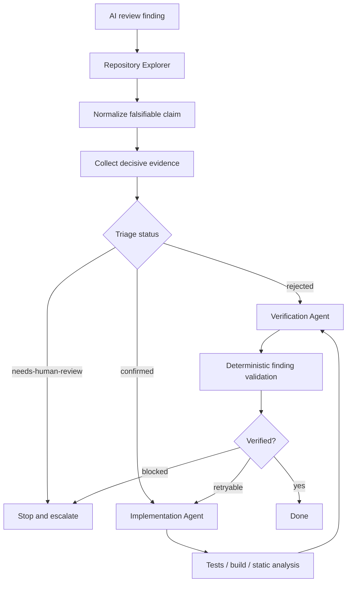

# AI Code Review False-Positive Triage Gate

A reusable engineering kit for turning AI-generated code-review findings into evidence-backed outcomes before they block merge or trigger remediation.

## Problem

AI review systems can produce plausible but incorrect findings. Teams then waste time fixing nonexistent defects, weaken code to satisfy a mistaken reviewer, or block merges on claims that were never reproduced. This kit treats every AI review finding as a hypothesis until repository evidence, tests, static analysis, runtime reproduction, or an authoritative specification confirms it.

## Purpose

Provide a bounded, portable workflow that separates repository exploration, implementation, and independent verification while adding deterministic validation for finding records and changed-file context.

## When to use

Use for AI-generated review comments that may block merge, require remediation, affect release confidence, or consume significant investigation time. It is especially useful for automated PR review pipelines and agent-assisted code review.

## When not to use

Do not use it as a replacement for security incident response, production debugging, or domain-owner decisions when the required evidence is outside the repository and unavailable to the workflow. Such findings should terminate as `needs-human-review`.

## Architecture



## Package tree

```text
agent-ai-code-review-false-positive-triage-gate/
├── README.md
├── config/
│   └── triage-policy.json
├── examples/
│   └── finding.example.json
├── hooks/
│   └── lifecycle-hooks.md
├── rules/
│   └── triage-rules.md
├── schemas/
│   └── finding.schema.json
├── scripts/
│   ├── check-review-diff.py
│   └── validate-findings.py
├── skills/
│   ├── remediation-and-verification.md
│   └── review-finding-triage.md
├── subagents/
│   ├── implementation-agent.md
│   ├── repository-explorer.md
│   └── verification-agent.md
├── tests/
│   └── test-validate-findings.py
└── workflows/
    └── end-to-end.md
```

## Component responsibilities

- `skills/review-finding-triage.md` defines evidence-first classification of a finding.
- `skills/remediation-and-verification.md` defines the scoped fix/test/retest procedure.
- `rules/triage-rules.md` provides enforceable safety and evidence rules.
- `subagents/repository-explorer.md` owns read-only context gathering.
- `subagents/implementation-agent.md` owns scoped remediation.
- `subagents/verification-agent.md` owns independent final verification.
- `workflows/end-to-end.md` defines stages, retries, approval points, failures, and Definition of Done.
- `hooks/lifecycle-hooks.md` binds deterministic commands to lifecycle checkpoints.
- `scripts/check-review-diff.py` captures the review surface from Git.
- `scripts/validate-findings.py` enforces blocking-finding evidence policy.
- `schemas/finding.schema.json` documents the structured handoff contract.
- `config/triage-policy.json` centralizes thresholds and accepted vocabulary.

## Installation

Copy this directory into a repository. Python 3.10+ and Git are the only dependencies for the included scripts. No secrets or external services are required.

Run package tests:

```bash
python3 -m unittest tests/test-validate-findings.py
```

## Configuration

Edit `config/triage-policy.json` only when project policy differs. Important defaults are:

- blocking severities: `critical`, `high`;
- minimum blocking confidence: `0.8`;
- reproduction evidence required for blocking findings;
- independent verification required;
- maximum remediation retries: `2`.

Changing thresholds to weaken review controls should be treated as a policy decision and reviewed by a human owner.

## Permissions

The default workflow needs repository read access, local Git access, and permission to run non-destructive repository-native tests/build/static analysis. The Implementation Agent needs only the file-write permissions required for the scoped fix. No production or infrastructure permission is required.

## Usage

Capture the changed surface:

```bash
python3 scripts/check-review-diff.py \
  --repo /path/to/repository \
  --base origin/main \
  --output /tmp/review-diff.json
```

Create one finding record per review claim, using `examples/finding.example.json` as the concrete contract. Validate records before allowing a blocking decision:

```bash
python3 scripts/validate-findings.py \
  --input /tmp/findings.json \
  --policy config/triage-policy.json
```

## Example agent invocation

> Triage the AI review finding using `workflows/end-to-end.md`. Treat the claim as unverified until reproduced or disproved. Load changed files first, then nearby tests and callers only as needed. Do not remediate a rejected or human-review-required finding. A confirmed high/critical finding must have reproduction evidence and independent verification before it can block merge.

## Workflow

The workflow is:

```text
Trigger
  ↓
Diff/context capture
  ↓
Falsifiable claim
  ↓
Evidence collection
  ↓
Triage
  ↓
Confirmed? ── no ──→ Reject or Human Review
  ↓ yes
Scoped remediation
  ↓
Test / build / analysis
  ↓
Independent verification
  ↓
Finding validation
  ↓
Complete
```

Retry loops are bounded to two implementation retries. Failed attempts must preserve evidence. Permission failures, unavailable required external evidence, policy ambiguity, and approval-required actions stop the autonomous workflow.

## Approval boundaries

Explicit human approval is required before production deployment, destructive SQL/data deletion, database schema changes, infrastructure changes, secret changes, production configuration changes, breaking public contracts, weakening security controls, irreversible migrations, force push/history rewriting, or large dependency upgrades.

The agent must stop before the action; investigation approval is not action approval.

## Failure handling

- **Validation failure:** fix the finding record or policy mismatch; do not alter product code to satisfy the validator.
- **Build/test failure:** diagnose within the two-retry remediation budget.
- **Tool failure:** retry once only when clearly transient; otherwise preserve error output and stop.
- **Permission failure:** stop without escalating privileges.
- **Business-rule ambiguity:** use `needs-human-review`.
- **Unavailable production/external evidence:** stop verification rather than inventing evidence.

## Verification

`Task executed` means triage/remediation actions ran. `Task verified successfully` requires evidence.

For a blocking confirmed finding, verification requires:

- exact affected code location;
- confidence meeting policy threshold;
- decisive reproduction evidence (`test`, `runtime-reproduction`, or `static-analysis`);
- successful relevant regression checks after remediation when code changed;
- independent verifier result `verified`;
- finding record accepted by `scripts/validate-findings.py`;
- no pending approval-required action.

For a rejected finding, independent repository/specification evidence must directly contradict the claim.

## Definition of Done

- Changed surface and relevant context were gathered.
- The claim was expressed as a falsifiable proposition.
- Facts and hypotheses were kept separate.
- Finding status is `confirmed`, `rejected`, or `needs-human-review`.
- Confirmed blockers satisfy policy evidence thresholds.
- Any remediation is minimal and relevant tests/checks pass.
- Independent verification is complete for terminal verified outcomes.
- Finding records validate successfully.
- Remaining risk and unavailable evidence are documented.
- No unapproved dangerous action or blocking workflow failure remains.

## Customization

Adjust severity thresholds and evidence policy in `config/triage-policy.json`. Extend the workflow with repository-native test/build commands in local agent configuration rather than hard-coding tool-specific commands into this portable core package. Keep the separation between exploration, implementation, and independent verification.
