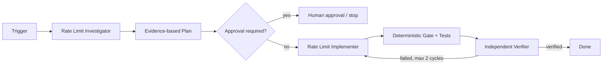

# Agent API Rate Limit Adaptive Throttling Gate

## Problem
AI agents and automation frequently call provider APIs faster than a quota, burst limit, or degraded service can safely handle. Naive fixed retries can synchronize callers, amplify traffic, waste tokens, increase latency, and turn a recoverable HTTP 429 into a retry storm.

## Purpose
This kit gives coding agents a repeatable workflow for investigating rate-limit failures, applying bounded adaptive throttling, and independently verifying that retries remain safe. It combines tool-neutral procedures with deterministic Python gates that can be copied into most repositories.

## When to use
Use for repeated 429/503 responses, quota alerts, burst-driven failures, retry storms, new external API integrations, or changes to retry/concurrency logic.

## When not to use
Do not use it to mask authentication, authorization, validation, conflict, or business-rule failures. It is not a substitute for provider capacity planning or explicit quota approval.

## Architecture


The investigator owns diagnosis, the implementer owns the minimal change, and the verifier independently proves retry classification, total-wait budget, and concurrency bounds. Deterministic checks are implemented in `scripts/adaptive_throttle.py`; package integrity is checked by `scripts/verify_package.py`.

## Package tree
```text
agent-api-rate-limit-adaptive-throttling-gate/
├── README.md
├── config/
│   └── rate-limit-policy.yaml
├── examples/
│   └── gate-result.json
├── hooks/
│   └── lifecycle.md
├── rules/
│   └── rate-limit-safety.md
├── schemas/
│   └── gate-result.schema.json
├── scripts/
│   ├── adaptive_throttle.py
│   └── verify_package.py
├── skills/
│   ├── adaptive-policy-change.md
│   └── rate-limit-investigation.md
├── subagents/
│   ├── rate-limit-implementer.md
│   ├── rate-limit-investigator.md
│   └── rate-limit-verifier.md
├── templates/
│   └── finding.md
├── tests/
│   └── test_adaptive_throttle.py
└── workflows/
    └── adaptive-throttling.md
```

## Component responsibilities
- `skills/rate-limit-investigation.md`: evidence collection and causal diagnosis.
- `skills/adaptive-policy-change.md`: bounded change procedure.
- `rules/rate-limit-safety.md`: enforceable retry, concurrency, secrets, and approval constraints.
- `subagents/`: non-overlapping investigation, implementation, and verification ownership.
- `workflows/adaptive-throttling.md`: end-to-end stages, bounded retries, failure paths, and Definition of Done.
- `hooks/lifecycle.md`: deterministic lifecycle checks.
- `scripts/adaptive_throttle.py`: reusable retry/concurrency decision helper and safe simulator.
- `scripts/verify_package.py`: checks required package files and rejects omitted-implementation placeholders.
- `config/rate-limit-policy.yaml`: portable policy defaults.
- `schemas/gate-result.schema.json`: output contract for gate results.
- `templates/finding.md`: structured evidence handoff.
- `examples/gate-result.json`: concrete successful gate output.
- `tests/test_adaptive_throttle.py`: deterministic unit coverage.

## Installation
Copy this directory into a repository. Requires Python 3.9+ for scripts and `pytest` for tests. Core policy files and agent instructions are otherwise tool-neutral.

## Configuration
Start with `config/rate-limit-policy.yaml`. Defaults are deliberately bounded: maximum 4 attempts, 500 ms exponential base delay, 30 s per-delay cap, 25% jitter, 90 s total wait budget, concurrency range 1–16, multiplicative decrease by 0.5, and additive increase after a 20-success window. Project policy may be stricter.

Provider-specific limits should be represented as configuration rather than embedded into general workflow instructions. Do not guess undocumented quotas.

## Permissions
The default workflow requires only repository read/write access plus read-only telemetry/provider documentation. Production changes, provider quota increases, production configuration changes, gate bypasses, secret changes, and infrastructure changes require explicit human approval.

## Usage
Run the deterministic gate locally:

```bash
python scripts/adaptive_throttle.py --statuses 429,429,200 --retry-after 1
```

A permanent error must stop instead of retrying:

```bash
python scripts/adaptive_throttle.py --statuses 401,200
```

Run unit tests:

```bash
python -m pytest tests/test_adaptive_throttle.py -q
```

Check package completeness:

```bash
python scripts/verify_package.py
```

## Example invocation for an AI coding agent
Use `workflows/adaptive-throttling.md` when an integration is returning 429s. First delegate evidence gathering to `subagents/rate-limit-investigator.md`. Do not edit code until the causal hypothesis is supported. If a safe change is justified, hand off to `subagents/rate-limit-implementer.md`, run the lifecycle hooks, then require `subagents/rate-limit-verifier.md` to independently verify the result.

## Workflow behavior
The workflow separates facts from hypotheses. It inspects retry ownership across SDK, HTTP middleware, caller, and background-job layers before changing behavior. It respects `Retry-After` where valid, otherwise uses exponential backoff with jitter, lowers concurrency on throttling, and only increases concurrency after sustained success.

Implementation/verification correction loops are capped at two cycles. Transient tool/network failures may be retried at most three times. Permission or approval failures are never retried automatically.

## Approval boundaries
Stop before any provider quota increase, production concurrency/limit change, provider plan change, production deployment, secret change, infrastructure change, or rate-limit gate bypass. Never increase privileges just to finish the workflow.

## Failure handling
- Missing telemetry: stop implementation and request instrumentation.
- 400/401/403/404/409/422: classify as non-retryable for this gate.
- 429/503 or retryable 5xx: preserve evidence and apply bounded retry policy.
- Retry budget exhaustion: fail closed and report cumulative wait/attempt evidence.
- Build/test failure: preserve output, return to implementation for at most two correction cycles.
- Repeated verifier failure: escalate; do not loop indefinitely.

## Verification
Completion requires evidence, not code generation. Verify that:
- successful requests pass without unnecessary retry;
- 429 recovery reduces concurrency and uses bounded delay;
- valid `Retry-After` is respected and capped;
- permanent errors stop immediately;
- maximum attempts and total wait are bounded;
- all retry layers have been inspected for amplification;
- unit/project tests pass;
- no unintended files changed;
- an independent verifier reports `verified`.

## Definition of Done
The causal finding is supported by logs/metrics/headers; the smallest safe change exists; relevant tests and deterministic gates pass; concurrency and retry budgets remain within policy; approval-required actions are either unnecessary or explicitly approved; independent verification succeeds; residual risks and open evidence gaps are documented; no blocking failure remains.

## Customization
Adjust `config/rate-limit-policy.yaml` to stricter project/provider limits, wire `scripts/adaptive_throttle.py` concepts into the repository's HTTP client or queue worker, and add project-specific build/integration commands to `hooks/lifecycle.md`. Keep the investigation, approval, bounded-loop, and independent-verification responsibilities intact.
