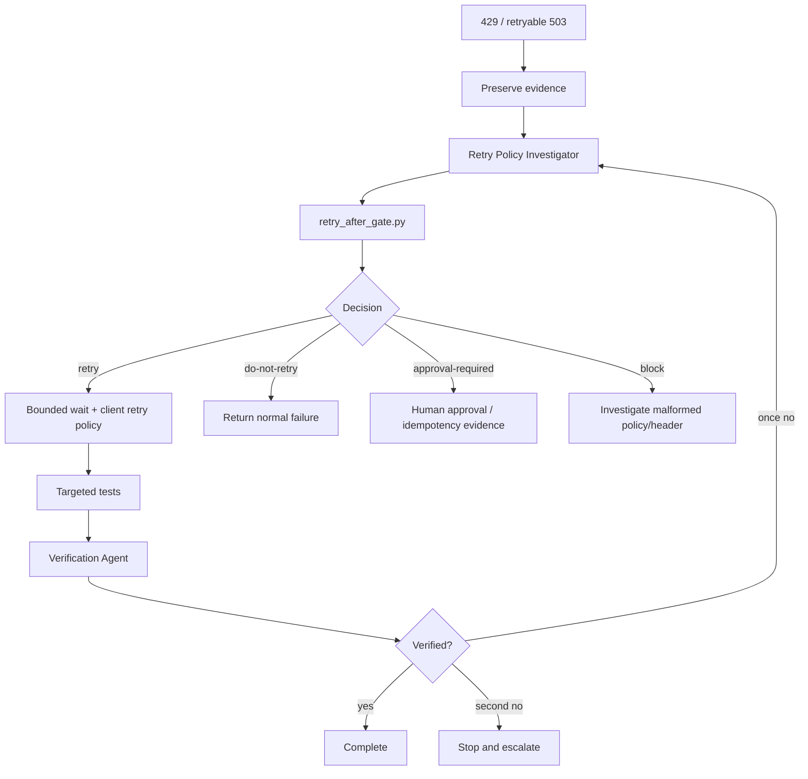

# Agent API Retry-After Compliance Gate

A reusable AI-engineering package for safely diagnosing and correcting API clients that mishandle HTTP `Retry-After`, especially around `429 Too Many Requests` and retryable `503 Service Unavailable` responses.

## Problem

AI-assisted implementation and incident workflows often respond to throttling by adding retries quickly. Unsafe retry logic can ignore server-provided wait times, retry too aggressively, duplicate side effects on non-idempotent methods, hide provider throttling, or loop until a request happens to succeed.

## Purpose

This kit provides a deterministic decision gate plus agent procedures that preserve the first failure, validate retry eligibility, honor `Retry-After`, cap delay and attempts, protect non-idempotent methods, and require independent verification before completion.

## When to use

Use when an HTTP client receives 429 or retryable 503 responses, when adding or modifying retry middleware, when logs show rapid repeated calls, when a provider reports rate-limit abuse, or during production-incident follow-up using captured evidence in a safe environment.

## When not to use

Do not use this to generate extra production traffic, override provider contracts, make arbitrary statuses retryable, or automatically retry operations that may have side effects without a documented idempotency guarantee.

## Architecture



## Package tree

```text
agent-api-retry-after-compliance-gate/
├── README.md
├── config/
│   └── retry-after-policy.json
├── examples/
│   └── retry-decision.example.json
├── hooks/
│   └── post-rate-limit-response.md
├── rules/
│   └── retry-after-rules.md
├── schemas/
│   └── retry-decision.schema.json
├── scripts/
│   ├── retry_after_gate.py
│   └── verify_package.py
├── skills/
│   └── triage-rate-limit-retry.md
├── subagents/
│   ├── retry-policy-investigator.md
│   └── verification-agent.md
├── templates/
│   └── retry-investigation-report.md
├── tests/
│   └── test_retry_after_gate.py
└── workflows/
    └── retry-after-compliance-gate.md
```

## Installation

Copy the directory into a repository or agent-instruction package. Python 3.9+ is sufficient; the executable scripts use only the standard library.

Validate the package:

```bash
python scripts/verify_package.py
python -m unittest tests/test_retry_after_gate.py
```

## Configuration

Edit `config/retry-after-policy.json` for the repository. The default policy permits retry classification only for 429 and 503, limits retry attempts to 3, uses a 2-second fallback delay when the header is absent, caps server-provided delay at 120 seconds, and protects POST/PATCH from automatic retry.

Do not put credentials, production URLs, or secrets in this file.

## Permissions

Agents need read access to the API client and tests, permission to run local/non-production tests, and write access only to scoped source/test changes and evidence output. They do not need deployment, infrastructure, secret-management, force-push, or production mutation permissions.

## Usage

Evaluate a GET response with delta-seconds:

```bash
python scripts/retry_after_gate.py \
  --method GET \
  --status 429 \
  --retry-after 30 \
  --policy config/retry-after-policy.json
```

A safe result is shaped like:

```json
{
  "decision": "retry",
  "reason": "bounded-retry-allowed",
  "delay_seconds": 30
}
```

Evaluate an unsafe non-idempotent method:

```bash
python scripts/retry_after_gate.py \
  --method POST \
  --status 429 \
  --retry-after 10 \
  --policy config/retry-after-policy.json
```

The gate returns `approval-required` and exit code 2. The script never sends the HTTP request itself.

## Input/output contract

`schemas/retry-decision.schema.json` defines the deterministic output. Allowed decisions are `retry`, `do-not-retry`, `approval-required`, and `block`. Every result includes a concrete reason and non-negative delay.

`Retry-After` is accepted as either non-negative delta-seconds or an HTTP-date. Invalid values block when `honor_retry_after` is enabled. Delays are capped to avoid unbounded sleeps.

## Workflow

Follow `workflows/retry-after-compliance-gate.md`: context → evidence → deterministic gate → plan → approval checkpoint → implementation → tests → independent verification → completion.

The workflow permits one retry for tool/environment failure after preserving evidence. Independent verification may return once to investigation; a second verification failure stops and escalates. Application retries remain bounded by `max_retry_attempts`.

## Approval boundaries

Explicit human approval is required before enabling retry for a non-idempotent operation without an already proven idempotency contract, changing production retry configuration, generating additional production traffic, weakening security controls, changing secrets, deploying, performing destructive data operations, or rewriting Git history.

The package never treats missing approval as permission.

## Failure handling

Malformed `Retry-After` values block rather than silently falling back when header honoring is required. Missing provider semantics stop the investigation until authoritative evidence is available. Production-only reproduction is rejected. Permission failures never cause privilege escalation. Exhausted retry budgets preserve the final response and return normal failure.

## Verification

The Verification Agent must independently inspect the diff and test at least: delta-seconds parsing, HTTP-date parsing, malformed values, max-delay capping, missing header fallback, non-retryable status behavior, protected non-idempotent methods, configured retry-attempt bounds, and relevant surrounding client tests.

A later successful request is not proof that the original throttling behavior was correct. Completion requires evidence that retry semantics are compliant and bounded.

## Definition of Done

The original 429/503 behavior is preserved as evidence; the deterministic gate and actual client behavior agree; valid Retry-After is honored; delay and attempts are bounded; protected methods are not automatically retried without explicit approval/idempotency evidence; targeted and surrounding tests pass; independent verification reports `verified`; no security or production boundary was weakened; and remaining risk is documented.

## Customization

Adjust retryable statuses, delay caps, fallback delay, and protected methods in `config/retry-after-policy.json`. Keep deterministic protocol logic in the script and provider-specific knowledge in repository-specific tests or supplementary skills. This makes the package portable across Codex, Claude Code, Cursor, ChatGPT, GitHub Copilot, OpenCode, and other coding agents.
