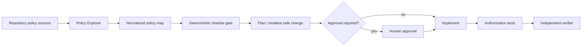

# Agent Authorization Policy Shadowing Gate

A reusable AI-engineering kit for finding authorization rules that are unreachable because a broader, higher-priority rule wins first. It combines repository exploration, deterministic analysis, independent verification, bounded recovery, and explicit approval boundaries.

## Problem
First-match authorization systems can silently ignore later deny or allow rules. A configuration may look secure in review while runtime behavior is controlled by an earlier wildcard or broader rule.

## When to use
Use for RBAC/ABAC policy changes, route/middleware authorization refactors, access-control incidents, IAM policy generation, or release-time security verification when rule order matters.

## When not to use
Do not use the deterministic script as proof for deny-overrides, allow-overrides, most-specific-match, or custom engines unless you adapt the evaluator to those semantics.

## Architecture


## Package tree
```text
agent-authorization-policy-shadowing-gate/
├── README.md
├── config/policy.yaml
├── examples/policy-map.json
├── hooks/lifecycle.md
├── rules/authorization-safety.md
├── schemas/result.schema.json
├── scripts/policy_shadow_gate.py
├── skills/analyze-policy-shadowing.md
├── skills/discover-authorization-rules.md
├── subagents/authorization-verifier.md
├── subagents/policy-explorer.md
├── templates/verification-record.md
├── tests/test_policy_shadow_gate.py
└── workflows/authorization-policy-shadowing.md
```

## Installation
Requires Python 3.10+ and no third-party packages. Copy the package into a repository or invoke the script from this directory.

## Input contract
The normalized JSON input contains `policies`. Each rule requires `id`, integer `priority`, `effect` (`allow` or `deny`), `actions`, and `resources`; `principals` is optional and defaults to `*`. Strings or arrays of strings are accepted. Lower priority numbers execute first.

## Usage
```bash
python scripts/policy_shadow_gate.py examples/policy-map.json
python scripts/policy_shadow_gate.py path/to/policies.json --output artifacts/policy-shadow-result.json
python -m unittest tests/test_policy_shadow_gate.py
```
Exit code `0` means no conflicting shadow was found, `1` means a blocking shadow exists, and `2` means input/tool validation failed.

## Workflow
Follow `workflows/authorization-policy-shadowing.md`. The explorer owns evidence collection, while `subagents/authorization-verifier.md` provides independent final verification.

## Approval boundaries
Explicit human approval is required before removing deny rules, widening privileged/admin scope, changing the default authorization effect, production policy updates, breaking public contracts, infrastructure or secret changes, destructive operations, or Git history rewrites.

## Failure handling
Transient command/I/O failures may retry at most twice with evidence preserved. Validation, semantic, and test failures require changed evidence or implementation before another attempt. Unknown evaluation semantics stop deterministic classification.

## Verification
A successful run requires reproducible gate output, targeted positive and negative authorization tests, no unintended diff, satisfied approvals, and independent verification. Task execution alone is not success.

## Definition of Done
- Policy sources and evaluation semantics are evidence-backed.
- Normalized input is valid.
- No unaccepted `shadowed-allow` or `shadowed-deny` remains.
- Affected allow and deny tests pass.
- Approval-required changes have explicit approval.
- Independent verifier reports `verified`.
- Residual risks are recorded.

## Customization
Adapt wildcard matching or policy precedence only in the deterministic evaluator and update tests together. Keep agent instructions tool-neutral; platform-specific adapters should remain separate from the core workflow.