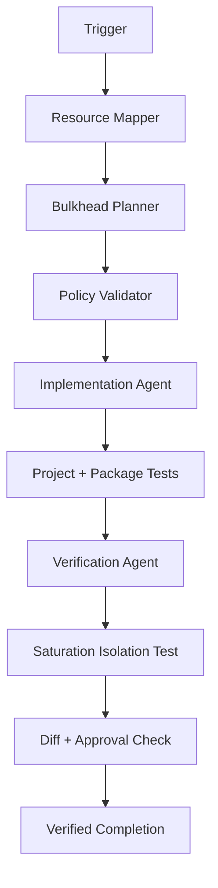

# Agent Bulkhead Concurrency Isolation Gate

## Problem
AI-assisted systems, background workers, integration services, and tool-using agents often share finite resources such as worker slots, HTTP connection pools, database connections, queues, semaphores, or downstream rate limits. A slow or overloaded workload can consume the shared capacity and starve unrelated workloads, causing cascading timeouts and retry amplification.

## Purpose
This package provides a reusable workflow for discovering shared resource contention, designing bounded bulkhead partitions, implementing the smallest safe isolation change, and proving through saturation tests that overload in one partition does not exhaust unrelated capacity.

## When to use
Use when introducing a high-latency or high-risk dependency, when queue depth or timeouts rise under load, when one tenant/task class can monopolize workers, when retries amplify saturation, or when production evidence suggests cross-workload starvation.

## When not to use
Do not use this package as a substitute for fixing a fundamentally undersized or broken downstream dependency. Do not run saturation tests against production. Do not automatically raise production limits to suppress rejection metrics.

## Architecture


## Package tree
```text
agent-bulkhead-concurrency-isolation-gate/
├── README.md
├── config/
│   └── bulkhead-policy.yaml
├── examples/
│   └── verification-result.json
├── hooks/
│   └── lifecycle.md
├── rules/
│   └── bulkhead-safety.md
├── schemas/
│   └── verification-result.schema.json
├── scripts/
│   └── validate_bulkhead.py
├── skills/
│   ├── bulkhead-design.md
│   └── saturation-verification.md
├── subagents/
│   ├── bulkhead-planner.md
│   ├── implementation-agent.md
│   ├── resource-mapper.md
│   └── verification-agent.md
├── templates/
│   └── verification-result.json
├── tests/
│   └── test_validate_bulkhead.py
└── workflows/
    └── bulkhead-isolation-workflow.md
```

## Component responsibilities
- `skills/bulkhead-design.md`: evidence-driven procedure for choosing isolation boundaries and bounded limits.
- `skills/saturation-verification.md`: deterministic verification procedure proving cross-partition isolation.
- `rules/bulkhead-safety.md`: enforceable safety, retry, timeout, queue, approval, and observability rules.
- `subagents/resource-mapper.md`: discovers resource coupling without edits.
- `subagents/bulkhead-planner.md`: converts evidence into a bounded isolation plan.
- `subagents/implementation-agent.md`: applies the minimal implementation.
- `subagents/verification-agent.md`: independently validates behavior.
- `workflows/bulkhead-isolation-workflow.md`: bounded end-to-end workflow with retry and failure paths.
- `hooks/lifecycle.md`: blocking lifecycle checks.
- `scripts/validate_bulkhead.py`: validates policy structure and safety invariants.
- `tests/test_validate_bulkhead.py`: regression tests for validator behavior.
- `schemas/verification-result.schema.json`: handoff/output contract for final verification.

## Installation
Copy this folder into a repository. Python 3.10+ is required for the deterministic validator/tests. Install PyYAML:

```bash
python -m pip install pyyaml
```

No runtime service dependency is imposed by this package; adapt the implementation to the target language/framework while preserving the workflow and safety invariants.

## Configuration
Edit `config/bulkhead-policy.yaml` for each resource partition. Important fields:
- `max_concurrency`: maximum active work in the partition.
- `max_queue`: maximum waiting work; never unbounded.
- `queue_timeout_ms`: maximum queue wait and must be less than execution timeout.
- `execution_timeout_ms`: maximum execution time.
- `retry_limit`: bounded retry count; validator permits 0–3.
- `failure_rate_open_threshold`, `minimum_samples`, `recovery_cooldown_seconds`: recovery/circuit-breaker coordination values.

Validate configuration:

```bash
python scripts/validate_bulkhead.py --policy config/bulkhead-policy.yaml
```

Expected output is `VALID` with exit code 0.

## Permissions
Core discovery, planning, testing, and verification require only repository read/write access and non-production test access. Production capacity/configuration changes, disabling isolation, infrastructure changes, secret changes, and permission expansion require explicit human approval.

## Usage
1. Run the workflow in `workflows/bulkhead-isolation-workflow.md`.
2. Use `subagents/resource-mapper.md` to map shared pools/dependencies.
3. Use `subagents/bulkhead-planner.md` and `skills/bulkhead-design.md` to select partitions and limits.
4. Validate policy before implementation.
5. Implement with `subagents/implementation-agent.md`.
6. Run package tests and repository-specific tests.
7. Use `skills/saturation-verification.md` with `subagents/verification-agent.md` to prove isolation outside production.
8. Record the final result using `templates/verification-result.json`; validate it against `schemas/verification-result.schema.json` in your preferred JSON Schema tooling.

## Example invocation
```text
Investigate worker starvation between AI document processing and interactive API requests. Use the bulkhead concurrency isolation workflow. Collect resource evidence first, propose bounded partitions, validate policy, implement the smallest safe change, run tests, then independently saturate only the document-processing partition and prove interactive requests retain capacity. Stop before any production capacity or configuration change requiring approval.
```

## Workflow and retries
The workflow permits at most two retries for transient tool/test failures and at most two implementation fix/retest cycles. Permission failures are not retried through privilege escalation. Repeated failures stop with preserved evidence.

## Approval boundaries
Explicit approval is mandatory before production capacity/configuration changes, disabling isolation, infrastructure changes, secret changes, permission expansion, destructive operations, or other irreversible actions. Agents must stop at the approval boundary.

## Failure handling
- Missing capacity evidence: use conservative provisional values and do not perform production tuning.
- Policy validation failure: block implementation until policy is corrected.
- Saturation still causes cross-partition starvation: split the shared resource further or lower per-partition limits, then run one bounded re-verification cycle.
- Repeated build/test/tool failure after retry budget: stop with status `failed` and preserve logs.
- Missing authorization for load generation: stop with status `blocked`.

## Verification
Task execution and verification are distinct. Completion requires:
- policy validator returns `VALID`;
- package tests pass;
- repository-specific relevant tests pass;
- active work never exceeds configured concurrency;
- waiting work never exceeds configured queue size;
- retries remain within `retry_limit` and caller deadlines;
- one deliberately saturated partition does not starve at least one unrelated control partition;
- recovery occurs after load stops;
- diff contains no unintended changes, secrets, removed safety controls, or unapproved production actions;
- independent Verification Agent returns `verified`.

## Definition of Done
The package-specific task is done only when the shared resource map exists, limits are bounded and evidence-backed or clearly provisional, implementation/tests exist, deterministic validation passes, non-production saturation proves isolation, remaining risks are recorded, required approvals exist, and no blocking failure remains.

## Customization
Keep the core instructions tool-neutral. Adapt semaphore, executor, queue, connection-pool, or worker implementation to the target stack. For .NET this may use `SemaphoreSlim`, bounded `Channel<T>`, `HttpClient` handler limits, Polly resilience pipelines, or worker partitioning; other platforms can use equivalent primitives. Preserve bounded concurrency, bounded queueing, deadline propagation, observability, independent verification, and approval boundaries.
