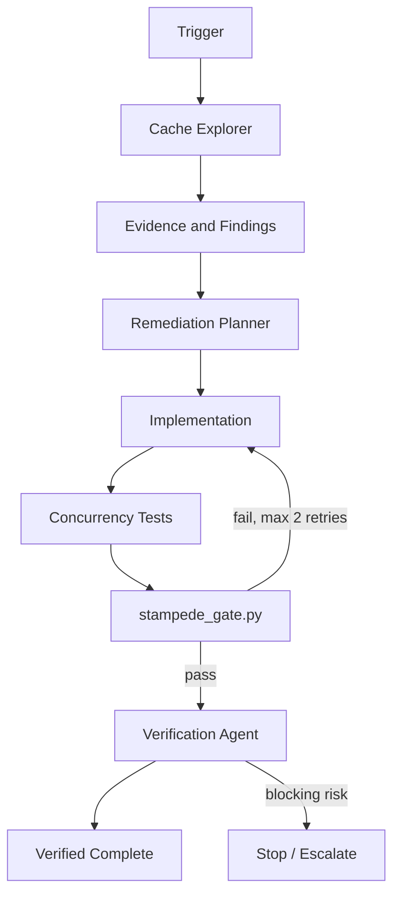

# Agent Cache Stampede Singleflight Gate

A reusable AI-engineering kit for detecting and remediating cache stampedes: many concurrent requests miss the same key and duplicate an expensive database/API/origin operation.

## Problem
A cache can reduce average latency while still failing catastrophically when a hot key expires. Without per-key request coalescing, hundreds of callers may execute the same loader simultaneously, overload the origin, increase latency, and amplify failures.

## Purpose
This package gives coding agents a bounded workflow to inspect cache miss paths, prove stampede risk, implement singleflight/request coalescing, add deterministic concurrency verification, and stop before dangerous production cache operations.

## When to use
Use after cache-related latency spikes, database/API saturation near expirations, repeated duplicate origin calls, or before introducing expensive cached computations.

## When not to use
Do not use this package to justify caching data that must always be strongly consistent or to hide an origin-capacity problem without evidence. It does not authorize production cache flushes or topology/configuration changes.

## Architecture


## Package tree
```text
agent-cache-stampede-singleflight-gate/
├── README.md
├── config/
│   └── policy.yaml
├── examples/
│   └── evidence-pass.json
├── hooks/
│   └── lifecycle.md
├── rules/
│   └── cache-safety.md
├── schemas/
│   └── analysis-result.schema.json
├── scripts/
│   └── stampede_gate.py
├── skills/
│   ├── cache-stampede-investigation.md
│   └── singleflight-remediation.md
├── subagents/
│   ├── cache-explorer.md
│   ├── remediation-planner.md
│   └── verification-agent.md
├── templates/
│   └── investigation-report.md
├── tests/
│   └── test_stampede_gate.py
└── workflows/
    └── cache-stampede-remediation.md
```

## Component responsibilities
- `skills/cache-stampede-investigation.md`: evidence-first cache miss analysis.
- `skills/singleflight-remediation.md`: minimal request-coalescing implementation procedure.
- `rules/cache-safety.md`: enforceable repository, concurrency, security, and approval rules.
- `subagents/cache-explorer.md`: read-only evidence collection.
- `subagents/remediation-planner.md`: remediation plan ownership.
- `subagents/verification-agent.md`: independent final verifier.
- `workflows/cache-stampede-remediation.md`: end-to-end bounded workflow.
- `hooks/lifecycle.md`: deterministic lifecycle checks.
- `scripts/stampede_gate.py`: validates concurrency evidence.
- `config/policy.yaml`: default timeouts, retry limits, stale strategy, and approval boundaries.
- `schemas/analysis-result.schema.json`: structured finding/verification contract.
- `templates/investigation-report.md`: reusable human-readable evidence report.
- `tests/test_stampede_gate.py`: executable tests for the gate.
- `examples/evidence-pass.json`: known passing evidence sample.

## Installation
Copy this directory into the target repository. Python 3.9+ is sufficient for the deterministic gate. Install `pytest` only to run the included test suite.

```bash
python -m pip install pytest
python -m pytest tests/test_stampede_gate.py
python scripts/stampede_gate.py examples/evidence-pass.json
```

When copied under another parent directory, run commands from the package root or adjust paths accordingly.

## Configuration
Edit `config/policy.yaml` to match repository-specific latency budgets. Keep all waits bounded. The default policy uses:
- 5,000 ms lock acquisition timeout
- 30,000 ms origin load timeout
- 60 seconds stale-while-revalidate allowance
- 10 seconds negative-cache TTL
- maximum two implementation retries
- 15% TTL jitter

Do not weaken safety or expand production permissions merely to make the gate pass.

## Permissions
The Explorer and Verifier need repository/test/telemetry read access only. The implementation phase needs normal repository write access. Production cache mutation is not required for this workflow.

Explicit human approval is required before:
- production cache flush
- cache cluster or infrastructure reconfiguration
- production configuration changes
- TTL reduction greater than 80%
- any action that weakens tenant/security boundaries

## Usage
Give the agent an affected cache path, symptom, or high-cost loader and instruct it to execute `workflows/cache-stampede-remediation.md` while enforcing `rules/cache-safety.md`.

Example invocation:

```text
Investigate the product-details cache for duplicate database calls during expiry.
Follow workflows/cache-stampede-remediation.md.
Use config/policy.yaml.
Do not mutate production.
Produce concurrency evidence and require independent verification before completion.
```

## Workflow
1. Inspect repository structure and locate cache adapter, key construction, miss path, loader, and tests.
2. Gather facts separately from hypotheses.
3. Confirm or reject stampede risk using code, telemetry, or reproducible load.
4. Plan the smallest per-key request-coalescing change.
5. Implement bounded singleflight plus safe TTL jitter/stale behavior only where justified.
6. Add concurrency and leader-failure tests.
7. Produce an evidence JSON file containing the fields consumed by `scripts/stampede_gate.py`.
8. Run the deterministic gate and repository-native tests.
9. Have the Verification Agent independently inspect behavior and diff scope.
10. Complete only when all Definition of Done criteria are evidenced.

## Evidence contract
A concurrency evidence file must contain:
- `key`
- `concurrent_callers`
- `origin_calls`
- `max_wait_ms`
- `lock_timeout_ms`
- `load_timeout_ms`
- `all_waiters_completed`
- `leader_failure_released`

The gate fails when duplicate origin calls exceed the configured threshold, waiters exceed their allowed duration, waiters do not complete, leader failure leaves coordination stuck, or required fields are absent.

## Failure handling
- **Transient test/tool failure:** retry the implementation/test cycle at most twice and preserve prior evidence.
- **Validation failure:** fix the evidence or implementation; do not bypass the gate.
- **Permission failure:** stop; never increase privileges silently.
- **Environment failure:** report the unavailable dependency and mark verification incomplete.
- **Business-rule incompatibility:** stop if stale serving, negative caching, or coalescing would violate correctness.
- **Repeated failure:** after two remediation/test retries, preserve logs, diff, and evidence and escalate.

## Verification
A successful implementation must prove:
- concurrent same-key callers are coalesced
- origin invocation count is bounded as expected
- unrelated keys do not serialize behind a global hot-path lock
- waiters terminate within configured timeouts
- leader cancellation/error releases coordination state
- repository-native tests pass
- cache key and tenant/security semantics are unchanged unless explicitly required
- required approvals exist for any dangerous action

`Task executed` is not equivalent to `Task verified successfully`.

## Definition of Done
- In-scope cache miss paths are classified with evidence.
- Vulnerable hot paths use bounded per-key coordination.
- Failure/cancellation paths cannot leave a stuck lock or waiter.
- Concurrency evidence passes `scripts/stampede_gate.py`.
- Included gate tests and repository-native affected tests pass.
- Independent verification is complete.
- No unintended cache-key, tenant-boundary, API, or production configuration changes exist.
- Required human approvals are recorded.
- Remaining risks and observability gaps are documented.

## Customization
Keep the core workflow tool-neutral. Replace the cache implementation details with Redis, MemoryCache, distributed locks, framework-native singleflight primitives, or application-specific adapters as needed. Preserve bounded waits, per-key isolation, evidence requirements, retry limits, and approval boundaries.
