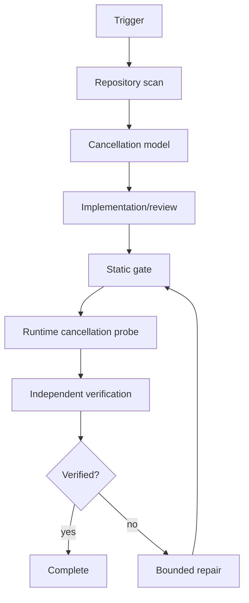

# Agent Cancellation Propagation & Orphan-Work Gate

## Problem
AI-driven workflows often start multiple tool calls, subprocesses, HTTP requests, database operations, or background tasks. If the parent task is cancelled, times out, or loses approval, child work can continue silently. That creates orphaned work, duplicate side effects, wasted compute, inconsistent state, and hard-to-debug incidents.

## Purpose
This kit makes cancellation a first-class workflow contract. It detects missing propagation, blocks unsafe side effects after cancellation, verifies bounded cleanup, and produces evidence that no orphan work remains.

## Use when
Use for coding agents, CI jobs, workers, API orchestration, long-running commands, parallel test runners, queue handlers, MCP/tool chains, and any workflow where parent cancellation should stop downstream work.

Do not use it as a substitute for transactional design where atomicity is required.

## Architecture

## Package tree
- `skills/cancellation-contract-review.md`
- `skills/orphan-work-investigation.md`
- `rules/cancellation-safety.md`
- `subagents/repository-explorer.md`
- `subagents/verification-agent.md`
- `workflows/cancellation-propagation-gate.md`
- `hooks/lifecycle.md`
- `scripts/cancellation_gate.py`
- `scripts/verify_package.py`
- `config/cancellation-policy.yaml`
- `schemas/cancellation-report.schema.json`
- `templates/cancellation-evidence.md`
- `examples/async-sample.py`
- `tests/test_cancellation_gate.py`

## Installation
Requires Python 3.11+. Copy this directory into a repository. No third-party Python package is required for the default gate.

## Configuration
Edit `config/cancellation-policy.yaml`. The scanner supports configurable source globs, cancellation-token names, risky-call patterns, and suppressions. Keep suppressions narrow and evidence-backed.

## Usage
Run:

`python scripts/cancellation_gate.py --root . --config config/cancellation-policy.yaml --out cancellation-report.json`

Then:

`python scripts/verify_package.py`

Run tests:

`python -m unittest discover -s tests -p "test_*.py"`

## Workflow
1. Repository Explorer locates async entry points, spawned tasks, loops, external I/O, and side effects.
2. The cancellation-contract skill builds the expected parent-to-child cancellation chain.
3. The implementation owner makes the smallest safe change.
4. `cancellation_gate.py` checks suspicious patterns deterministically.
5. Runtime tests cancel work at representative checkpoints and verify child termination.
6. Verification Agent reviews evidence independently.
7. At most two implementation retries are allowed for build/test failures. Repeated failure stops with preserved evidence.

## Approval boundaries
Human approval is mandatory before production deployment, destructive cleanup, schema changes, secret/config changes, breaking API changes, force pushes, or weakening timeout/cancellation controls.

## Failure handling
Transient tool failure: retry at most 2 times. Validation failure: do not retry unchanged input. Build/test failure: preserve logs, repair once per distinct root cause, maximum 2 repair cycles. Permission failure: stop; do not escalate permissions automatically. Runtime cancellation failure: preserve process IDs/task names/logs and mark `not_verified`.

## Verification
A task is only `verified` when the configured scan passes or approved suppressions exist, runtime cancellation tests pass, no unintended diff is present, required approvals are recorded, and the independent verifier signs off.

## Definition of Done
- Cancellation entry points and child work are identified.
- Cancellation propagates through cancellable APIs.
- New side effects are prevented after cancellation is observed.
- Detached work is explicitly justified or eliminated.
- Runtime cancellation tests terminate within the configured grace period.
- No orphan child process/task remains in the test fixture.
- Evidence report validates against the schema.
- Required approval boundaries remain intact.

## Customization
Extend risky call patterns for your stack, add framework-specific runtime probes, or feed the JSON report to Codex, Claude Code, Cursor, ChatGPT, Copilot, OpenCode, or another coding agent. Keep the deterministic gate tool-neutral.