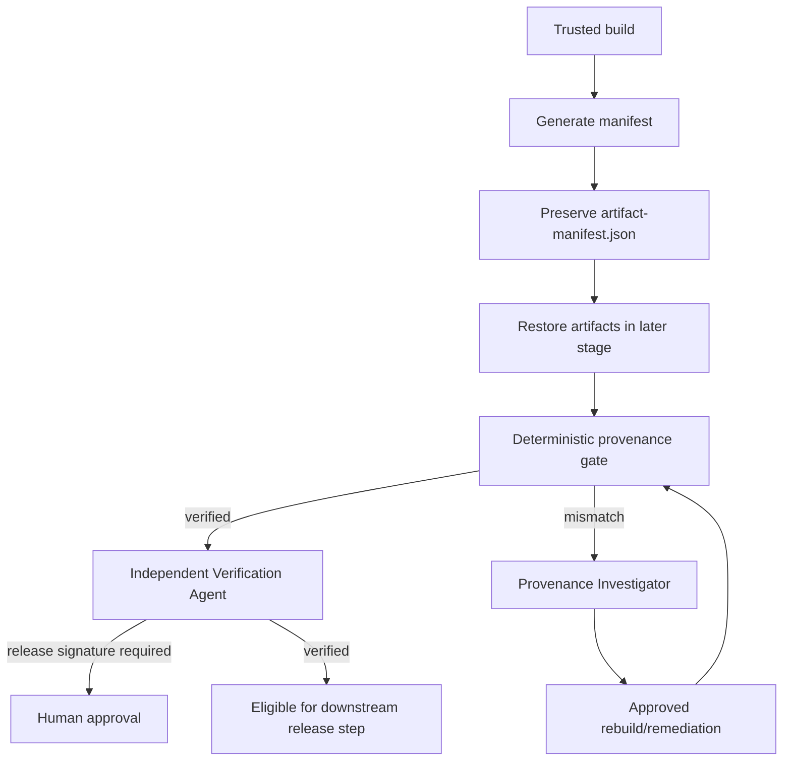

# Agent CI Artifact Provenance Integrity Gate

A reusable safety gate for proving that CI artifacts came from the intended source commit and were not silently changed between build and release.

## Problem
Build pipelines often produce binaries, packages, archives, or publish folders that later move through signing, storage, release, and deployment stages. Without explicit provenance checks, an agent or CI job can accidentally publish artifacts built from the wrong commit, omit files, introduce unexpected files, or release content that changed after the original build.

## Purpose
This kit adds deterministic artifact hashing, commit binding, bounded investigation, independent verification, and approval boundaries before signing or release publication.

## When to use
Use after producing build artifacts, before release publication, when restoring artifacts in a later CI stage, during release reproduction, or when investigating suspected artifact tampering/provenance drift.

## When not to use
Do not use it as a substitute for a trusted build environment, package signing, SBOM generation, dependency verification, or deployment authorization. It verifies configured artifacts and commit association; it does not establish trust in compromised source or runners.

## Architecture



## Package tree

```text
agent-ci-artifact-provenance-integrity-gate/
├── README.md
├── config/
│   └── policy.yaml
├── examples/
│   └── artifact-manifest.json
├── hooks/
│   └── lifecycle.md
├── rules/
│   └── artifact-integrity-safety.md
├── schemas/
│   └── provenance-result.schema.json
├── scripts/
│   ├── provenance_gate.py
│   └── verify_package.py
├── skills/
│   └── artifact-provenance-investigation.md
├── subagents/
│   ├── provenance-investigator.md
│   └── verification-agent.md
├── templates/
│   └── ci-snippet.yml
├── tests/
│   └── test_provenance_gate.py
└── workflows/
    └── artifact-provenance-gate.md
```

## Component responsibilities
- `scripts/provenance_gate.py`: deterministic commit, manifest, SHA-256, missing/unexpected artifact, and release-signature gate.
- `config/policy.yaml`: tool-neutral safety configuration.
- `schemas/provenance-result.schema.json`: structured output contract.
- `skills/artifact-provenance-investigation.md`: evidence-driven investigation procedure.
- `subagents/provenance-investigator.md`: root-cause owner for mismatches.
- `subagents/verification-agent.md`: independent final verifier.
- `rules/artifact-integrity-safety.md`: mandatory/forbidden behavior.
- `workflows/artifact-provenance-gate.md`: bounded end-to-end execution model.
- `hooks/lifecycle.md`: deterministic lifecycle hook definitions.
- `templates/ci-snippet.yml`: CI integration example.
- `tests/test_provenance_gate.py`: executable behavior tests.
- `scripts/verify_package.py`: completeness and package-test verification.

## Installation
Copy this directory into a repository. Python 3.9+ is required. `pytest` is required only for package self-tests.

## Configuration
Edit `config/policy.yaml` to match real artifact roots and intentionally ignored files. Keep ignore patterns narrow. The deterministic script parses the provided simple YAML structure without third-party YAML dependencies.

CI may provide:
- `BUILD_COMMIT_SHA`: expected source commit.
- `RELEASE_BUILD=true`: enables release-signature policy handling.
- `ARTIFACT_SIGNATURE_VERIFIED=true`: indicates external signature verification already succeeded.

The kit never contains signing keys or secrets.

## Permissions
Normal generation/verification needs read access to repository metadata and local artifact files, plus write access only for `artifact-manifest.json` / `provenance-result.json` in the CI workspace. Publishing, deployment, signing, secret changes, history rewriting, and destructive cleanup are outside this kit and require explicit human approval.

## Usage
Immediately after a trusted build:

```bash
python scripts/provenance_gate.py --write-manifest --expected-commit "$BUILD_COMMIT_SHA"
```

In a later release/verification stage, restore the original artifacts and manifest, then run:

```bash
python scripts/provenance_gate.py --expected-commit "$BUILD_COMMIT_SHA"
```

Exit codes:
- `0`: verified.
- `1`: tool/environment failure.
- `2`: deterministic blocking provenance failure.
- `3`: approval required.

## Example invocation
For a .NET pipeline producing `artifacts/`, start from `templates/ci-snippet.yml` and adjust only the build command/artifact root where needed.

## Workflow
The full workflow is in `workflows/artifact-provenance-gate.md`: build → manifest → preserve evidence → verify → investigate if needed → retry at most twice after concrete remediation → independent verification → approval boundary → complete.

## Approval boundaries
Explicit human approval is required before release signing/publication when the configured policy requires signature approval, and before any production deployment, destructive cleanup, secret change, security weakening, force push/history rewrite, or infrastructure mutation. Agents must stop rather than increase permissions or bypass the policy.

## Failure handling
Transient tool/environment failures may be retried at most twice with evidence preserved. Commit/hash mismatches are deterministic failures and must not be retried as if transient. Preserve the original manifest, suspect artifacts, verification result, and relevant CI logs for investigation.

## Verification
A task is executed when the gate ran. It is verified successfully only when:
- expected commit equals repository HEAD;
- all configured artifacts exist;
- every artifact size and SHA-256 matches the original manifest;
- no unexpected artifact remains;
- output structure is valid;
- package tests pass when validating this kit;
- required release signature/approval evidence exists.

Run package self-verification with:

```bash
python scripts/verify_package.py
```

## Definition of Done
- Required source/build context was gathered.
- `artifact-manifest.json` was produced only from a trusted build stage.
- Later verification used the preserved manifest rather than silently regenerating it.
- `provenance-result.json` reports `verified`.
- No blocking mismatch remains.
- Independent verification completed.
- Required approvals/signature evidence exist for release operations.
- Remaining risk is documented rather than hidden.

## Customization
You may change artifact roots, ignore patterns, manifest limits, or release policy. Keep core verification deterministic and tool-neutral. Integrations with Codex, Claude Code, Cursor, ChatGPT, GitHub Copilot, OpenCode, or other agents should call the same scripts/contracts instead of embedding platform-specific reasoning into the integrity check.
