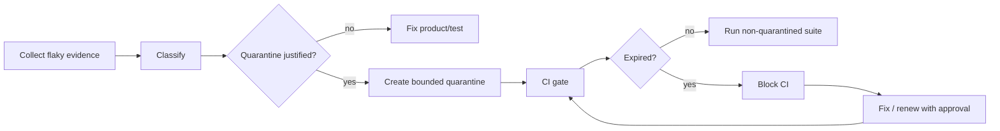

# Agent CI Flaky Test Quarantine Expiry Gate

Reusable AI engineering kit for safely quarantining flaky CI tests without allowing quarantines to become permanent blind spots.

## Problem
Flaky tests can block delivery, but disabling or quarantining them indefinitely silently reduces coverage. This kit makes quarantine temporary, evidence-based, owner-assigned, expiry-bound, and mechanically enforced.

## Trigger
Use when a test is suspected to be nondeterministic, repeatedly fails without a reproducible product defect, or an existing quarantine is near/over expiry.

## Inputs
- repository and CI configuration
- candidate test identifier
- historical pass/fail evidence
- quarantine registry at `config/quarantines.json`
- policy at `config/policy.json`
- current date in UTC or configured CI clock

## Architecture


## Package tree
```text
README.md
config/policy.json
config/quarantines.json
schemas/quarantine.schema.json
scripts/quarantine_gate.py
scripts/record_quarantine.py
scripts/verify_package.py
skills/flaky-test-investigation.md
skills/quarantine-decision.md
rules/quarantine-safety.md
subagents/flaky-test-investigator.md
subagents/quarantine-reviewer.md
subagents/verification-agent.md
workflows/flaky-test-quarantine.md
hooks/pre-quarantine.md
hooks/ci-quarantine-gate.md
examples/history.json
tests/test_quarantine_gate.py
```

## Requirements
Python 3.10+, standard library only.

## Usage
Validate registry:
```bash
python scripts/quarantine_gate.py --registry config/quarantines.json --policy config/policy.json
```

Create a quarantine entry:
```bash
python scripts/record_quarantine.py --registry config/quarantines.json --test-id tests/test_api.py::test_retry --owner team-api --reason "Fails intermittently under CI clock skew" --evidence-url "https://ci.example.invalid/run/123" --expires 2026-09-12
```

Run package verification:
```bash
python scripts/verify_package.py
```

## Policy
A quarantine must have a unique test id, owner, reason, evidence, creation date, expiry date, and status. Active quarantines must not exceed the configured maximum duration. Expired active quarantines block the gate. Renewal requires explicit human approval and fresh evidence.

## Approval boundaries
Explicit approval is required for quarantine renewal, coverage reduction beyond configured limits, disabling an entire suite, altering production behavior to avoid a flaky test, weakening security checks, destructive operations, force push/history rewrite, infrastructure changes, secrets, or production deployment.

## Retry and recovery
Transient CI history collection may retry twice. Investigation/fix cycles are limited to two before escalation. The deterministic gate itself is not retried on policy failure. Evidence is preserved in the registry and CI artifacts.

## Verification
Task execution is not success. Success requires valid registry schema, no expired active quarantines, no quarantine exceeding duration policy, quarantined count within limits, relevant build/tests passing, and independent verification.

## Definition of Done
- flaky behavior has reproducible or statistical evidence
- quarantine decision is justified and owner-assigned
- expiry is within policy
- deterministic gate passes
- host CI passes under the declared quarantine set
- repair issue/work item is traceable in `reason` or `evidence_url`
- independent verifier confirms no hidden blanket disablement
- no approval-required action remains

## Portability
Core logic is agent-neutral and works with Codex, Claude Code, Cursor, ChatGPT, GitHub Copilot, OpenCode, or other coding agents. CI-specific integration only needs to call the scripts.
