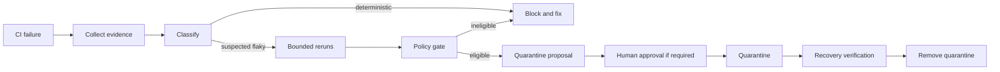

# Agent CI Flaky-Test Quarantine Gate

A reusable, evidence-driven workflow for detecting nondeterministic CI tests, distinguishing flaky behavior from deterministic regressions, applying bounded quarantine only when policy allows it, and proving recovery before quarantine removal.

## Problem
Intermittent tests waste CI capacity and train agents to rerun failures blindly. Blind retries can also hide real regressions. This kit makes retry evidence explicit and treats quarantine as a controlled, reversible exception.

## Use when
Use after a test fails in CI and the same revision can be rerun safely. It is suitable for unit, integration, API, and E2E suites where individual test identities can be extracted.

Do not use to suppress deterministic failures, security checks, migration checks, compliance gates, or tests whose failure may indicate data loss.

## Architecture

## Package tree
- `skills/investigate-flaky-test.md`
- `skills/recover-quarantined-test.md`
- `rules/flaky-test-safety.md`
- `subagents/failure-investigator.md`
- `subagents/verification-agent.md`
- `workflows/flaky-test-quarantine.md`
- `hooks/pre-quarantine.md`
- `hooks/final-verification.md`
- `scripts/flaky_gate.py`
- `scripts/verify_package.py`
- `config/policy.json`
- `schemas/evidence.schema.json`
- `templates/evidence.json`
- `examples/evidence-pass.json`
- `tests/test_flaky_gate.py`

## Installation
Requires Python 3.10+. Copy this directory into a repository. No third-party Python packages are required.

## Configuration
Edit `config/policy.json`. Protected test patterns are never quarantine-eligible. The default evidence threshold requires at least 3 observations with both pass and fail outcomes, and caps automated reruns at 3.

## Usage
Record observations in an evidence JSON file, then run:

`python scripts/flaky_gate.py evaluate --evidence evidence.json --policy config/policy.json`

Validate the package itself with:

`python scripts/verify_package.py`

Run unit tests with:

`python -m unittest discover -s tests -v`

## Workflow
The Failure Investigator owns evidence collection and classification. The implementing agent may repair the test or product code, but the Verification Agent independently verifies the final state. Reruns are bounded and always use the same revision and materially equivalent environment.

## Approval boundaries
The workflow stops for approval before disabling or skipping a protected test, changing CI required checks, weakening assertions/security controls, changing production configuration, destructive database operations, or merging a quarantine that policy marks as approval-required.

## Failure handling
Transient runner/tool failures may be retried up to 2 times and are not counted as test observations. Test reruns are capped by `max_test_reruns`. Repeated infrastructure failures stop with preserved evidence. A deterministic repeated failure is never converted into a flaky classification merely to unblock CI.

## Verification
A quarantine decision is valid only when the evidence schema is valid, revision identity is stable, minimum observations are met, both pass and fail outcomes exist, protected-pattern checks pass, and the gate returns `quarantine_eligible`. Recovery requires the configured consecutive passing observations on the same candidate fix revision.

## Definition of Done
Evidence is preserved; classification is explicit; retry limits were respected; no protected test was silently disabled; any required approval exists; the final verification agent reviewed results; quarantine has an owner/reason when used; and the gate/test/package verification commands pass.

## Customization
Change thresholds and protected patterns in `config/policy.json`. Adapt CI-specific test-result parsing outside the core gate; keep the evidence contract unchanged so the workflow remains portable across coding agents and CI systems.
