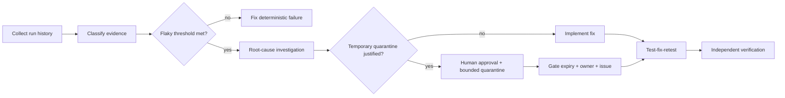

# Agent CI Flaky Test Quarantine Gate

A reusable AI engineering kit for diagnosing flaky tests, deciding whether quarantine is justified, enforcing bounded quarantine, and preventing a coding agent from hiding deterministic failures behind retries or permanent skips.

## Problem
Intermittent CI failures waste developer time and can destabilize autonomous coding workflows. Blind retries make the build look green without proving correctness, while permanent skips silently reduce coverage. This kit provides evidence-based classification, temporary quarantine with expiry, deterministic policy enforcement, and independent verification.

## Trigger
Use when a test fails intermittently across CI runs, passes on rerun without a code change, exhibits timing/order/environment sensitivity, or when an agent proposes retry/skip/quarantine logic.

## Inputs
- CI test history exported as JSON
- repository and test code
- `config/flaky-test-policy.json`
- optional `config/quarantine.json`
- host build/test commands

## Architecture


## Package tree
```text
README.md
config/flaky-test-policy.json
config/quarantine.json
schemas/history.schema.json
schemas/quarantine.schema.json
scripts/flaky_test_gate.py
scripts/verify_package.py
skills/classify-flakiness.md
skills/root-cause-flaky-test.md
skills/plan-quarantine.md
rules/flaky-test-safety.md
subagents/test-investigator.md
subagents/quarantine-reviewer.md
subagents/verification-agent.md
workflows/flaky-test-quarantine.md
hooks/pre-change.md
hooks/post-change.md
examples/history.json
examples/quarantine.example.json
tests/test_flaky_test_gate.py
```

## Requirements
Python 3.10+. Executable scripts use only the standard library.

## Configuration
`config/flaky-test-policy.json` controls minimum observations, minimum pass/fail counts, flaky-rate bounds, maximum quarantine duration, and retry limits. `config/quarantine.json` is the active quarantine registry and should be committed when used.

## History format
Each observation contains `test`, `status`, `run_id`, and optional `commit`, `attempt`, and `duration_ms`. Valid statuses are `passed` and `failed`. Observations for the same test must represent actual executions; synthetic duplication is forbidden.

## Usage
```bash
python scripts/flaky_test_gate.py \
  --history examples/history.json \
  --quarantine config/quarantine.json \
  --policy config/flaky-test-policy.json \
  --output flaky-report.json

python scripts/verify_package.py
```

Exit codes: `0` policy satisfied, `1` blocking flaky/quarantine finding, `2` invalid input/configuration.

## Approval boundaries
Explicit human approval is required before adding a test to quarantine, increasing quarantine duration, converting a failing test into skip/ignore behavior, weakening coverage, or changing CI policy. Production deployment, destructive data/file operations, secret changes, infrastructure changes, force push/history rewrite, breaking public APIs, or security weakening also require explicit approval.

## Failure and recovery
Transient CI/log retrieval failures may retry twice. Invalid history does not retry blindly. Implementation test-fix-retest loops are limited to two cycles. Expired quarantine always blocks. Unknown ownership or missing issue reference blocks quarantine approval.

## Verification
Task execution is not verification. Verification requires deterministic gate success, host build/tests, no expired quarantine, every active quarantine having owner/issue/expiry/reason, independent review, and evidence that deterministic failures were not mislabeled as flaky.

## Definition of Done
- failing test history is collected and valid
- flakiness classification is evidence-based
- root-cause hypotheses are tested individually
- deterministic failures are fixed rather than quarantined
- any quarantine is approved, owned, issue-linked, and unexpired
- relevant tests/build pass under defined policy
- independent verifier signs off
- residual risks are documented
- no blocking failure remains

## Portability
The workflow is agent-neutral and can be used with Codex, Claude Code, Cursor, ChatGPT, GitHub Copilot, OpenCode, or other coding agents. CI-specific history adapters can feed the normalized JSON format without changing core policy logic.
