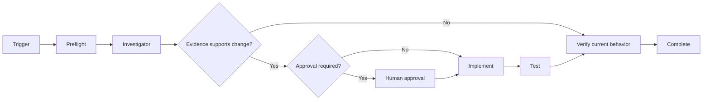

# Agent Circuit Breaker State Transition Gate

Reusable AI-engineering kit for investigating, changing, and independently verifying circuit-breaker behavior around unreliable dependencies.

## Problem
Circuit breakers can amplify incidents when agents misclassify caller errors as dependency failures, open too early, probe too aggressively, close without enough recovery evidence, or combine retries with an open breaker. Ad-hoc prompts rarely preserve the evidence needed to prove state transitions are correct.

## Purpose
Turn breaker work into an evidence-first workflow with deterministic validation, bounded retries, explicit approval boundaries, regression tests, and independent verification.

## When to use
Use for unexpected open/half-open states, dependency incidents, resilience refactors, fallback storms, or proposed breaker-policy changes. Do not use as a generic retry library or to make production policy changes without approval.

## Architecture


## Package tree
```text
agent-circuit-breaker-state-transition-gate/
├── README.md
├── config/policy.yaml
├── examples/open-circuit.json
├── hooks/final-verification.md
├── hooks/pre-task.md
├── rules/circuit-breaker-safety.md
├── schemas/evidence.schema.json
├── scripts/validate-circuit.py
├── skills/implement-breaker-fix.md
├── skills/investigate-breaker.md
├── subagents/breaker-investigator.md
├── subagents/verification-agent.md
├── templates/evidence.json
├── tests/test_validate_circuit.py
└── workflows/circuit-breaker-gate.md
```

## Installation
Copy this directory into the target repository. Python 3.9+ is sufficient for the deterministic validator/tests; the core agent instructions are tool-neutral. Adapt `config/policy.yaml` to the application's actual breaker policy before using it as evidence.

## Configuration
`failure_rate_threshold` is a fraction from 0 to 1. `minimum_requests` prevents opening on tiny samples. `open_duration_seconds` controls the cool-down before half-open. `half_open_max_probes` bounds recovery concurrency. `half_open_successes_to_close` defines recovery evidence. Retryable/non-retryable status lists are examples and must match the application's dependency semantics.

## Permissions
Default to repository read/write and non-production test execution. Production logs should be read-only and redacted. Production policy/config, secrets, infrastructure, destructive actions, breaking contracts, disabling the breaker, or increasing tolerated failure require explicit human approval.

## Usage
1. Read `rules/circuit-breaker-safety.md` and `workflows/circuit-breaker-gate.md`.
2. Copy `templates/evidence.json` and populate it from real ordered observations.
3. Follow `skills/investigate-breaker.md` before editing code.
4. Validate evidence: `python scripts/validate-circuit.py path/to/evidence.json --min-requests 10 --threshold 0.5`.
5. If a defect is confirmed, follow `skills/implement-breaker-fix.md`.
6. Run validator tests: `python -m unittest tests/test_validate_circuit.py`.
7. Have the independent Verification Agent execute `hooks/final-verification.md`.

Example: `python scripts/validate-circuit.py examples/open-circuit.json` should exit 0 and report an expected baseline state of `open`.

## Workflow and ownership
The Breaker Investigator owns evidence and root-cause classification. The implementation owner makes the smallest justified change. The Verification Agent independently proves the result. `workflows/circuit-breaker-gate.md` defines checkpoints, failure paths, bounded retries, and handoffs.

## Failure handling
Transient read/tool failures are retried at most twice. An implementation/test correction receives one evidence-driven retry. Permission, approval, or validation failures are not blindly retried. Every stop preserves the command/error/evidence and returns `failed` or `blocked`, never a false success.

## Verification
Success requires relevant tests, deterministic evidence validation when applicable, scoped diff inspection, approval evidence where required, and independent verification. `Task executed` is not equivalent to `Task verified successfully`.

## Definition of Done
The root cause or correct behavior is evidenced; required code/config/test artifacts exist; focused and relevant regression tests pass; deterministic validation passes; approval-bound actions have approval; independent verification is `passed`; remaining risks are documented; no unintended changes or blocking failures remain.

## Customization
Map policy values and error classifications to the target runtime (for example Polly/.NET, Resilience4j, Envoy, service mesh, or a custom client). Keep the workflow/rules/contracts unchanged unless project-specific safety requirements are stricter. Extend the validator only with deterministic policy semantics that can be tested.
