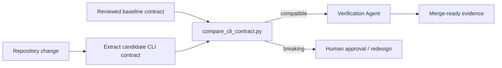

# Agent CLI Contract Regression Gate

A reusable, deterministic compatibility gate for AI-assisted changes to command-line interfaces. It compares a reviewed CLI baseline contract with a candidate contract and blocks breaking changes unless they are explicitly approved.

## Problem

CLI changes often look local but break scripts, CI jobs, runbooks, wrappers, and human workflows. Typical regressions include removing commands or flags, changing requiredness, narrowing accepted values, altering defaults, or changing documented exit-code semantics. AI coding agents can easily make these changes while local tests still pass.

This package makes CLI compatibility explicit and machine-checkable.

## When to use

Use before merging changes that modify commands, subcommands, options, positional arguments, defaults, accepted values, environment-variable fallbacks, or documented exit codes.

Do not use it as a substitute for end-to-end CLI tests or for reviewing intentionally redesigned interfaces. Breaking changes still require explicit human approval and a migration plan.

## Architecture



## Package tree

```text
agent-cli-contract-regression-gate/
├── README.md
├── config/
│   └── policy.json
├── examples/
│   ├── baseline.json
│   ├── breaking-candidate.json
│   └── compatible-candidate.json
├── hooks/
│   ├── post-edit.md
│   └── pre-merge.md
├── rules/
│   └── cli-compatibility.md
├── schemas/
│   ├── cli-contract.schema.json
│   └── cli-report.schema.json
├── scripts/
│   ├── compare_cli_contract.py
│   └── verify_package.py
├── skills/
│   ├── capture-cli-contract.md
│   └── review-cli-regression.md
├── subagents/
│   ├── cli-contract-explorer.md
│   └── verification-agent.md
├── tests/
│   └── test_compare_cli_contract.py
└── workflows/
    └── cli-contract-change.md
```

## Requirements

- Python 3.10+
- Standard library only
- A repository-specific adapter or test that emits the candidate CLI contract JSON

## Contract model

A CLI contract contains commands. Each command contains options, positional arguments, and documented exit codes.

Compatibility rules implemented by the script:

- Removing an existing command is breaking.
- Removing an existing option is breaking.
- Making an optional option required is breaking.
- Narrowing option choices is breaking.
- Changing an existing option default is breaking unless allowed by policy.
- Removing an accepted positional argument is breaking.
- Making a positional argument newly required is breaking.
- Removing a documented exit code is breaking.
- Adding commands/options/choices is compatible by default.

## Usage

Compare a compatible candidate:

```bash
python scripts/compare_cli_contract.py \
  --baseline examples/baseline.json \
  --candidate examples/compatible-candidate.json \
  --policy config/policy.json
```

Compare a breaking candidate:

```bash
python scripts/compare_cli_contract.py \
  --baseline examples/baseline.json \
  --candidate examples/breaking-candidate.json \
  --policy config/policy.json
```

Write a machine-readable report:

```bash
python scripts/compare_cli_contract.py \
  --baseline path/to/baseline.json \
  --candidate path/to/candidate.json \
  --policy config/policy.json \
  --output artifacts/cli-contract-report.json
```

## Exit codes

| Code | Meaning |
|---:|---|
| 0 | Compatible |
| 2 | Breaking changes detected |
| 4 | Invalid input or policy |
| 5 | Internal error |

## Integration

1. Capture the reviewed baseline using `skills/capture-cli-contract.md`.
2. Generate the candidate contract from the changed CLI using repository-native code/tests.
3. Run `scripts/compare_cli_contract.py`.
4. If compatible, run normal CLI tests and the independent verification workflow.
5. If breaking, stop. Either restore compatibility or obtain explicit human approval with a migration plan.

## Approval boundaries

Human approval is required before intentionally accepting a breaking CLI contract. Approval must identify the exact findings, affected commands/options, migration strategy, and release communication plan. This package does not automatically mutate the baseline after a breaking change.

## Failure and recovery

- Invalid contract JSON: fix the extractor or contract data; do not bypass the gate.
- Missing baseline: stop and capture/review one before claiming compatibility.
- Breaking finding: fix the candidate or escalate for explicit approval.
- Tool failure: preserve inputs and rerun at most once after fixing the deterministic failure.
- Repeated verification failure: stop after two implementation/fix cycles and preserve evidence.

## Verification

Run:

```bash
python scripts/verify_package.py
```

This validates JSON assets, executes the unit tests, and checks both compatible and breaking examples.

## Definition of Done

A CLI change is verified only when:

1. Baseline and candidate contracts are valid.
2. The comparator reports no unapproved breaking findings.
3. Repository-native CLI tests pass.
4. Help/output snapshots or contract extractor tests pass where applicable.
5. Independent verification confirms the candidate contract matches actual behavior.
6. Any approved breaking change has explicit migration and release evidence.
7. No blocking failure remains.

## Customization

Edit `config/policy.json` to allow documented default changes or to tune which compatibility checks are enforced. Add repository-specific extraction code outside this package, but keep the normalized contract shape stable.