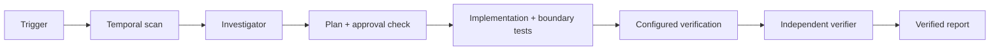

# Agent Clock & Time-Zone Boundary Gate

A reusable implementation kit for finding, fixing, and independently verifying date/time defects caused by implicit clocks, UTC/local conversion, DST transitions, calendar boundaries, recurring schedules, and range semantics.

## Problem
Temporal bugs frequently pass normal tests because they appear only at midnight, offset transitions, leap/calendar boundaries, or on machines configured with a different local zone. Coding agents can amplify the risk when timestamp semantics are inferred rather than proven.

## When to use
Use for scheduled/background jobs, expiry, reminders, booking windows, reporting dates, audit timestamps, cross-region APIs, date-range queries, or production incidents involving time. Do not use this gate as a replacement for product decisions when ambiguous/invalid local-time policy is genuinely unspecified.

## Architecture


## Package tree
```text
agent-clock-timezone-boundary-gate/
├── README.md
├── config/temporal-gate.json
├── hooks/final-verification.md
├── hooks/pre-task-temporal-scan.md
├── rules/temporal-safety.md
├── schemas/verification.schema.json
├── scripts/temporal_scan.py
├── scripts/verify_temporal_gate.py
├── skills/clock-timezone-boundary-analysis.md
├── skills/temporal-boundary-test-design.md
├── subagents/independent-temporal-verifier.md
├── subagents/temporal-implementation-agent.md
├── subagents/temporal-investigator.md
├── templates/temporal-investigation-report.md
├── tests/test_temporal_scan.py
└── workflows/temporal-boundary-workflow.md
```

## Installation
Copy this directory into a repository. Python 3.9+ is the only package-level runtime dependency. The target project's own build/test dependencies remain unchanged.

## Configuration
Edit `config/temporal-gate.json`. Set `business_timezone` to the authoritative zone and replace `verification_commands` with repository-specific formatter/build/test commands. Commands execute from the repository root. Keep destructive or production commands out of this list.

## Permissions
Investigation needs read access and local command execution. Implementation needs normal source/test write access. Production, infrastructure, schema, migration, secret, scheduler, public-contract, and security-control changes remain human-approval boundaries.

## Usage
Run the preflight inventory:

```bash
python scripts/temporal_scan.py --root . --output .ai-temporal/scan.json
```

Follow `workflows/temporal-boundary-workflow.md`, using `templates/temporal-investigation-report.md` to keep facts and hypotheses separate. After implementation run:

```bash
python scripts/verify_temporal_gate.py --config config/temporal-gate.json
```

The verifier writes `.ai-temporal/verification.json`. The scan is heuristic: a finding is a candidate for investigation, not proof of a bug.

## Component responsibilities
`skills/clock-timezone-boundary-analysis.md` defines evidence gathering and correction. `skills/temporal-boundary-test-design.md` defines boundary coverage. The investigator cannot edit; the implementation agent cannot be the sole verifier; the independent verifier cannot edit while verifying. Hooks connect deterministic scripts to lifecycle checkpoints.

## Workflow and retries
The workflow is bounded. Transient tool failures retry at most twice. Deterministic implementation-caused build/test failures permit at most two fix/retest cycles. Unknown business semantics, missing approval, permission failures, and unsafe production changes stop instead of looping.

## Approval boundaries
Explicit human approval is mandatory before database schema or persisted timestamp representation changes, migrations, production scheduler/config changes, infrastructure changes, public API breaking changes, destructive data operations, secret changes, or weakened security controls.

## Verification
Success means the affected temporal path is inventoried, relevant exact boundaries are tested, configured commands all exit zero, the diff contains no unapproved dangerous change, and independent verification accepts the evidence. Generated code alone is not verification.

## Definition of Done
The task is done only when required context is gathered; facts/hypotheses are separated; relevant UTC/local, range, DST, and calendar boundaries are covered; intended changes and tests exist; configured checks pass; required approvals exist; `.ai-temporal/verification.json` is produced with `status: verified`; and remaining risks are documented.

## Customization
Add language-specific scan patterns only when they produce actionable candidates. Add project test/build commands in configuration rather than hard-coding them into agent instructions. Keep business-zone policy in project-owned configuration and requirements, not in prompts.