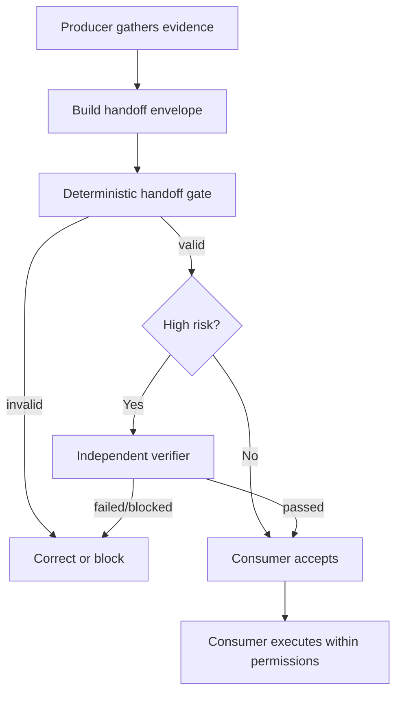

# Agent Cross-Agent Handoff Integrity Gate

Reusable AI engineering kit for preventing context loss, unsupported claims, stale artifacts, and false completion when work moves between coding agents or between agent roles.

## Problem
Multi-agent workflows often fail at boundaries rather than inside individual agents. A repository explorer may hand a planner an unsupported assumption, an implementation agent may omit a failed test, or a reviewer may consume stale artifacts. Plain-language handoffs make facts, hypotheses, verification, and approval state difficult to distinguish.

## Purpose
This package introduces a structured handoff envelope, deterministic validation, artifact hashing, independent verification for high-risk work, bounded retry rules, and lifecycle hooks. It is tool-neutral and can be adapted to Codex, Claude Code, Cursor, ChatGPT, GitHub Copilot, OpenCode, or other agents that can read/write JSON and invoke local scripts.

## When to use
Use when task ownership transfers between repository exploration, planning, implementation, testing, QA, security, database, performance, architecture, or verification agents; when a long-running agent checkpoints work; or whenever a downstream agent would otherwise need to trust an informal summary.

## When not to use
Do not add this ceremony to a single-agent, low-risk task with no ownership transfer and no meaningful state to preserve. Do not use the gate as a substitute for task-specific tests or human approvals.

## Architecture



The envelope explicitly separates facts, hypotheses, decisions, evidence, open questions, artifacts, and verification. `scripts/handoff_gate.py` validates semantic invariants that generic JSON parsing alone cannot prove.

## Package tree

```text
agent-cross-agent-handoff-integrity-gate/
├── README.md
├── config/
│   └── handoff-policy.yaml
├── examples/
│   └── valid-handoff.json
├── hooks/
│   └── lifecycle.md
├── rules/
│   └── handoff-integrity.md
├── schemas/
│   └── handoff-envelope.schema.json
├── scripts/
│   ├── handoff_gate.py
│   └── verify_package.py
├── skills/
│   ├── prepare-handoff.md
│   └── verify-handoff.md
├── subagents/
│   ├── handoff-producer.md
│   └── handoff-verifier.md
├── templates/
│   └── handoff-envelope.json
├── tests/
│   └── test_handoff_gate.py
└── workflows/
    └── cross-agent-handoff-gate.md
```

## Component responsibilities
- `skills/prepare-handoff.md`: repeatable procedure for producing evidence-backed handoffs.
- `skills/verify-handoff.md`: independent verification procedure.
- `rules/handoff-integrity.md`: enforceable MUST/MUST NOT/SHOULD boundaries.
- `subagents/handoff-producer.md`: producer ownership and permissions.
- `subagents/handoff-verifier.md`: independent verifier ownership and permissions.
- `workflows/cross-agent-handoff-gate.md`: end-to-end bounded workflow, retries, approval points, and Definition of Done.
- `hooks/lifecycle.md`: deterministic pre-transfer, artifact-integrity, high-risk, and package-verification hooks.
- `scripts/handoff_gate.py`: non-destructive semantic validator and local artifact hash verifier.
- `scripts/verify_package.py`: verifies the package tree and validates the included example.
- `schemas/handoff-envelope.schema.json`: structured handoff contract.
- `config/handoff-policy.yaml`: portable policy defaults.
- `templates/handoff-envelope.json`: editable starting envelope.
- `examples/valid-handoff.json`: concrete valid normal-risk handoff.
- `tests/test_handoff_gate.py`: executable unit coverage for core safety invariants.

## Installation
Copy this directory into the target repository, or copy its contents under an agent tooling folder of your choice. Python 3.10+ is required. The gate itself uses only the Python standard library. YAML policy is intentionally declarative; no YAML library is required by the current script.

Make the script executable on Unix-like systems if desired:

```bash
chmod +x scripts/handoff_gate.py scripts/verify_package.py
```

## Configuration
Edit `config/handoff-policy.yaml` to align risk tags, retry count, required fields, and artifact policy with the repository. Keep the core invariants aligned with `rules/handoff-integrity.md` and the scripts. If you change a status or required field, update the schema, scripts, tests, workflow, and README together.

## Permissions
Producer and verifier roles should use least privilege. Normal handoff preparation needs repository read/search plus permission to run local non-destructive checks. Independent verification should normally be read-only except for temporary local test artifacts. The package never authorizes production deployment, destructive SQL, file/data deletion, schema changes, force push/history rewrite, infrastructure changes, secret changes, production configuration changes, breaking API changes, security weakening, irreversible migrations, or large dependency upgrades.

## Usage
Start from the template and populate real task state:

```bash
cp templates/handoff-envelope.json handoff.json
python scripts/handoff_gate.py handoff.json
```

When the envelope references local artifacts with `file:` paths:

```bash
python scripts/handoff_gate.py handoff.json --root . --verify-files
```

For a high-risk handoff moving to `verified`:

```bash
python scripts/handoff_gate.py handoff.json --independent-verifier verification-agent
```

Run package self-verification and tests:

```bash
python scripts/verify_package.py
python -m unittest discover -s tests -p 'test_*.py'
```

## Example invocation
A repository explorer can prepare an envelope after locating an entry point and nearby tests, validate it, and hand it to a planner. If the task is tagged `security`, `database`, `production`, `infrastructure`, `secrets`, or `breaking-api`, the implementation producer cannot be the only verifier before status becomes `verified`.

## Workflow
1. Gather only task-relevant context.
2. Separate facts from hypotheses.
3. Attach evidence IDs to confirmed facts.
4. Record decisions, open questions, approvals, and artifact hashes.
5. Validate deterministically.
6. Independently verify high-risk handoffs.
7. Consumer checks sufficiency and currentness.
8. Proceed, return, fail, or block based on evidence.

Retries are bounded: deterministic validation failures require a correction; transient test/tool failures may be retried at most twice while preserving failure evidence. Permission and approval failures are not bypassed by escalating privileges.

## Approval boundaries
Explicit human approval is required before production deployment, destructive data operations, database schema changes, file/data deletion, force push/history rewriting, infrastructure changes, secret changes, production configuration changes, breaking API contracts, weakening security controls, irreversible migrations, or large dependency upgrades. Agents stop at the approval boundary.

## Failure handling
- Missing evidence: downgrade the statement to a hypothesis or mark the handoff blocked.
- Contradictory evidence: mark failed and return to the producer/planner.
- Stale repository state: refresh only relevant evidence and rebuild the handoff.
- Artifact digest mismatch: stop; re-establish provenance before proceeding.
- Tool/environment failure: preserve output; retry transient failures at most twice.
- Permission/approval failure: mark blocked; never silently increase privileges.

## Verification
A handoff is structurally executable when the deterministic gate exits 0. It is engineering-verified only when its task-specific checks have actually passed and the envelope records that evidence. A high-risk handoff additionally requires a verifier distinct from the producer. Schema validity or code generation alone is never proof of task correctness.

## Definition of Done
- Required handoff context is present.
- Facts, hypotheses, decisions, evidence, questions, artifacts, and verification are distinct.
- Confirmed `ready`/`verified` facts reference evidence.
- Artifact SHA-256 values are present and match when local verification is requested.
- Required independent verification is complete for high-risk work.
- Verification status matches reproduced evidence.
- Approval-required actions remain stopped unless explicit approval exists.
- Bounded retry rules were respected.
- No blocking failure remains.
- Package self-verification and unit tests pass after package changes.

## Customization
Add repository-specific risk tags, evidence types, or adapters outside the core contract when they provide real value. Keep tool-specific integrations isolated from the reusable workflow. When extending the envelope, prefer a small field with deterministic validation over free-form prose that downstream agents cannot reliably verify.
