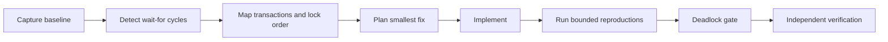

# Agent Database Deadlock Reproduction Gate

Reusable evidence-first kit for proving that a database deadlock is reproducible before a fix and absent across bounded post-fix runs.

## Problem
Database deadlocks are often declared fixed after code inspection or a single passing test. That is weak evidence because timing-dependent lock cycles may disappear temporarily without the underlying lock-order inversion being removed.

## Trigger
Use after a deadlock incident, when changing transaction boundaries/lock order, after EF Core or SQL changes affecting concurrent writes, or before closing a deadlock-related bug.

## Inputs
- normalized baseline deadlock capture
- normalized candidate reproduction capture
- repository paths for affected transaction code
- host build/test evidence
- optional human approval for schema/index/production changes

## Architecture


## Package tree
```text
README.md
config/policy.json
schemas/deadlock-capture.schema.json
schemas/deadlock-report.schema.json
scripts/deadlock_gate.py
scripts/verify_package.py
skills/reproduce-deadlock.md
skills/plan-lock-order-fix.md
rules/database-deadlock-safety.md
subagents/deadlock-investigator.md
subagents/fix-planner.md
subagents/verification-agent.md
workflows/deadlock-reproduction.md
hooks/pre-change.md
hooks/post-change.md
examples/baseline-deadlock.json
examples/candidate-clean.json
tests/test_deadlock_gate.py
```

## Requirements
Python 3.10+. Executable scripts use only the standard library.

## Capture format
A capture contains one or more runs. Each run contains transactions and wait edges. A wait edge means `waiter` is blocked by `holder` on a resource. The gate detects directed cycles in the wait-for graph.

## Usage
```bash
python scripts/deadlock_gate.py --baseline examples/baseline-deadlock.json --candidate examples/candidate-clean.json --output deadlock-report.json --min-candidate-runs 3
python scripts/verify_package.py
```

Exit codes: `0` verified clean candidate, `1` failed gate, `2` invalid input.

## Safety and approval
The workflow is read-only by default. Explicit human approval is required before destructive SQL, schema/index changes, production diagnostics that increase risk, transaction isolation changes in production, deployment, secret/config changes, force push/history rewrite, or security weakening.

## Failure and recovery
- invalid capture: stop; do not infer success
- transient reproduction tool failure: retry at most twice
- deadlock still present after fix: at most two implementation cycles
- candidate has too few runs: fail verification
- baseline does not reproduce a cycle: classify as not yet reproduced, not fixed
- unknown transaction/resource mapping: stop and escalate with evidence

## Verification
A task is verified only when the baseline demonstrates at least one cycle, candidate contains the configured minimum clean runs, host tests/build pass, changed transaction ordering is reviewed, and an independent verifier confirms the evidence.

## Definition of Done
- incident path and transactions identified
- baseline deadlock cycle reproduced
- lock-order hypothesis backed by evidence
- smallest safe fix implemented
- configured candidate reproduction runs contain zero cycles
- relevant tests/build pass
- no unapproved database/production action remains
- independent verification status is `verified`
- remaining concurrency risks documented

## Portability
Core procedures are agent-neutral and work with Codex, Claude Code, Cursor, ChatGPT, Copilot, OpenCode, or other agents. Database-specific capture adapters can normalize SQL Server deadlock graphs, PostgreSQL lock-wait evidence, MySQL/InnoDB diagnostics, or application-level tracing into the JSON contract used here.
