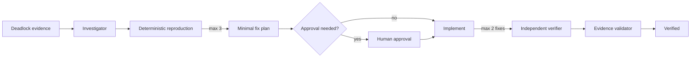

# Agent Database Deadlock Reproduction Gate

A reusable evidence-first AI engineering kit for turning intermittent database deadlocks into deterministic reproduction, a minimal cycle-breaking fix, and independent verification.

## Problem
Deadlocks are easy to misdiagnose from a victim exception alone. Agents may add retries, increase timeouts, or alter transaction/isolation behavior without proving which transactions formed the cycle. This package requires both sides of the cycle, a non-production reproduction, bounded fix attempts, and independent verification.

## When to use
Use for application/database deadlock incidents, concurrency regressions, ORM transaction changes, or PRs suspected of introducing cyclic lock acquisition. Do not use it as a generic slow-query optimizer or for ordinary lock waits without deadlock evidence.

## Architecture


## Package tree
```text
agent-database-deadlock-reproduction-gate/
├── README.md
├── config/gate.json
├── hooks/lifecycle.md
├── rules/safety.md
├── schemas/evidence.schema.json
├── scripts/scan-lock-order.py
├── scripts/validate-evidence.py
├── skills/deadlock-investigation.md
├── skills/fix-and-verify.md
├── subagents/investigator.md
├── subagents/verifier.md
├── templates/evidence.json
├── tests/test_validate_evidence.py
└── workflows/deadlock-fix.md
```

## Installation and dependencies
Copy this directory into a repository. Runtime scripts require Python 3.9+ and only the standard library. The JSON Schema is provided for external validators; `validate-evidence.py` performs the mandatory portable checks without third-party dependencies. Tests use `pytest` if you want to run the included test module.

## Configuration
`config/gate.json` fixes the safety defaults: three reproduction attempts, two fix attempts, independent verification, and approval for schema or production actions. Host projects may make policy stricter but must not silently weaken approval boundaries.

## Permissions
Default to repository read/write and non-production database/test access. Production database writes, destructive SQL, schema/index changes, isolation-level changes, production configuration, secret/permission changes, force pushes, and irreversible operations require explicit human approval.

## Usage
1. Copy `templates/evidence.json` to a run-specific evidence path.
2. Preserve sanitized database deadlock diagnostics and repository revision.
3. Run `python scripts/scan-lock-order.py <repository-root>` for heuristic discovery.
4. Follow `skills/deadlock-investigation.md` and `workflows/deadlock-fix.md`.
5. After an evidenced fix, use a separate verifier following `subagents/verifier.md`.
6. Finish with `python scripts/validate-evidence.py <evidence.json>`.
7. Optional package tests: `pytest tests/test_validate_evidence.py`.

Example agent invocation: `Investigate this deadlock using workflows/deadlock-fix.md. Treat the supplied deadlock graph as evidence, use non-production reproduction only, preserve each attempt, and stop at every approval boundary.`

## Workflow and recovery
Investigation must identify both participating transactions and their resource order. Reproduction is limited to three attempts. A fix is attempted only after `reproduction_before=true`; at most two distinct fix hypotheses are allowed, reverting a failed hypothesis before the next. Transient environment/tool failures may consume/retry within those limits. Permission failures never justify broader permissions. Repeated failure becomes `blocked` with evidence preserved.

## Verification
A verified result requires: original cycle evidence; successful pre-fix reproduction; relevant build/tests passing; post-fix harness unable to reproduce the target deadlock in three independent verifier runs; business invariants and rollback behavior intact; scoped diff; and `validate-evidence.py` exit code 0. The scanner is heuristic and never constitutes proof.

## Definition of Done
The task is done only when evidence identifies the cycle, the pre-fix harness reproduces it, the smallest safe fix is applied, independent verification succeeds, required approvals exist, evidence status is `verified`, and no blocking risk remains. Execution without this evidence is not verification.

## Customization
Adapt the reproduction harness to the host database/ORM and use engine-native deadlock diagnostics. Keep the core contracts tool-neutral. Agent-specific adapters may be added outside this package, but must preserve retry limits, approval boundaries, evidence schema, and independent verification.
