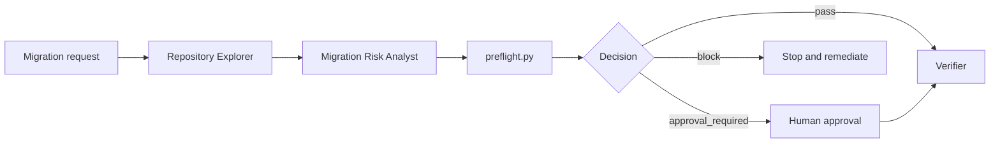

# Agent Database Migration Preflight Safety Gate

A reusable, evidence-driven gate that lets an AI agent inspect a proposed database migration without applying it. It detects destructive or high-risk operations, requires explicit approval for schema/data changes, runs deterministic policy checks, and produces a machine-readable decision.

## Problem
AI-assisted changes can generate migrations that compile but still drop data, lock large tables, rebuild indexes unexpectedly, introduce non-null columns without a safe backfill, or mix irreversible data changes with schema changes. This kit makes migration review a repeatable preflight instead of an ad-hoc prompt.

## Use when
Use before committing, merging, or executing SQL/ORM migrations. It is suitable for EF Core migrations and plain SQL repositories. Do not use it as permission to execute production migrations; execution remains outside this package.

## Architecture


## Package tree
```text
README.md
config/policy.yaml
schemas/preflight-result.schema.json
skills/collect-migration-evidence.md
skills/assess-migration-risk.md
rules/migration-safety.md
subagents/repository-explorer.md
subagents/migration-risk-analyst.md
subagents/verification-agent.md
workflows/migration-preflight.md
hooks/pre-migration.md
hooks/final-verification.md
scripts/preflight.py
templates/request.yaml
examples/safe-add-column.sql
examples/unsafe-drop-column.sql
tests/test_preflight.py
```

## Requirements
Python 3.10+ is required. PyYAML is optional: the script has a built-in default policy, while `--policy config/policy.yaml` requires `pip install pyyaml`. Tests use only the Python standard library.

## Permissions
The gate needs read access to the repository and permission to create local evidence files. It does not require database credentials, Git write permission, cloud credentials, or production access.

## Usage
From this package directory:

```bash
python scripts/preflight.py --input examples/safe-add-column.sql --output preflight-result.json
python scripts/preflight.py --input path/to/migration.sql --policy config/policy.yaml --output preflight-result.json
python -m unittest discover -s tests -v
```

For EF Core, first generate the SQL script without applying it, for example `dotnet ef migrations script <FROM> <TO> -o migration.sql`, then inspect that SQL with this gate. Never use `database update` as a preflight command.

## Workflow
1. `repository-explorer` identifies migration files, target DB/ORM, nearby conventions, and existing tests.
2. `migration-risk-analyst` follows both skills and records facts separately from hypotheses.
3. `scripts/preflight.py` scans the generated SQL deterministically and emits the structured result defined by `schemas/preflight-result.schema.json`.
4. Any `block` stops the workflow. Any `approval_required` stops before execution until explicit human approval is recorded.
5. `verification-agent` independently checks evidence, policy result, generated SQL, and scope.

## Decision semantics
`pass` means no configured risky pattern was detected; it does not prove runtime safety. `approval_required` means the change may be legitimate but requires human review before any database execution. `block` means the proposed artifact violates a blocking policy and must be changed or explicitly handled outside this automated workflow.

## Approval boundaries
Human approval is mandatory before applying any schema change, destructive SQL, data deletion, irreversible migration, production configuration change, or migration that can materially lock/rewrite production data. The agent must not infer approval from a ticket, branch name, prior approval, or successful preflight.

## Failure and recovery
Invalid/missing input is a validation failure and is not retried. Tool/read failures may be retried at most twice while preserving the previous evidence. A failed test/build is remediated once and rerun once; a second failure stops. Permission failures stop immediately. The gate never retries database execution because it never executes database changes.

## Verification
A run is verified only when the input artifact exists, deterministic preflight completed, result conforms to the documented contract, no blocking finding remains, all required approvals are explicit, tests pass, and the verifier confirms no migration execution occurred.

## Definition of Done
The migration scope and target are identified; generated SQL is captured; deterministic scan completed; every finding has evidence; blocking findings are resolved; approval-required findings have explicit approval before any external execution; tests pass; final verification is recorded; remaining risks are documented.

## Customization
Edit `config/policy.yaml` to tune keywords, severity, and limits. Keep organization-specific execution commands outside this kit so the core remains tool-neutral and non-destructive.

## Schema example

`examples/preflight-result.example.json` is a synthetic instance of `schemas/preflight-result.schema.json` for contract smoke tests. It contains no production data and demonstrates shape only; validate it with the package's documented checker or a Draft 2020-12 JSON Schema validator before adapting it.
