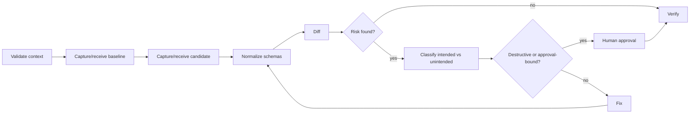

# Agent Database Schema Drift Gate

Reusable gate for AI-assisted database work that detects unintended schema drift before migrations or generated SQL are accepted.

## Problem
AI agents can edit entities, mappings, migrations, or database scripts independently. A change that appears local may produce unexpected table rebuilds, dropped columns, altered nullability, index churn, or provider-specific SQL.

## Trigger
Run after changes touching persistence models, ORM mappings, migrations, schema scripts, or dependency upgrades that can affect generated schema.

## Inputs
- repository checkout
- baseline schema snapshot or migration history
- candidate schema snapshot or generated migration SQL
- `config/schema-drift.yaml`

## Workflow


The implementation is tool-neutral: the agent supplies schema snapshots as JSON; deterministic Python performs normalization, diffing, policy evaluation, and report generation.

## Package tree
- `README.md`
- `skills/investigate-schema-drift.md`
- `skills/verify-schema-change.md`
- `rules/schema-safety.md`
- `subagents/schema-investigator.md`
- `subagents/verification-agent.md`
- `workflows/schema-drift-gate.md`
- `hooks/pre-migration.md`
- `hooks/final-verification.md`
- `scripts/schema_drift.py`
- `scripts/verify_package.py`
- `config/schema-drift.yaml`
- `schemas/schema-snapshot.schema.json`
- `examples/baseline-schema.json`
- `examples/candidate-schema.json`

## Installation
Requires Python 3.10+. No third-party Python package is required. Copy this directory into a repository. Configure the commands used by your ORM or database tooling to export baseline and candidate snapshots matching `schemas/schema-snapshot.schema.json`.

## Configuration
`config/schema-drift.yaml` documents policy defaults. The executable accepts equivalent CLI options so it remains dependency-free. Destructive changes always require approval regardless of configuration.

## Usage
```bash
python scripts/schema_drift.py --baseline path/to/baseline.json --candidate path/to/candidate.json --report artifacts/schema-drift-report.json
python scripts/verify_package.py
```
Exit `0` means no blocking drift. Exit `2` means policy-blocking drift. Exit `1` means invalid input/tool failure.

## Agent responsibilities
`schema-investigator` gathers evidence and classifies differences. It must not approve its own destructive changes. `verification-agent` independently validates snapshots, report, repository diff, and required approval evidence.

## Approval boundaries
Explicit human approval is mandatory before destructive SQL, dropped/renamed database objects, narrowing types, nullability tightening, irreversible migrations, production execution, or changes whose data-loss impact cannot be disproven. Approval applies only to the exact reviewed diff; any material schema change invalidates it.

## Failure and recovery
Invalid snapshots stop immediately. A transient schema-export command may be retried at most twice while preserving command output. A deterministic policy failure is never retried unchanged. Build/test failures may enter at most two fix/retest cycles. Permission failures stop without privilege escalation.

## Verification
A run is verified only when snapshots validate, deterministic diff completes, blocking findings are resolved or explicitly approved, repository tests/build relevant to persistence pass, generated SQL has been reviewed when applicable, and `scripts/verify_package.py` succeeds.

## Definition of Done
- baseline and candidate evidence exist
- schema diff report exists and is reproducible
- every difference is classified
- no unapproved destructive change remains
- relevant build/tests pass
- independent verification is complete
- remaining risks are recorded

## Portability
Agent instructions do not depend on a specific coding assistant. Adapt only the snapshot-export commands for EF Core, Prisma, Flyway, Liquibase, Rails, Django, or native database tooling; keep the gate contract unchanged.
