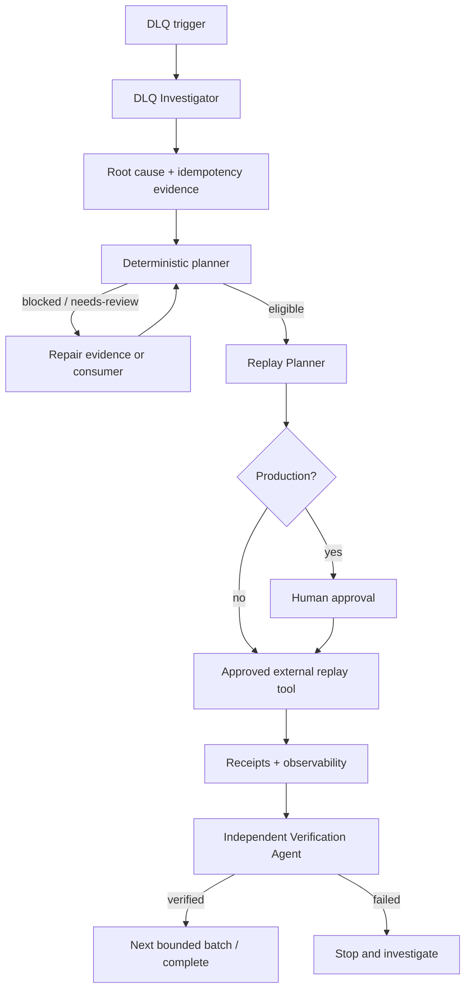

# Agent Dead-Letter Queue Replay Safety Gate

A reusable implementation kit for investigating failed queue messages, proving replay safety, generating bounded replay batches, enforcing approval boundaries, and reconciling every replay outcome before completion.

## Problem
A DLQ is not simply a backlog to resend. Messages may have failed because of schema defects, business rules, authorization errors, poison payloads, duplicate side effects, or transient infrastructure faults. Blind redrive can double-charge customers, duplicate orders, overwrite newer state, or create an infinite poison-message loop.

## Purpose
Turn DLQ recovery into an evidence-driven workflow: investigate → classify → prove idempotency → plan deterministic batches → approve dangerous execution → reconcile receipts → verify.

## When to use
Use after a consumer bug fix, upstream outage recovery, queue backlog incident, deployment rollback, or when historical dead-lettered messages may need reprocessing.

## When not to use
Do not use this kit as a queue vendor SDK, automatic production redrive daemon, message schema migration engine, or replacement for application-level idempotency. It intentionally does not send, delete, purge, or replay queue messages.

## Architecture


## Package tree
```text
agent-dead-letter-queue-replay-safety-gate/
├── README.md
├── config/replay-policy.json
├── examples/messages.jsonl
├── examples/replay-receipts.jsonl
├── hooks/post-replay.md
├── hooks/pre-replay.md
├── rules/dlq-replay-rules.md
├── schemas/message.schema.json
├── schemas/replay-plan.schema.json
├── scripts/check_changed_files.py
├── scripts/dlq_replay_gate.py
├── skills/investigate-dlq.md
├── skills/prepare-replay.md
├── subagents/dlq-investigator.md
├── subagents/replay-planner.md
├── subagents/verification-agent.md
├── tests/test_dlq_replay_gate.py
└── workflows/dlq-replay-workflow.md
```

## Component responsibilities
- **Investigation skill/agent:** traces consumer behavior, failure classes, and idempotency without queue mutation.
- **Replay planner:** turns evidence into a bounded plan and approval packet.
- **Rules:** prohibit blind redrive, unbounded retries, destructive queue actions, and silent permission escalation.
- **`dlq_replay_gate.py`:** deterministic message classifier, batch planner, and receipt reconciler. It never replays a message.
- **`check_changed_files.py`:** optional repository safety check for sensitive file classes during consumer remediation.
- **Verification Agent:** independently checks that every intended replay has an acceptable receipt and no unintended message was executed.

## Installation
Copy this directory into a repository. Requirements are Python 3.9+ for the scripts and Git for `check_changed_files.py`. The core planner/reconciler uses only the Python standard library.

On Unix, make scripts executable if needed:
```bash
chmod +x scripts/dlq_replay_gate.py scripts/check_changed_files.py
```

## Configuration
Edit `config/replay-policy.json` to match your operational policy. Safe defaults require message IDs, idempotency keys, failure reasons, non-expired messages, bounded batches, and production approval. The default permanently blocks schema-invalid, authorization, poison-message, and business-rule failures from automatic eligibility.

Policy weakening is itself an approval-required change. Do not store queue credentials, tokens, connection strings, or message secrets in configuration.

## Input contract
The planner reads JSONL. Each line should contain at least:
```json
{"message_id":"m-1","idempotency_key":"order-42","failed_at":"2026-09-06T10:00:00Z","failure_class":"transient-upstream","failure_reason":"HTTP 503","payload":{}}
```

The package does not require payload content for classification; if payload contains sensitive data, export only the minimum needed evidence.

## Usage
Generate a plan for staging:
```bash
python scripts/dlq_replay_gate.py plan \
  --input examples/messages.jsonl \
  --policy config/replay-policy.json \
  --environment staging \
  --out .dlq/replay-plan.json
```

Generate a production plan. The output is intentionally `blocked` until the workflow records explicit approval:
```bash
python scripts/dlq_replay_gate.py plan \
  --input .dlq/messages.jsonl \
  --policy config/replay-policy.json \
  --environment production \
  --out .dlq/replay-plan.json
```

After an approved external replay tool exports receipts, reconcile them:
```bash
python scripts/dlq_replay_gate.py reconcile \
  --plan .dlq/replay-plan.json \
  --receipts .dlq/replay-receipts.jsonl \
  --approved \
  --out .dlq/verification.json
```

A valid receipt is expected to carry `message_id`, matching `idempotency_key`, status `succeeded` or `deduplicated`, and an `external_receipt` reference.

## Workflow
Follow `workflows/dlq-replay-workflow.md`. The core sequence is:

```text
Context → investigate → classify → plan → approve → execute bounded batch → reconcile → independently verify
```

No retry loop is infinite. Tool/export transient failures are capped at 2 retries. Planning is capped at 2 retries after evidence/root-cause correction. A failed or ambiguous replay result has zero automatic replay retries.

## Permissions
Planning requires repository read access and access to an exported message snapshot. Consumer remediation may require normal repository edit/test permissions. Production queue mutation must be performed separately by an approved least-privilege operator/tool. The package never requires force-push, infrastructure administration, secrets-management writes, or database mutation.

## Approval boundaries
Explicit human approval is required before production replay, destructive queue operations, message deletion/purge, schema or database changes, production config/infrastructure changes, secret changes, breaking API changes, security-control weakening, irreversible migrations, or large dependency upgrades.

Agents stop before these operations and never expand permissions to unblock themselves.

## Failure handling
- **Transient export/log/tool failure:** retry at most twice and preserve each failure.
- **Validation failure:** block affected messages; do not bypass planner output.
- **Build/test failure:** repair the consumer before replay planning continues.
- **Schema/business-rule/authorization failure:** quarantine until the underlying approved change is complete.
- **Ambiguous replay outcome:** reconcile actual downstream state before any retry.
- **Verification failure:** stop subsequent batches and preserve plan, receipts, and observability evidence.

## Verification
`Task executed` means a replay command ran. `Task verified successfully` requires all of the following:
- root cause is fixed or evidenced as transient;
- idempotency/deduplication is proven;
- every replayed message was `eligible` in the immutable plan;
- required approval was recorded;
- every attempted message has exactly one acceptable success/deduplication receipt;
- no receipt exists for a non-eligible message;
- relevant consumer tests pass;
- remaining blocked messages and risks are documented.

Run package tests:
```bash
python -m unittest tests/test_dlq_replay_gate.py
```

## Definition of Done
The investigation is evidence-backed; the replay plan is deterministic; dangerous actions were explicitly approved; bounded batches were used; all replayed messages were independently reconciled; no unresolved blocking failure remains; and the final verification artifact has status `verified`.

## Customization
Adapt failure-class names, maximum message age, batch size, and approval environments in `config/replay-policy.json`. Keep vendor-specific queue commands outside the core planner so the workflow remains portable across SQS, Azure Service Bus, RabbitMQ, Kafka retry/DLQ patterns, Pub/Sub dead-letter topics, and other messaging systems.
