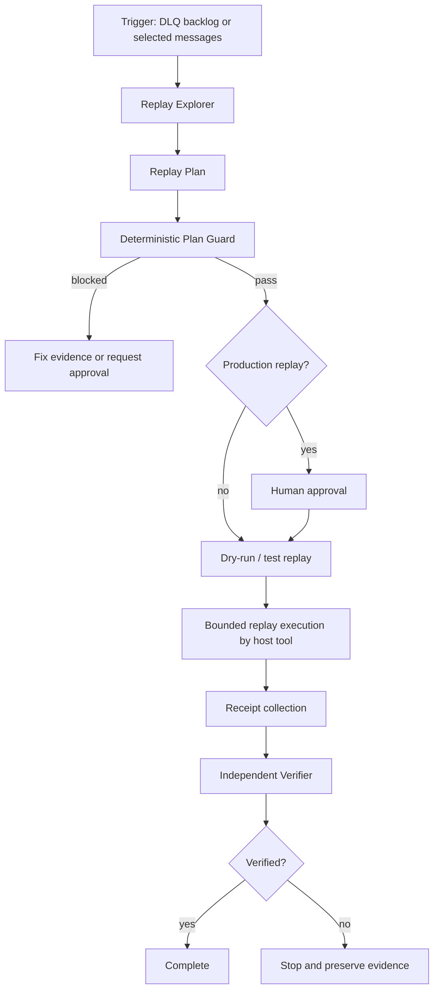

# Agent Dead-Letter Queue Replay Safety Gate

A reusable implementation kit for investigating and replaying dead-lettered messages without turning recovery into duplicate side effects, cross-tenant leakage, poison-message loops, or unbounded production writes.

## Problem

Dead-letter queues (DLQs) contain failed messages, but replaying them is not automatically safe. The original failure may still exist; handlers may be non-idempotent; message schemas or routing rules may have changed; credentials and tenant boundaries may differ; and bulk replay can overload downstream systems. An AI agent that sees “requeue these messages” can cause more damage than the original incident.

## Purpose

This package turns DLQ replay into an evidence-based workflow with deterministic plan validation, message-scope checks, bounded batch sizing, idempotency evidence, approval boundaries, replay receipts, and independent verification.

## When to use

Use this kit when investigating or preparing replay of messages from a dead-letter queue, poison queue, failed-event store, or equivalent recovery topic after a production incident, deployment defect, transient dependency outage, schema incompatibility, or handler bug.

## When not to use

Do not use it as a message broker implementation, incident paging system, schema registry, or production deployment tool. It does not authorize destructive queue operations or guarantee handler idempotency by itself; those properties must be demonstrated with repository/runtime evidence.

## Architecture



## Package tree

```text
agent-dead-letter-queue-replay-safety-gate/
├── README.md
├── config/replay-policy.json
├── examples/replay-plan.json
├── hooks/final-verification.md
├── hooks/pre-replay.md
├── rules/dlq-replay-rules.md
├── schemas/replay-plan.schema.json
├── scripts/replay_guard.py
├── scripts/validate_receipts.py
├── skills/investigate-dlq.md
├── skills/plan-safe-replay.md
├── subagents/replay-explorer.md
├── subagents/replay-planner.md
├── subagents/replay-verifier.md
├── tests/test_replay_guard.py
└── workflows/dlq-replay-workflow.md
```

## Component responsibilities

- **Replay Explorer** gathers failure, handler, schema, routing, tenant, and idempotency evidence without replaying messages.
- **Replay Planner** builds a bounded machine-readable replay plan.
- **`replay_guard.py`** validates that plan against hard safety limits and produces deterministic evidence.
- **Host replay tool** performs the actual broker-specific replay only after approval where required. This package intentionally does not ship a generic production replay command because broker semantics and authorization differ materially.
- **`validate_receipts.py`** verifies that execution receipts match the approved plan and that no unplanned message IDs were reported.
- **Replay Verifier** independently decides whether recovery is actually verified.

## Installation

Copy the package directory into a repository. Requirements are Python 3.9+ only for the included scripts and tests. No third-party Python packages are required.

## Configuration

Edit `config/replay-policy.json` to match local limits. Defaults block wildcard scopes, require explicit message IDs, cap batches at 100 messages, require idempotency evidence for replayable messages, forbid production replay without approval metadata, and limit execution retries to 2.

Policy weakening, larger production batches, wildcard replay, bypassing tenant checks, or accepting non-idempotent side effects require explicit human approval outside the package.

## Permissions

Exploration should be read-only. Plan generation only needs repository and exported message-metadata access. Production replay requires a separate broker permission scoped to the approved queue/topic and selected messages. Never grant delete/purge/admin privileges merely to perform replay.

## Usage

Validate a plan:

```bash
python scripts/replay_guard.py \
  --plan examples/replay-plan.json \
  --policy config/replay-policy.json \
  --out .dlq-replay/guard.json
```

After the host-specific replay mechanism emits a JSON receipt array, verify it:

```bash
python scripts/validate_receipts.py \
  --plan examples/replay-plan.json \
  --receipts .dlq-replay/receipts.json \
  --out .dlq-replay/receipt-verification.json
```

Run package tests:

```bash
python -m unittest tests/test_replay_guard.py
```

## Replay plan contract

The schema in `schemas/replay-plan.schema.json` requires explicit environment, queue, message IDs, tenant scope, failure cause, fix evidence, idempotency evidence, batch size, retry limit, expected handler outcome, and approval metadata when production is targeted.

## Workflow

Follow `workflows/dlq-replay-workflow.md`. The workflow separates facts, hypotheses, decisions, evidence, approvals, execution receipts, and unresolved risks. Replays are bounded by message ID set and retry count; there is no “replay until empty” loop.

## Approval boundaries

Human approval is mandatory before production replay, replaying messages with uncertain idempotency, expanding scope beyond the reviewed message set, changing queue retention/dead-letter configuration, changing secrets/credentials, purging/deleting messages, modifying production infrastructure, weakening security controls, or retrying beyond policy limits.

## Failure handling

Transient broker/tool failures may be retried at most the configured execution retry count, default 2, with receipts/logs preserved. Business-rule failures, repeated poison-message failures, idempotency uncertainty, schema mismatch, tenant mismatch, or receipt-plan mismatch are non-retryable until the underlying evidence changes. Permission failures stop immediately; permissions are never escalated automatically.

## Verification

`Task executed` means replay commands ran. `Task verified successfully` requires guard status `pass`, required approval, receipt validation, expected downstream state, no unplanned message IDs, no repeated dead-lettering for the replayed set, and independent verifier status `verified`.

## Definition of Done

- Selected message IDs and queue/environment are explicit.
- Original failure cause is evidenced or explicitly classified unresolved and blocking.
- Handler/schema/routing version compatibility is checked.
- Tenant scope and destination are verified.
- Idempotency or compensating safety evidence exists for every replayed message class.
- Plan passes deterministic guard policy.
- Required production approval exists and matches the exact plan fingerprint.
- Execution receipts match the approved message set.
- Expected side effects are verified and duplicates are absent within available evidence.
- Replayed messages do not re-enter the DLQ during the verification window.
- Remaining risks are documented and non-blocking.

## Customization

Keep broker adapters outside the core package and make them emit the same receipt contract (`message_id`, `status`, `attempt`, `timestamp`, optional `destination`). Add broker-specific checks in separate host scripts rather than weakening the generic safety rules.