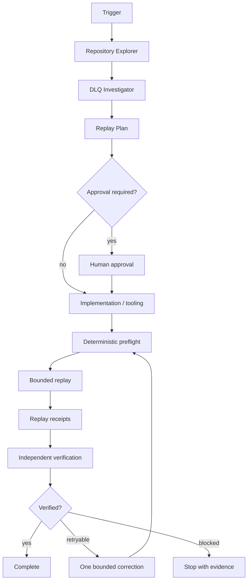

# Agent Dead-Letter Queue Replay Safety Gate

A reusable AI-engineering package for investigating and safely replaying dead-lettered messages without creating duplicate side effects, violating tenant boundaries, replaying stale commands, or turning a local recovery task into an uncontrolled production incident.

## Problem

Dead-letter queues are operationally useful but dangerous. A message can fail because of a transient dependency outage, a permanent schema mismatch, a poison payload, a business-rule violation, or code that is no longer compatible with the original event. Blind replay can double-charge customers, resend notifications, duplicate writes, trigger obsolete commands, or repeatedly poison the queue.

This package gives coding and operations agents a bounded, evidence-first workflow with deterministic validation, explicit replay plans, approval boundaries, replay receipts, and independent verification.

## Trigger

Use this package when one or more dead-lettered messages need investigation or replay, when replay tooling is being implemented or changed, or when a production incident includes DLQ accumulation.

Do not use it to bypass an existing incident process, message-retention policy, or production change-control requirement.

## Inputs

- repository root;
- DLQ evidence exported to a local JSON file;
- replay target environment;
- queue/topic/subscription identifier;
- optional message IDs or selection criteria;
- repository-specific build/test commands;
- `config/dlq-replay-gate.json`.

## Architecture



## Package tree

```text
agent-dead-letter-queue-replay-safety-gate/
├── README.md
├── config/
│   └── dlq-replay-gate.json
├── examples/
│   └── replay-evidence.example.json
├── hooks/
│   ├── post-replay-verification.md
│   └── pre-replay-validation.md
├── rules/
│   └── dlq-replay-safety.md
├── schemas/
│   └── replay-evidence.schema.json
├── scripts/
│   ├── analyze-dlq.py
│   ├── validate-replay-plan.py
│   └── verify-replay-evidence.py
├── skills/
│   ├── dlq-investigation.md
│   ├── replay-planning.md
│   └── replay-verification.md
├── subagents/
│   ├── dlq-investigator.md
│   ├── replay-implementation-agent.md
│   └── verification-agent.md
├── tests/
│   └── test-replay-gate.py
└── workflows/
    └── safe-dlq-replay.md
```

## Dependencies

Python 3.10+ is required for the deterministic scripts. They use only the standard library. Provider-specific queue clients are intentionally not included because replay execution must remain an explicit host integration, not a hidden default action.

## Installation

Copy the directory into a repository and review `config/dlq-replay-gate.json`. Keep replay execution outside these scripts unless a repository-specific adapter is added with equivalent approval and evidence controls.

Run the package self-test:

```bash
python3 -m unittest tests/test-replay-gate.py
```

## Configuration

The configuration defines:

- maximum messages allowed per replay batch;
- maximum age allowed without explicit override approval;
- fields treated as message identity and tenant identity;
- required replay-plan fields;
- statuses considered permanent/non-retryable;
- whether unknown failure classifications block replay.

## Usage

Analyze an exported DLQ sample:

```bash
python3 scripts/analyze-dlq.py \
  --input /tmp/dlq.json \
  --config config/dlq-replay-gate.json \
  --output /tmp/dlq-analysis.json
```

Validate a replay plan before any queue write occurs:

```bash
python3 scripts/validate-replay-plan.py \
  --plan /tmp/replay-plan.json \
  --config config/dlq-replay-gate.json
```

Verify the final evidence bundle:

```bash
python3 scripts/verify-replay-evidence.py \
  --evidence /tmp/replay-evidence.json
```

## Agent invocation

> Investigate the DLQ backlog using `workflows/safe-dlq-replay.md`. Do not replay anything until failure causes, idempotency behavior, message age, tenant scope, and batch size are evidenced. Production replay requires explicit human approval. Preserve replay receipts and have the Verification Agent independently verify outcomes.

## Approval boundaries

Explicit human approval is mandatory before:

- any production replay;
- replaying messages older than the configured age threshold;
- replaying a message whose handler is not proven idempotent or deduplicated;
- changing message schema, consumer compatibility behavior, infrastructure, secrets, queue retention, or production configuration;
- replaying more than the configured batch limit;
- deleting or purging DLQ messages;
- bypassing tenant, authorization, or security validation;
- destructive database work, deployment, force push, or history rewrite.

The workflow stops before these actions.

## Failure and recovery

- Validation failure blocks replay immediately.
- Unknown failure classification blocks replay by default.
- Transient tooling failures may be retried once with the same immutable plan.
- Replay execution itself is never automatically retried by this package.
- A failed replay batch is preserved as evidence and escalated; do not widen the batch.
- Permission errors never trigger automatic privilege escalation.
- If receipts cannot establish what happened, status is `reconciliation-required`, not `verified`.

## Verification

Execution and verification are separate states. A replay is verified only when:

- the exact approved plan hash is known;
- attempted message IDs are recorded;
- replay receipts record accepted/rejected/unknown outcomes;
- no unapproved message was replayed;
- idempotency/deduplication evidence exists for side-effecting handlers;
- host tests/builds required by the repository pass;
- post-replay queue and application evidence is checked;
- independent verification sets `verification_status` to `verified`.

## Definition of Done

- DLQ messages are classified by failure cause.
- Permanent failures are not silently replayed.
- Replay scope is explicit and bounded.
- Required approval exists.
- Replay execution matches the approved message set.
- Receipts exist for every attempted message.
- Unknown outcomes are reconciled or explicitly blocked.
- Independent verification is complete.
- Remaining risk is documented.
- No blocking failure remains.

## Portability

Core instructions and scripts are provider-neutral. Repository-specific Azure Service Bus, AWS SQS/SNS, Kafka, RabbitMQ, Google Pub/Sub, or custom queue adapters should be isolated in host tooling and must consume the validated replay plan rather than re-derive scope independently.
