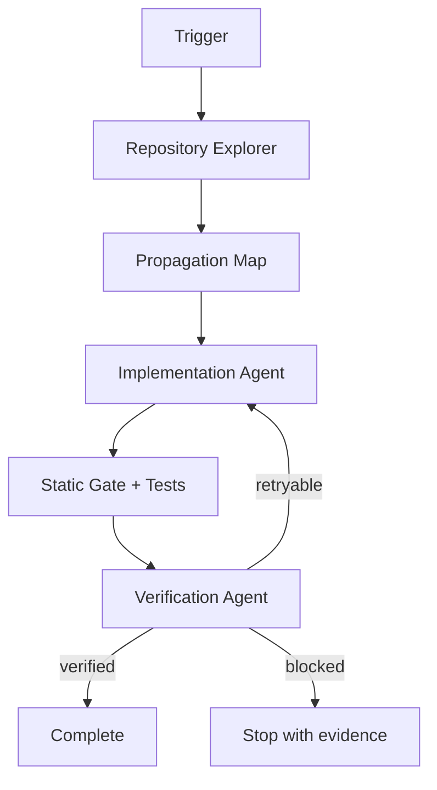

# Agent Distributed Trace Context Propagation Gate

Reusable implementation kit for finding and fixing broken distributed trace propagation across HTTP, messaging, background jobs, and asynchronous boundaries.

## Problem

Distributed traces become misleading when a service drops inbound context, creates an unrelated root span, fails to inject outbound context, forwards malformed trace headers, or reuses stale context across jobs. The code may still build and requests may succeed, so the defect often survives normal tests.

## Trigger

Use this package when adding or changing HTTP clients, message producers/consumers, schedulers, workers, OpenTelemetry instrumentation, correlation middleware, or when traces contain unexpected roots or broken parent-child relationships.

## Inputs

- repository root
- task/incident description
- changed files when available
- optional runtime trace evidence
- `config/trace-gate.json`

## Workflow



The workflow allows at most two implementation retries. The implementing agent is never the only verifier.

## Package tree

```text
agent-distributed-trace-context-propagation-gate/
├── README.md
├── config/trace-gate.json
├── examples/evidence.example.json
├── hooks/pre-task-validation.md
├── hooks/post-edit-verification.md
├── rules/safety-and-evidence.md
├── schemas/evidence.schema.json
├── scripts/run-gate.sh
├── scripts/scan-trace-propagation.py
├── scripts/validate-config.py
├── scripts/verify-evidence.py
├── skills/trace-context-investigation.md
├── skills/propagation-repair.md
├── skills/verification.md
├── subagents/repository-explorer.md
├── subagents/implementation-agent.md
├── subagents/verification-agent.md
├── tests/test-scan-trace-propagation.py
└── workflows/end-to-end.md
```

## Dependencies

Python 3.10+ using only the standard library. `run-gate.sh` requires a POSIX shell. Repository-specific build/test tools remain the host project's responsibility.

## Installation

Copy the directory into a repository. Review `config/trace-gate.json` and adjust roots/excludes only when necessary.

```bash
python3 scripts/validate-config.py --config config/trace-gate.json
python3 -m unittest tests/test-scan-trace-propagation.py
```

## Usage

```bash
./scripts/run-gate.sh --repo /path/to/repository --evidence /tmp/trace-evidence.json
```

Or run the scanner directly:

```bash
python3 scripts/scan-trace-propagation.py --repo /path/to/repository --config config/trace-gate.json --output /tmp/trace-scan.json
```

The scanner is heuristic. Findings identify boundaries requiring evidence; they do not by themselves prove a defect.

## Approval boundaries

Explicit human approval is required before production deployment, production telemetry configuration changes, sampling-policy changes, secret changes, infrastructure changes, destructive operations, force-push/history rewriting, weakening validation of inbound trace headers, or breaking public API/message contracts.

## Failure handling

- configuration/validation failure: stop and preserve output;
- build/test failure: diagnose once, then use at most two implementation retries total;
- transient tool failure: retry once;
- permission failure: stop without privilege escalation;
- missing runtime evidence: use deterministic boundary tests if they prove the contract, otherwise mark verification blocked;
- ambiguous ownership: stop before broad refactoring.

## Verification

`executed` and `verified` are different states. Verification requires:

- config validation passes;
- every affected process boundary is mapped;
- inbound extraction and outbound injection are evidenced where applicable;
- message consumers create child/linked work from valid context rather than silently unrelated roots;
- host build/tests pass;
- blocking scanner findings are resolved or explicitly evidenced as false positives;
- evidence JSON validates against `schemas/evidence.schema.json`;
- Verification Agent sets `verification_status` to `verified`;
- no approval-required action remains pending.

## Definition of Done

- propagation map exists for each affected boundary;
- facts, hypotheses, and decisions are separated;
- smallest safe repair is implemented;
- focused tests exercise the repaired boundary;
- deterministic gate passes or remaining findings are justified with evidence;
- independent verification completes;
- remaining risk is documented;
- no blocking failure remains.

## Portability

Core instructions are tool-neutral and can be used with Codex, Claude Code, Cursor, ChatGPT, GitHub Copilot, OpenCode, or other coding agents. Framework-specific adapters should live in the target repository rather than changing the core workflow.