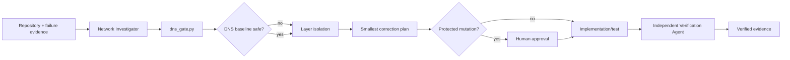

# Agent DNS Resolution Failover Gate

A reusable evidence-first kit for AI coding/operations agents investigating dependency DNS failures and proving failover recovery without unsafe endpoint pinning or automatic production network changes.

## Problem
A timeout or connection error is often mislabeled as DNS. Agents may then increase retries, pin an IP, disable TLS verification, or change production DNS without proving the failing layer. Long-lived clients can also keep stale connections even when DNS itself has recovered.

## Use when
External APIs, databases, queues, storage, service discovery, or internal services intermittently fail by hostname; after DNS/load-balancer changes; or when failover behavior must be verified.

Do not use this package as a DNS management/deployment tool. It intentionally performs no provider, firewall, resolver, or production configuration writes.

## Architecture


## Package tree
```text
agent-dns-resolution-failover-gate/
├── README.md
├── config/policy.json
├── examples/evidence.example.json
├── hooks/final-verification.md
├── hooks/preflight.md
├── rules/safety.md
├── schemas/evidence.schema.json
├── scripts/dns_gate.py
├── skills/investigate-dns-failure.md
├── skills/verify-failover.md
├── subagents/network-investigator.md
├── subagents/verification-agent.md
├── templates/investigation.json
├── tests/test_dns_gate.py
└── workflows/dns-failure-to-verification.md
```

## Installation
Copy this directory into a repository. Requires Python 3.9+ and only the standard library. Edit `config/policy.json` to add authoritative dependency hosts and environment-appropriate forbidden ranges. Keep private/internal ranges forbidden unless the workload is intentionally expected to resolve there and policy explicitly permits it.

## Permissions
The deterministic gate needs only local file read/write and ordinary hostname lookup. Agent investigation should use repository read access and non-mutating diagnostics. Production DNS, resolver, network, certificate, secret, or configuration changes require explicit human approval and are outside the script.

## Usage
From this package directory:

```bash
python scripts/dns_gate.py --policy config/policy.json --output dns-evidence.json api.example.com
python -m unittest tests/test_dns_gate.py
```

Exit codes: `0` verified baseline; `1` resolution/policy verification failed; `2` invalid input or policy. `dns-evidence.json` is evidence, not a secret store.

`examples/evidence.example.json` is synthetic output that validates against `schemas/evidence.schema.json`; replace it with evidence from a controlled, authorized diagnostic run rather than copying its addresses into production configuration.

For an agent, provide the environment, authoritative hostname/config location, sanitized error, expected failover behavior, and recovery window; then instruct it to follow `workflows/dns-failure-to-verification.md` and `rules/safety.md`.

## Workflow
The investigator locates authoritative configuration, captures deterministic resolution evidence, separates DNS from routing/TLS/application/client-refresh failures, and proposes the smallest correction. Implementation is bounded to approved repository changes. An independent verifier reruns tests and evidence checks and, for failover tasks, follows `skills/verify-failover.md`.

## Approval boundaries
Stop for human approval before DNS/provider/resolver writes, production firewall/network/load-balancer/config changes, certificate or secret changes, security weakening, destructive operations, or any test that intentionally disrupts production.

## Failure and recovery
Transient DNS diagnostics retry at most `max_retries` (default 2). Build/test repair is limited to two fix-test cycles. Validation, policy, permission, certificate, and business-rule failures are not made retryable by widening timeouts or permissions. Preserve evidence and escalate after the budget is exhausted.

## Verification
A task is not verified merely because a hostname resolves. Verification requires correct policy-compliant addresses, layer isolation, passing deterministic tests, application/TLS proof where relevant, no unintended diff, and measured failover recovery when failover is in scope. `schemas/evidence.schema.json` defines the deterministic evidence contract.

## Definition of Done
Authoritative hosts and environment are identified; DNS evidence exists; the failing layer is evidenced; proposed/implemented changes are minimal; protected actions have approval; tests pass; failover recovery is measured when applicable; independent verification reports `verified`; unresolved risks are documented and non-blocking.

## Customization
Adjust address policy, resolution timeout, address-count bounds, and retry budget in `config/policy.json`. Add project-specific application health probes outside `dns_gate.py` rather than embedding credentials in the DNS gate. Preserve the separation between deterministic resolution evidence and agent reasoning.
