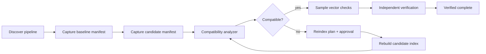

# Agent Embedding Index Compatibility Gate

Reusable AI engineering kit that prevents RAG/search regressions caused by embedding-model, vector-dimension, normalization, distance-metric, or index-configuration drift.

## Problem
Embedding pipelines can remain syntactically healthy while becoming semantically incompatible. Common failures include changing embedding model or dimensions without rebuilding vectors, switching cosine/dot/L2 assumptions, mixing normalized and non-normalized vectors, partial re-embedding, querying an index with a different model fingerprint, or silently serving stale vectors after deployment.

## Trigger
Use before any change to embedding model/provider, dimensions, normalization, chunking identity, vector-store collection/index, similarity metric, reindex job, or RAG deployment.

## Inputs
- baseline embedding/index manifest
- candidate embedding/index manifest
- optional sampled vectors for deterministic shape/norm checks
- repository/config references to embedding generation and vector queries
- rebuild/reindex evidence when incompatibility is intentional

## Architecture


## Package tree
```text
README.md
config/policy.json
schemas/embedding-manifest.schema.json
schemas/compatibility-report.schema.json
scripts/check_embedding_compat.py
scripts/check_vector_samples.py
scripts/verify_package.py
skills/discover-embedding-contract.md
skills/plan-safe-reindex.md
rules/embedding-index-safety.md
subagents/embedding-explorer.md
subagents/reindex-planner.md
subagents/verification-agent.md
workflows/embedding-index-compatibility.md
hooks/pre-change.md
hooks/post-change.md
examples/baseline-manifest.json
examples/candidate-compatible.json
examples/candidate-breaking.json
examples/sample-vectors.json
tests/test_embedding_compat.py
```

## Requirements
Python 3.10+. Scripts use only the standard library.

## Installation
Copy the directory into a repository. Populate a manifest from your actual embedding pipeline and vector store. Keep provider-specific capture logic outside the core gate.

## Usage
```bash
python scripts/check_embedding_compat.py --baseline examples/baseline-manifest.json --candidate examples/candidate-compatible.json --output compat-report.json
python scripts/check_vector_samples.py --manifest examples/baseline-manifest.json --vectors examples/sample-vectors.json
python scripts/verify_package.py
```

## Compatibility model
The gate blocks when a candidate changes any field that makes existing vectors unsafe to reuse: embedding model identity/fingerprint, vector dimension, normalization policy, distance metric, chunking fingerprint, or namespace/collection identity unless the manifest explicitly indicates a full rebuild with a new index generation.

Provider changes are treated as breaking even when dimensions match because vector spaces are not assumed interoperable.

## Permissions and approval
Read-only inspection is allowed by default. Explicit human approval is required before deleting/recreating indexes, production reindexing, changing production vector-store configuration, destructive data operations, large paid embedding jobs, secret changes, infrastructure changes, or production deployment.

## Failure and recovery
Manifest validation failures block immediately. Transient provider/vector-store metadata reads may retry twice. Compatibility failures do not retry blindly. Reindex implementation may run at most two fix/verification cycles before escalation. Preserve manifests and reports for every attempt.

## Verification
A successful vector-store query is not proof of compatibility. Verification requires manifest compatibility or documented full rebuild, sampled-vector dimension/norm checks, host tests/build, independent review, and no pending approval-required action.

## Definition of Done
- embedding generation and query paths identified
- baseline and candidate manifests captured
- deterministic compatibility report passes
- vector samples match dimension/normalization expectations
- any intentional incompatibility has a new index generation and complete rebuild evidence
- host tests/build pass
- independent verifier marks `verified`
- residual risks are recorded

## Portability
Core workflow is provider-neutral and can be adapted to OpenAI, Azure OpenAI, Cohere, Voyage, local embedding models, pgvector, Pinecone, Qdrant, Weaviate, Elasticsearch/OpenSearch, Milvus, or other vector stores. Provider-specific metadata acquisition should be isolated in adapters; the compatibility contract remains stable.
