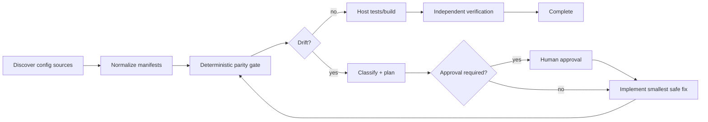

# Agent Environment Config Drift Parity Gate

A reusable implementation kit that prevents AI-assisted changes from being declared complete when required configuration differs across development, CI, staging, and production templates.

## Problem

Configuration drift is a common source of deployment failure: code compiles locally, yet staging or production is missing a required key, has a different type, carries a forbidden secret-like value, or diverges on a critical feature flag. AI coding agents often edit one `.env.example`, appsettings file, or CI variable declaration without proving parity across environments.

## Trigger

Use after changes that add, remove, rename, or change configuration keys; alter feature flags; add integrations; change connection settings; modify deployment manifests; or touch environment templates.

## Inputs

- repository working tree
- normalized JSON environment manifests
- `config/policy.json`
- optional approved exception file
- host build/test evidence

## Architecture



## Package tree

```text
README.md
config/policy.json
schemas/report.schema.json
scripts/config_parity_gate.py
scripts/verify_package.py
skills/discover-config-contract.md
skills/remediate-config-drift.md
rules/config-safety.md
subagents/config-explorer.md
subagents/remediation-planner.md
subagents/verification-agent.md
workflows/config-parity.md
hooks/pre-change.md
hooks/post-change.md
examples/dev.json
examples/staging.json
examples/production.json
tests/test_config_parity_gate.py
```

## Requirements

Python 3.10+. Runtime scripts use only the Python standard library.

## Manifest format

Each environment file is normalized JSON:

```json
{
  "environment": "staging",
  "values": {
    "API_BASE_URL": {"type": "url", "required": true, "value": "https://staging.example.invalid"},
    "CACHE_TTL_SECONDS": {"type": "integer", "required": true, "value": 60}
  }
}
```

The gate compares key presence, declared type, `required`, secret policy, and selected value equality rules. It does not need real secrets; secret-bearing keys should use redacted placeholders or omit `value` entirely.

## Usage

```bash
python scripts/config_parity_gate.py \
  --policy config/policy.json \
  --manifest examples/dev.json \
  --manifest examples/staging.json \
  --manifest examples/production.json \
  --output parity-report.json

python scripts/verify_package.py
```

Exit codes: `0` pass, `1` policy/parity failure, `2` invalid input.

## Permissions and approval

The package is read-only by default. Agents may inspect repository configuration and generate normalized manifests. Explicit approval is required before changing production configuration, secrets, infrastructure, destructive data operations, breaking API contracts, security controls, database schema, or deployment state.

## Failure handling

Invalid manifests stop immediately. Transient file/tool failures may retry twice. A parity failure allows at most two remediation cycles. Permission or approval failures do not retry automatically. Evidence from failed attempts is preserved.

## Verification

A task is verified only when the deterministic gate passes, relevant build/tests pass, configuration references in code and deployment files are reviewed, no secret values were introduced, required approvals exist, and the independent verifier confirms no unresolved drift.

## Definition of Done

- configuration sources and consumers were identified
- all required environment manifests validate
- no required key is missing from a governed environment
- declared types and requiredness agree
- equality-constrained values agree where policy requires it
- secret-like values are not committed
- host build/tests pass
- independent verification completed
- remaining exceptions are documented and approved
- no blocking failure remains

## Portability

Core workflow is tool-neutral and can be used with Codex, Claude Code, Cursor, ChatGPT, GitHub Copilot, OpenCode, or other coding agents. Repository-specific extraction can be adapted without changing the deterministic parity contract.
