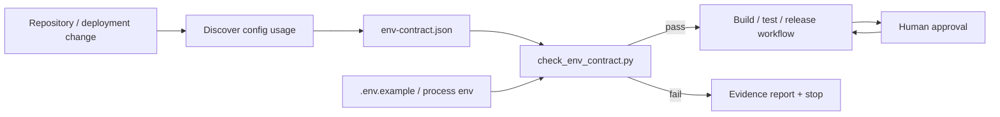

# Agent Environment Variable Contract Gate

A reusable, deterministic guardrail for AI-assisted repositories that prevents configuration failures caused by missing, misspelled, undocumented, unsafe, or environment-incompatible environment variables.

## Problem

AI agents often add configuration reads quickly but fail to update `.env.example`, deployment manifests, documentation, or validation code. The result is configuration drift: code expects variables that are absent, variables exist with unsafe values, secrets are accidentally committed as examples, or production-only requirements are not enforced before release.

This package defines a machine-readable environment-variable contract and a fail-closed validation workflow that agents can run before implementation completion, CI, release, or deployment preparation.

## When to use

Use when a repository reads environment variables for application configuration, credentials, feature flags, URLs, ports, resource limits, or deployment settings.

Do not use this package as a secret manager. It validates names and value constraints but never stores real secrets.

## Architecture



## Package tree

```text
agent-environment-variable-contract-gate/
├── README.md
├── config/
│   └── env-contract.json
├── examples/
│   ├── .env.example
│   └── production.env.sample
├── hooks/
│   ├── post-config-change.md
│   └── pre-release.md
├── rules/
│   └── environment-contract-rules.md
├── schemas/
│   └── env-contract.schema.json
├── scripts/
│   ├── check_env_contract.py
│   └── verify_package.py
├── skills/
│   ├── discover-environment-contract.md
│   └── update-environment-contract.md
├── subagents/
│   ├── config-discovery-agent.md
│   └── verification-agent.md
├── tests/
│   └── test_check_env_contract.py
└── workflows/
    └── environment-contract-gating.md
```

## Requirements

- Python 3.10+
- No third-party packages
- Repository-level `.env.example` or equivalent sample file

## Contract model

`config/env-contract.json` defines variables with:

- `name`
- `required_in`: environments where the variable must exist
- `secret`: whether examples must avoid real-looking values
- optional `allowed_values`
- optional `pattern`
- optional `default`
- optional `description`

Supported environments in this package are arbitrary strings such as `development`, `test`, `staging`, and `production`.

## Usage

Validate an example file for development:

```bash
python scripts/check_env_contract.py \
  --contract config/env-contract.json \
  --env-file examples/.env.example \
  --environment development
```

Validate an environment file intended for production:

```bash
python scripts/check_env_contract.py \
  --contract config/env-contract.json \
  --env-file examples/production.env.sample \
  --environment production
```

Validate the current process environment without printing values:

```bash
python scripts/check_env_contract.py \
  --contract config/env-contract.json \
  --use-process-env \
  --environment production
```

## Exit codes

| Code | Meaning |
|---:|---|
| 0 | Contract satisfied |
| 2 | Contract violation |
| 3 | Invalid input/contract |
| 4 | Unexpected internal error |

## Safety behavior

The checker never prints secret values. For variables marked `secret: true`, evidence reports only presence, absence, placeholder status, or validation class.

Human approval is still required before production configuration changes, secret rotation, deployment, infrastructure changes, or weakening a production requirement in the contract.

## Failure and recovery

- Missing required variable: stop and add/configure it in the correct environment.
- Undocumented sample variable: either add it to the contract or remove it from the sample.
- Invalid value: correct the value or update the contract only with evidence and review.
- Secret-like value in a committed sample: replace with a safe placeholder immediately.
- Invalid contract: stop; do not bypass validation.
- Repeated validation failure: preserve JSON evidence and escalate after 2 repair cycles.

## Verification

Run:

```bash
python scripts/verify_package.py
```

This verifies package paths, JSON syntax, contract integrity, unit tests, and positive/negative examples.

## Definition of Done

A configuration-affecting task is verified only when:

1. Environment-variable reads relevant to the task were identified.
2. Contract entries exist for every managed variable.
3. Sample configuration contains no undocumented variable and no real-looking secret.
4. Required variables are present for the target environment.
5. Allowed-value/pattern checks pass.
6. Unit tests and package verification pass.
7. Any production configuration or secret change has explicit human approval.
8. Remaining configuration risks are documented.

## Portability

The core contract and Python validator are agent-neutral. OpenAI Codex, Claude Code, Cursor, ChatGPT, GitHub Copilot, OpenCode, or another agent can use the same workflow by invoking the deterministic validator before completion.