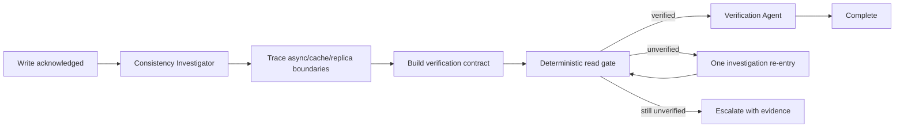

# Agent Eventual Consistency Read-After-Write Gate

A reusable AI engineering kit for diagnosing and verifying cases where a write is acknowledged but the expected state is not immediately visible through a downstream read model, replica, projection, cache, or search index.

## Problem
Distributed systems often acknowledge a mutation before every derived read path has converged. Agents can misclassify normal propagation delay as a failed write, repeatedly mutate data, flush shared caches, or claim success without evidence. This package provides a bounded, evidence-driven workflow that separates write acknowledgement from verified read visibility.

## Purpose
Use this kit to investigate stale or missing reads after successful writes, identify the consistency boundary, and prove convergence with a deterministic read-only verification gate.

## When to use
Use after API/database/message-driven writes that feed replicas, read models, caches, search indexes, projections, or asynchronous consumers. It is also useful when changing code in those paths and you need a regression gate.

## When not to use
Do not use it as a replacement for transactional correctness, durability testing, or destructive recovery. It does not authorize production writes, cache flushes, checkpoint rewinds, schema changes, or consistency-model changes.

## Architecture



The AI agents own investigation and interpretation. `scripts/consistency_gate.py` owns bounded polling and result evidence. The implementing/investigating role is not the only verifier.

## Package tree

```text
agent-eventual-consistency-read-after-write-gate/
├── README.md
├── config/
│   └── policy.yaml
├── examples/
│   └── sample-request.json
├── hooks/
│   └── lifecycle.md
├── rules/
│   └── safety.md
├── schemas/
│   └── result.schema.json
├── scripts/
│   ├── consistency_gate.py
│   └── verify_package.py
├── skills/
│   ├── investigate-consistency.md
│   └── verify-read-after-write.md
├── subagents/
│   ├── consistency-investigator.md
│   └── verification-agent.md
├── tests/
│   └── test_consistency_gate.py
└── workflows/
    └── read-after-write-gate.md
```

## Component responsibilities

- `skills/investigate-consistency.md`: trace write-to-read propagation and classify the failure boundary.
- `skills/verify-read-after-write.md`: run and interpret the deterministic verification gate.
- `rules/safety.md`: enforce evidence, retry, permission, and production-safety boundaries.
- `subagents/consistency-investigator.md`: owns root-cause investigation.
- `subagents/verification-agent.md`: independently owns verification status.
- `workflows/read-after-write-gate.md`: bounded end-to-end process with one investigation re-entry.
- `hooks/lifecycle.md`: pre-task, post-evidence, and final package checks.
- `scripts/consistency_gate.py`: read-only bounded polling with per-attempt evidence.
- `scripts/verify_package.py`: confirms required package files exist and contain no omitted-implementation markers.
- `config/policy.yaml`: reusable default retry/safety policy.
- `schemas/result.schema.json`: output contract for deterministic results.
- `examples/sample-request.json`: copyable request contract.
- `tests/test_consistency_gate.py`: validates delayed convergence and invalid-contract behavior.

## Installation

Copy this folder into the target repository. Python 3.9+ is sufficient; the scripts use only the standard library.

## Configuration

Start from `examples/sample-request.json`. Set:

- `read_url`: approved read-only endpoint to verify.
- `correlation_id`: identifier from the acknowledged write.
- `value_path`: dot-separated JSON field whose value must converge.
- `expect.value`: expected state.
- `expect.version_path` and `expect.min_version`: optional write/read monotonic version check.
- retry parameters only within the service's documented consistency window.

`config/policy.yaml` defines package defaults and safety boundaries. The executable script accepts equivalent values from the request JSON so it remains dependency-free.

## Permissions

Prefer read-only credentials. The package requires no write permission for verification. Production writes, destructive compensation, global/shared cache flushes, consumer checkpoint changes, routing/infrastructure changes, security changes, and consistency-model changes require explicit human approval.

## Usage

Create a request JSON from the example, then run:

```bash
python scripts/consistency_gate.py --request request.json --output consistency-result.json
```

Exit codes:

- `0`: verified successfully.
- `2`: invalid input/contract.
- `3`: bounded verification completed but remained unverified.

Validate the kit itself with:

```bash
python scripts/verify_package.py
python tests/test_consistency_gate.py
```

## Example invocation

A write returns version `42`, while the first two reads still show `pending`. The gate records those stale observations, backs off, and only returns `verified` when the read endpoint returns the expected value and version. It never retries the original write.

## Workflow

Follow `workflows/read-after-write-gate.md`:

1. Gather write evidence and repository context.
2. Trace asynchronous/read-model boundaries.
3. Form evidence-backed hypotheses.
4. Build the read verification contract.
5. Run at most four read attempts.
6. If unverified, allow one investigation re-entry.
7. Run one final bounded gate.
8. Complete only with verified evidence; otherwise escalate.

## Approval boundaries

Agents must stop before any production mutation, destructive compensation, shared cache flush, checkpoint rewind, infrastructure/routing change, permission expansion, or consistency-model change. Approval never grants permission implicitly; the required tool/account access must already be authorized.

## Failure handling

Transient HTTP/read failures are retried only inside the configured four-attempt budget. Validation and permission failures stop. Persistent stale or missing data gets one investigation re-entry and one final bounded verification. All attempt evidence is preserved. Repeated failure ends as `unverified`, not success.

## Verification

A task is **executed** when the gate ran. It is **verified successfully** only when the intended read contract exposes the expected value and, when supplied, a version not older than the acknowledged write version. Intermediate stale reads remain in evidence.

## Definition of Done

- The acknowledged write identity and expected state/version are recorded.
- Writer, propagation boundaries, and intended read path were identified.
- The deterministic gate ran within the configured retry budget.
- The final result is `verified`, or the workflow explicitly reports `unverified` and escalates.
- Evidence for every attempt is preserved.
- No repeated mutation or unintended production change occurred.
- Required approvals were respected.
- Remaining risks are documented.
- `python scripts/verify_package.py` and `python tests/test_consistency_gate.py` pass in a local copy.

## Customization

For numeric/vector-clock/custom version semantics, replace the simple version comparison with an application-specific comparator and add tests before use. For non-HTTP read models, keep the same workflow and output contract but adapt only the deterministic read adapter; do not move deterministic retry logic into an LLM prompt.
