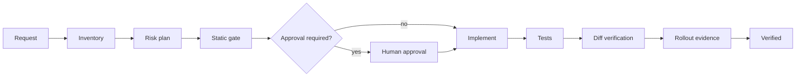

# Agent Feature-Flag Rollout Safety Gate

A reusable AI-engineering kit for changing feature flags without accidentally widening exposure, deleting rollback paths, or declaring a rollout healthy without evidence.

## Problem
AI coding/operations agents can safely edit ordinary code yet make dangerous rollout changes: enabling a flag globally, changing targeting semantics, removing a fallback, or promoting from canary to full traffic without verifying telemetry. This package turns feature-flag work into an evidence-driven, bounded workflow.

## Use when
Use for creating or modifying feature flags, targeting rules, rollout percentages, flag-backed migrations, kill switches, or cleanup after a completed rollout. Do not use it as a deployment system or as authorization to change production.

## Architecture


## Package tree
```text
agent-feature-flag-rollout-safety-gate/
├── README.md
├── config/policy.yaml
├── hooks/pre-change.md
├── hooks/post-change.md
├── rules/feature-flag-safety.md
├── schemas/change-request.schema.json
├── scripts/feature_flag_gate.py
├── skills/inventory-and-risk.md
├── skills/verify-rollout.md
├── subagents/rollout-planner.md
├── subagents/independent-verifier.md
├── templates/change-request.json
├── tests/test_feature_flag_gate.py
└── workflows/safe-rollout.md
```

## Installation
Requires Python 3.10+ and PyYAML (`python -m pip install pyyaml`). Copy the package into a repository. Customize `config/policy.yaml` with the repository's flag files and protected environments.

## Usage
Fill `templates/change-request.json`, then run:

`python scripts/feature_flag_gate.py --config config/policy.yaml --request templates/change-request.json --repo-root .`

Run tests with `python -m unittest tests/test_feature_flag_gate.py`.

## Permissions
The gate needs read access to the repository and Git metadata. Editing source requires normal workspace write access. Production flag changes, rollout increases in protected environments, destructive flag deletion, security-control weakening, and rollback removal require explicit human approval outside this package.

## Workflow
Follow `workflows/safe-rollout.md`. The planner owns scope and risk; implementation may proceed only after the static gate passes; the independent verifier owns final evidence. A failed deterministic check blocks completion.

## Approval boundaries
Approval is mandatory for protected-environment exposure increases, global enablement, flag deletion, rollback/fallback removal, targeting changes affecting privileged or regulated cohorts, and changes that weaken security controls. Approval must name the exact flag, environment, intended exposure, and change identifier. Approval for one state is invalid after material scope drift.

## Failure handling
Transient tooling failures may be retried at most twice. Validation, policy, test, or approval failures are not transient: preserve evidence, correct the input/change, and rerun. Never bypass the gate by changing policy during the same task unless that policy change is separately approved.

## Verification
Success requires a passing static gate, passing relevant tests, an inspected diff, preserved rollback behavior, and evidence that requested exposure equals actual intended exposure. Production health claims require external telemetry supplied by an authorized operator; absence of telemetry means `unverified`, not healthy.

## Definition of Done
The request validates; affected flags and call sites are inventoried; risk is classified; required approval exists; deterministic gate and tests pass; no unrequested flags changed; rollback remains available; verifier records evidence and unresolved risks; status is `verified` only when all required evidence exists.

## Portability
Core instructions are tool-neutral and can be used with Codex, Claude Code, Cursor, ChatGPT, Copilot, OpenCode, or human workflows. Adapt only tool invocation and flag-provider specifics; keep approval and verification rules unchanged.