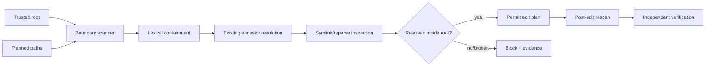

# Agent Filesystem Symlink Boundary Gate

A reusable repository-safety kit that prevents coding agents, scripts, and automated refactors from escaping the intended workspace through symbolic links, junctions, reparse points, or path traversal.

## Problem

An agent may be instructed to edit `repo/config/app.json` while `config` is a symlink or junction to a directory outside the repository. A seemingly local write can then modify unrelated files, shared configuration, mounted secrets, or another checkout. Lexical path checks such as `path.startswith(root)` are insufficient because filesystem resolution can cross the workspace boundary.

## Trigger

Use before any automated write, rename, generation, refactor, cleanup, or bulk edit when the repository may contain symlinks/junctions, generated mounts, worktrees, vendor links, or user-controlled paths.

## Inputs

- trusted workspace root
- planned edit paths or a full workspace scan
- `config/policy.json`
- repository tree and filesystem metadata
- explicit human approval before changing the trusted root or performing any otherwise dangerous action

## Architecture



## Package tree

```text
README.md
config/policy.json
schemas/boundary-report.schema.json
scripts/path_boundary_gate.py
scripts/verify_package.py
skills/audit-workspace-boundaries.md
skills/validate-edit-plan.md
rules/workspace-boundary-safety.md
subagents/boundary-explorer.md
subagents/verification-agent.md
workflows/safe-filesystem-edit.md
hooks/pre-task.md
hooks/pre-write.md
hooks/final-verification.md
examples/paths.txt
tests/test_path_boundary_gate.py
```

## Requirements

Python 3.10+. Runtime scripts use only the standard library.

## Usage

Validate explicit planned paths:

```bash
python scripts/path_boundary_gate.py \
  --root . \
  --paths-file examples/paths.txt \
  --output boundary-report.json
```

Audit the existing workspace:

```bash
python scripts/path_boundary_gate.py --root . --scan-all --output boundary-report.json
```

Run package verification:

```bash
python scripts/verify_package.py
```

Exit codes: `0` safe, `1` boundary violation or broken link, `2` invalid invocation/input.

## Detection model

For every path the gate:

1. anchors relative paths to the trusted root;
2. rejects lexical traversal outside the root;
3. finds the nearest existing ancestor for not-yet-created files;
4. resolves that ancestor through links/reparse points;
5. rejects any resolved location outside the trusted root;
6. records link/reparse components as evidence;
7. rejects broken symlinks;
8. optionally scans the whole existing tree without following linked directories.

This protects planned new files as well as existing targets. Internal symlinks are allowed by default only when their resolved target remains inside the trusted root.

## Permissions and approval

The gate is read-only. Agents must not silently broaden `--root`, bypass the gate, replace an external link, or increase filesystem permissions to unblock work. Explicit human approval is required before changing the intended workspace boundary, deleting/replacing links, editing outside the trusted root, production/configuration/secret changes, destructive data operations, force push/history rewriting, infrastructure changes, breaking API changes, or security weakening.

Approval to change scope means the workflow must be restarted with the newly approved root; it is not permission to ignore a failing report.

## Failure and recovery

- invalid root/input: stop, exit 2;
- broken link or escaped target: stop, exit 1, preserve report;
- transient filesystem metadata error: retry at most twice after preserving the error;
- permission failure: stop and escalate rather than increasing privileges;
- path changed between validation and write: rerun pre-write validation;
- repeated boundary drift: stop after two validation retries.

## Verification

Task execution is not verification. Completion requires the pre-write report to pass, the post-edit scan to pass, intended files to be the only changed files, repository tests/build relevant to the task to pass, and an independent verifier to confirm no path escaped the approved workspace.

## Definition of Done

- trusted root is explicit and canonicalized
- every planned path was validated
- no path resolves outside the trusted root
- no broken symlink is involved
- no unapproved boundary change occurred
- final workspace scan passes
- changed-file list matches the edit plan
- relevant host checks pass
- independent verification is `verified`
- remaining risks are documented

## Portability

Core logic is coding-agent neutral. The scanner handles ordinary POSIX symlinks and uses Windows reparse-point metadata when exposed by Python. Filesystem/container semantics can differ, so network mounts or virtual filesystems that do not expose link metadata must be treated as an environment limitation and escalated rather than assumed safe.