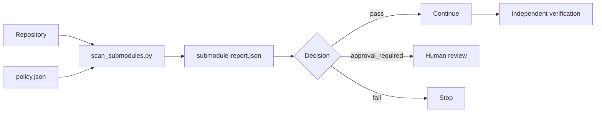

# Agent Git Submodule Pin Drift Gate

Reusable safety gate for AI-assisted repositories that use Git submodules. It detects unreviewed submodule URL changes, branch-tracking changes, missing initialization, dirty submodules, detached/unexpected pins, and gitlink SHA movement before an agent commits, merges, releases, or deploys.

## Problem

A submodule update can silently replace a large dependency surface with a single 160000-mode gitlink change. AI agents may treat that as a tiny diff even though the referenced repository content changed substantially. This package makes submodule changes explicit, reviewable, and evidence-backed.

## Trigger

Run before commit/PR completion, dependency update acceptance, release preparation, deployment, or whenever `.gitmodules` or a gitlink changes.

## Inputs

- Repository worktree.
- Optional baseline ref, default `HEAD`.
- `config/policy.json`.
- Git metadata and initialized submodules when verification is required.

## Architecture



## Package tree

```text
agent-git-submodule-pin-drift-gate/
├── README.md
├── config/policy.json
├── examples/approval-record.json
├── hooks/post-change.md
├── hooks/pre-commit.md
├── rules/submodule-safety.md
├── schemas/approval-record.schema.json
├── schemas/submodule-report.schema.json
├── scripts/scan_submodules.py
├── scripts/verify_package.py
├── skills/investigate-submodule-drift.md
├── skills/review-submodule-update.md
├── subagents/submodule-reviewer.md
├── subagents/verification-agent.md
├── tests/test_scan_submodules.py
└── workflows/submodule-change-gate.md
```

## Requirements

- Python 3.10+
- Git CLI 2.20+
- No third-party Python packages

## Usage

```bash
python scripts/scan_submodules.py --repo . --policy config/policy.json --baseline HEAD --output submodule-report.json
```

Exit codes:

- `0`: pass
- `2`: blocking policy failure
- `3`: explicit human approval required
- `4`: invalid input/configuration
- `5`: tool/internal failure

## Policy

`config/policy.json` controls whether URL changes, branch tracking, dirty submodules, uninitialized submodules, and gitlink movement are denied or require approval. The default posture is fail-closed for malformed state.

A gitlink SHA movement is not automatically considered safe merely because the submodule repository is trusted. Review must inspect the referenced commit range.

## Approval boundaries

Human approval is required for submodule URL changes, branch-tracking additions/changes, and gitlink movement unless policy is deliberately tightened to deny them. Production release/deployment remains a separate approval boundary even after this gate passes.

## Verification

Run:

```bash
python scripts/verify_package.py
```

The verifier checks required files, parses JSON, runs unit tests, and validates that the scanner handles no-submodule repositories safely.

## Failure and recovery

- Missing Git metadata or invalid policy: stop; do not bypass.
- Uninitialized submodule: initialize only if repository policy allows network access; otherwise preserve evidence and escalate.
- Dirty submodule: stop until changes are reviewed, committed elsewhere, or intentionally discarded by a human-approved process.
- Baseline unavailable: retry once after fetching only if network access is allowed; otherwise stop.
- Scanner/tool failure: fail closed with exit code `5`.

## Definition of Done

A submodule-sensitive change is complete only when the report is generated, every changed gitlink is identified, URL/branch metadata changes are classified, dirty/uninitialized state is resolved, required approvals are present, referenced commit ranges were reviewed, and post-change repository verification passes.

## Portability

The workflow is tool-neutral. Coding agents only need permission to run Git/Python read operations and must honor blocking/approval outcomes. Do not let the model override scanner results.