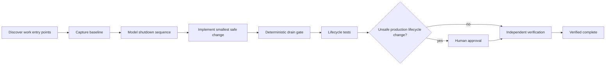

# Agent Graceful Shutdown In-Flight Drain Gate

Reusable AI-engineering kit for preventing deploys, restarts, autoscaling, and process termination from dropping in-flight HTTP requests, background jobs, queue messages, or partially completed side effects.

## Problem
A service can pass functional tests and still terminate unsafely. Common failures include continuing to accept work after shutdown starts, removing readiness too late, setting a drain timeout shorter than the longest handler budget, abandoning queue leases, failing to propagate cancellation, or force-killing work before checkpoints/acknowledgements are safe. AI-assisted edits can introduce these lifecycle bugs because they span hosting, networking, workers, retries, and deployment configuration.

## Trigger
Use when changing process lifecycle code, HTTP hosting, workers/consumers, Kubernetes/systemd/container shutdown settings, queue acknowledgement behavior, cancellation handling, autoscaling, rolling deployments, or incident fixes involving interrupted work.

## Inputs
- repository and runtime/deployment configuration
- baseline and candidate shutdown snapshots
- handler/job duration evidence
- acknowledgement/checkpoint semantics
- rollout policy in `config/drain-policy.json`
- build/test evidence

## Architecture


## Package tree
```text
README.md
skills/shutdown-discovery.md
skills/drain-design.md
skills/failure-recovery.md
rules/shutdown-safety.md
subagents/lifecycle-explorer.md
subagents/drain-planner.md
subagents/verification-agent.md
workflows/graceful-shutdown.md
hooks/pre-change.md
hooks/post-change.md
scripts/shutdown_drain_gate.py
scripts/verify_package.py
config/drain-policy.json
schemas/shutdown-snapshot.schema.json
schemas/gate-report.schema.json
examples/baseline.json
examples/candidate-safe.json
examples/candidate-unsafe.json
tests/test_shutdown_drain_gate.py
```

## Requirements
Python 3.10+. Runtime scripts use only the standard library.

## Snapshot contract
A snapshot describes one service lifecycle using these fields: `stop_accepting_new_work`, `readiness_removed_before_drain`, `cancellation_propagated`, `drain_timeout_seconds`, `max_handler_seconds`, `termination_grace_period_seconds`, `force_termination_after_timeout`, `work_sources`, and `checkpoint_or_ack_safe`.

The deterministic gate checks that new work stops before drain, readiness is withdrawn before draining, cancellation is propagated, drain timeout covers the maximum handler budget plus policy margin, platform termination grace covers drain plus policy margin, queue/background work has safe checkpoint/ack semantics, and force termination is explicitly bounded.

## Usage
```bash
python scripts/shutdown_drain_gate.py \
  --snapshot examples/candidate-safe.json \
  --policy config/drain-policy.json \
  --output shutdown-report.json

python scripts/verify_package.py
```

Exit codes: `0` pass, `1` blocking lifecycle violation, `2` invalid input.

## Permissions and approval
The workflow is analysis/test-only by default. Explicit human approval is required before production deployment, changing production termination grace periods, changing load-balancer/readiness behavior, altering queue acknowledgement semantics, destructive retry/checkpoint changes, infrastructure changes, secret changes, breaking API changes, force push/history rewrite, or weakening security controls.

## Failure and recovery
Malformed or incomplete lifecycle evidence blocks completion. Transient capture/tool failures retry at most twice. Build/test/gate failures allow at most two implementation cycles. Unknown acknowledgement semantics, unbounded handlers, or unverifiable production shutdown ordering stop the workflow and preserve evidence.

## Verification
A clean process exit is not proof of safe shutdown. Verification requires deterministic gate success, lifecycle tests that start work and initiate shutdown concurrently, evidence that new work is refused, in-flight work completes or checkpoints safely, host build/tests pass, diff inspection, and independent verification.

## Definition of Done
- every work entry point is identified
- shutdown ordering is documented from evidence
- candidate snapshot passes the deterministic gate
- in-flight lifecycle tests pass
- queue/job acknowledgement or checkpoint behavior is proven safe
- host build/static/tests pass
- required approvals exist
- independent verifier marks `verified`
- residual risks are documented
- no blocking failure remains

## Portability
Core workflow is runtime-neutral. Adapt snapshot capture and lifecycle tests for ASP.NET Core, Node.js, Java/Spring, Python, Go, Kubernetes, systemd, serverless workers, or queue consumers without changing the safety model.
