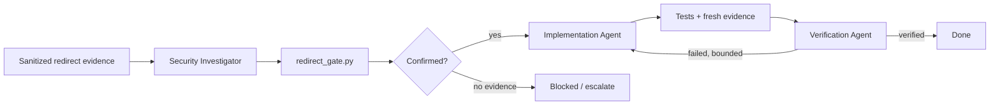

# Agent HTTP Redirect Credential Leak Gate

A reusable AI-engineering package for investigating and preventing credentials, cookies, or API keys from being forwarded to unsafe destinations when authenticated HTTP clients follow redirects.

## Problem
Automatic redirects are convenient but can cross hosts, downgrade HTTPS, reach private-network targets, or preserve sensitive headers in ways that expose credentials. AI coding agents can make this worse by changing client configuration or broadening allowlists without proving redirect behavior.

## When to use
Use for authenticated API clients, webhook callers, download/upload workers, OAuth-adjacent integrations, proxy changes, endpoint migrations, HTTP-client upgrades, SSRF reviews, or incidents involving unexpected 3xx responses.

Do not use this package as a general SSRF scanner or as permission to probe production/private networks.

## Architecture


## Package tree
```text
agent-http-redirect-credential-leak-gate/
├── README.md
├── config/policy.json
├── examples/unsafe-chain.json
├── hooks/final-verification.md
├── hooks/pre-task.md
├── rules/redirect-safety.md
├── schemas/report.schema.json
├── scripts/redirect_gate.py
├── skills/investigate-redirect-chain.md
├── skills/remediate-and-verify.md
├── subagents/implementation-agent.md
├── subagents/security-investigator.md
├── subagents/verification-agent.md
├── tests/test_redirect_gate.py
└── workflows/redirect-leak-response.md
```

## Dependencies and installation
Python 3.9+ only; the gate and tests use the standard library. Copy this directory into a repository. Run from this package root:

```bash
python -m unittest discover -s tests -p 'test_*.py'
```

## Configuration
Edit `config/policy.json`. Keep allowlists empty unless a redirect destination is a documented requirement. `allowed_redirect_hosts` is exact-host matching; `allowed_redirect_suffixes` permits the suffix and its subdomains. Neither allowlist permits HTTPS downgrade or credential forwarding across hosts.

## Input
The gate consumes a sanitized JSON object with a non-empty `hops` array. Each hop requires an absolute `url`; optional `status` and `headers` provide evidence. Header values must be redacted before persistence. See `examples/unsafe-chain.json`.

## Usage
```bash
python scripts/redirect_gate.py \
  --input examples/unsafe-chain.json \
  --policy config/policy.json \
  --output redirect-gate-report.json
```

Exit codes: `0` passed, `2` policy finding/block, `3` invalid input/config or file error. Output follows `schemas/report.schema.json`.

## Workflow
Start with `hooks/pre-task.md`, then execute `workflows/redirect-leak-response.md`. Investigation is owned by the Security Investigator, remediation by the Implementation Agent, and final decision by the independent Verification Agent. Skills contain the detailed procedures.

Retry limits are bounded: transient tool failures twice, implementation/test-fix cycles twice, and one return from independent verification to implementation. Permission failures stop immediately.

## Permissions and approval boundaries
Normal execution requires only repository read/write for the implementation agent and permission to run local tests. Explicit human approval is required before production deployment; secret rotation; DNS, proxy, firewall, infrastructure, or production configuration changes; allowlist expansion; breaking API changes; or weakening security controls. Force push and history rewriting are forbidden.

## Safety model
`rules/redirect-safety.md` requires cross-host credential stripping, HTTPS downgrade blocking, private-target protection, sanitized evidence, redirect-hop limits, and independent verification. The deterministic script detects policy violations; agents provide repository-specific tracing and remediation.

## Failure and recovery
Incomplete traces produce `blocked`, not a guessed conclusion. Validation failures stop. Transient tooling errors may retry twice with stderr preserved. Test/build failures use the bounded remediation loop. Exhausted retries escalate with evidence. Policy must never be weakened merely to make verification pass.

## Verification
A completed fix must show: the original reproduction with fake credentials is blocked or sanitized; cross-host sensitive headers are absent; HTTPS downgrade and private/unapproved targets are rejected; expected same-host redirects still pass; unit/relevant repository tests pass; no real secret appears in fixtures/logs; and the Verification Agent returns `verified`.

## Definition of Done
The issue is evidence-backed; required code/tests exist; gate and relevant tests pass for accepted behavior; unsafe behavior has a regression test; independent verification succeeds; no unintended security weakening exists; required approvals are present; and residual risks are documented.

## Customization
Extend `SENSITIVE` in `scripts/redirect_gate.py` for organization-specific credential headers. Keep policy changes code-reviewed. For language-specific HTTP clients, preserve the workflow/rules and implement client-specific tests proving that sensitive headers are reconstructed only after destination validation.
