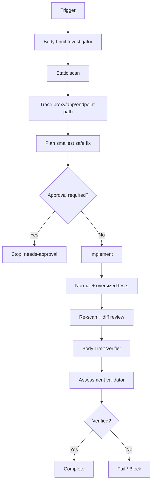

# Agent HTTP Request Body Size Limit Gate

A reusable AI engineering package for detecting, fixing, and independently verifying unsafe HTTP request-body size handling across application, server, proxy, multipart, streaming, and decompression layers.

## Problem
HTTP endpoints that accept uploads, imports, webhooks, JSON/XML payloads, or streamed bodies can become memory/CPU/availability risks when effective size limits are missing, disabled, inconsistent across layers, or enforced only via `Content-Length`. Accidental buffering and decompression can magnify the problem even when a nominal limit exists.

## Purpose
Provide a repeatable workflow that combines deterministic scanning, repository-aware investigation, bounded remediation, explicit approval boundaries, targeted request tests, and independent verification.

## When to use
Use when changing upload/import APIs, multipart/form handling, body-reading middleware, reverse proxies, request decompression, request-size settings, or when investigating memory spikes, request timeouts, 413 inconsistencies, or oversized payload abuse.

## When not to use
Do not treat scanner matches as confirmed defects. Do not use this package to raise production limits or bypass provider/gateway restrictions without explicit requirement and approval.

## Architecture


## Package tree
```text
agent-http-request-body-size-limit-gate/
├── README.md
├── config/body-size-policy.json
├── schemas/assessment.schema.json
├── scripts/scan-body-size-risk.py
├── scripts/validate-assessment.py
├── skills/request-body-size-review.md
├── rules/request-body-safety.md
├── subagents/body-limit-investigator.md
├── subagents/body-limit-verifier.md
├── workflows/request-body-size-gate.md
├── hooks/lifecycle-hooks.md
├── examples/assessment.example.json
└── tests/self-test.py
```

## Component responsibilities
- `config/body-size-policy.json`: defaults, retry budgets, approval boundaries, and required verification flags.
- `schemas/assessment.schema.json`: structured output contract.
- `scripts/scan-body-size-risk.py`: advisory scan for body buffering, disabled limits, large explicit limits, and upload-related paths.
- `scripts/validate-assessment.py`: deterministic assessment validation and `pass` guard.
- `skills/request-body-size-review.md`: end-to-end investigation/remediation procedure.
- `rules/request-body-safety.md`: enforceable MUST/MUST NOT/SHOULD behavior.
- `subagents/body-limit-investigator.md`: owns context mapping and evidence-backed findings.
- `subagents/body-limit-verifier.md`: independently validates final behavior.
- `workflows/request-body-size-gate.md`: bounded execution workflow with approvals and failure paths.
- `hooks/lifecycle-hooks.md`: predictable pre/post/final checks.
- `examples/assessment.example.json`: concrete passing contract example.
- `tests/self-test.py`: validates scanner and assessment guard behavior.

## Installation
Copy this directory into the target repository or shared agent package directory. Python 3.9+ is sufficient; the scripts use only the standard library.

## Configuration
Adjust `config/body-size-policy.json` only when repository/provider requirements justify different defaults. Endpoint-specific limits are preferred over broad global exceptions.

## Permissions
Normal operation needs repository read access and permission to run local tests/builds. Write access is needed only for approved repository changes. Production configuration/deployment, infrastructure changes, breaking contracts, security-control weakening, and large dependency upgrades require explicit human approval.

## Usage
Run the advisory scanner:
```bash
python scripts/scan-body-size-risk.py /path/to/repository --output scan.json
```
Exit `0` means no heuristic findings, `1` means findings require review, and `2` means invalid invocation/input.

Follow `skills/request-body-size-review.md`, enforce `rules/request-body-safety.md`, and then validate the final assessment:
```bash
python scripts/validate-assessment.py assessment.json
```

Run the package self-test:
```bash
python tests/self-test.py
```

## Example invocation
Run the HTTP request-body size gate on the changed upload/import path. Trace proxy, server, middleware, endpoint, multipart/decompression, buffering, and storage behavior. Run the scanner before/after edits. Implement only the smallest safe fix. Test a normal near-limit request and an oversized request. Keep fix/retest cycles to at most 2. Stop before approval-required actions. Hand the final diff and assessment to the independent verifier, then validate the assessment contract.

## Workflow
The authoritative process is `workflows/request-body-size-gate.md`: context -> scan -> evidence -> plan -> approval checkpoint -> implementation -> targeted request tests -> re-scan/diff review -> independent verification -> assessment validation -> completion.

## Approval boundaries
Explicit approval is required before production configuration or deployment, infrastructure changes, breaking public API contracts, security-control weakening, or large dependency upgrades. The agent must never increase limits, permissions, or infrastructure capacity merely to make a failing request pass.

## Failure and recovery
Transient tool/environment failures may be retried at most 2 times. Fix/test cycles are capped at 2. Deterministic failures require a changed hypothesis or implementation before rerun. Permission/environment gaps become `blocked`; dangerous required remediation becomes `needs-approval`; oversized requests still reaching expensive processing remain `fail` until fixed and verified.

## Verification
`Task executed` is not `Task verified successfully`. Status `pass` requires all verification flags to be true: `limit_enforced`, `oversized_request_rejected`, `streaming_path_reviewed`, `proxy_app_limits_aligned`, `normal_request_still_passes`, and `independent_verification`. High/critical findings cannot remain unverified.

## Definition of Done
- All in-scope HTTP entry points and content types are mapped.
- Effective finite limits are identified and intentional.
- Multipart, streaming/buffering, and decompression paths are reviewed where applicable.
- Proxy/application limit alignment is proven or completion is blocked.
- A normal near-limit request succeeds.
- An oversized request is rejected deterministically before unintended side effects where practical.
- Relevant build/tests pass.
- Final diff contains no unrelated/global weakening.
- Independent verifier completes review.
- Assessment validates successfully.
- Required approvals exist and no blocking failure remains.

## Customization
Extend the scanner with framework/provider-specific patterns such as ASP.NET Core/Kestrel/IIS, NGINX, Apache, Envoy, API gateways, Node/Express, Spring, Django, or multipart libraries. Keep deterministic heuristics separate from repository-aware judgment and runtime proof.
