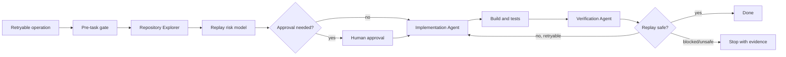

# Agent Idempotency Replay Safety Gate

A reusable engineering kit for preventing duplicate durable side effects when APIs, webhooks, queue consumers, background jobs, or AI-agent tool calls are retried after timeouts, crashes, lost acknowledgements, or at-least-once delivery.

## Problem and purpose
Retries improve availability but can repeat writes, messages, payments, emails, jobs, or remote mutations. The dangerous case is an ambiguous failure: the first attempt committed, the caller did not receive the acknowledgement, and the caller retries. This kit turns replay safety into an evidence-driven workflow with static discovery, explicit ownership, bounded retries, independent verification, and human approval boundaries.

Use it when an operation is retryable and has durable/external side effects, or when duplicate effects have been observed. Do not use it as a substitute for domain-level compensation design, distributed consensus, or a provider's documented idempotency semantics.

## Architecture



The explorer owns evidence gathering, the implementation agent owns the change and its first-pass tests, and the verification agent independently proves replay behavior. The implementing agent is never the sole verifier.

## Package tree

```text
agent-idempotency-replay-safety-gate/
├── README.md
├── config/policy.yaml
├── hooks/
│   ├── final-verification.md
│   └── pre-task.md
├── rules/replay-safety-rules.md
├── schemas/investigation-result.schema.json
├── scripts/
│   ├── replay-http.py
│   ├── scan-replay-risk.py
│   └── verify-package.py
├── skills/
│   ├── implement-idempotency.md
│   └── investigate-replay-safety.md
├── subagents/
│   ├── implementation-agent.md
│   ├── repository-explorer.md
│   └── verification-agent.md
├── templates/investigation-result.json
└── workflows/replay-safety-workflow.md
```

## Installation and dependencies
Copy this directory into the target repository or agent instruction directory. Core scripts require Python 3.9+ and only the standard library. Repository build/test dependencies remain project-specific. JSON Schema validation can be performed by any Draft 2020-12 compatible validator; the workflow does not require a specific agent vendor.

## Configuration
`config/policy.yaml` contains default retry limits, side-effect discovery markers, idempotency headers, approval categories, and verification requirements. Adapt markers to your stack, but keep retry limits and approval boundaries explicit. No secrets belong in the policy or result artifacts.

## Permissions
Exploration needs repository read/search and read-only logs. Implementation needs normal repository edits plus local/test build infrastructure. Verification needs build/test and safe replay access. Production mutation, schema/destructive database changes, production configuration, breaking contracts, secret/security changes, data deletion, infrastructure changes, and irreversible migrations require explicit human approval.

## Usage
1. Give the orchestrating agent the operation/entry point, expected business effect, retry source, repository, acceptance criteria, and safe test target.
2. Apply `rules/replay-safety-rules.md` and follow `workflows/replay-safety-workflow.md`.
3. Run `python scripts/scan-replay-risk.py /path/to/repo --output replay-risk.json` during exploration.
4. Implement only after the stable replay identity and every side effect are understood.
5. Run project build/tests plus sequential and concurrent replay tests. For a local/test HTTP endpoint, `python scripts/replay-http.py http://localhost:5000/orders --key test-123 --body-file request.json` can compare repeated responses; business-state assertions remain mandatory.
6. Produce a result matching `schemas/investigation-result.schema.json` and independently verify it.

## Workflow, retries, and recovery
The complete flow is in `workflows/replay-safety-workflow.md`. Transient tool/environment failures can retry at most twice. Implementation-caused build/test failures get at most two total fix-test cycles. Permission, business-rule, unsafe-target, and approval failures are not blindly retried. Evidence is preserved before escalation. There are no infinite loops.

An ambiguous external mutation after timeout is not automatically safe to retry. If the remote provider has no reliable idempotency/query mechanism, stop and document residual risk or require a domain-specific reconciliation/compensation decision.

## Verification
A `safe` verdict requires evidence for all durable/external side effects, stable key propagation, atomic duplicate protection, passing build/tests, sequential replay, concurrent replay, and diff review. Where payload/key reuse matters, verify same-key/different-payload rejection. Test the commit-succeeded/acknowledgement-lost scenario when infrastructure permits it. Static scanner output is only a discovery aid.

To verify this package's required artifacts after copying it, run `python scripts/verify-package.py`.

## Definition of Done
The operation has a documented stable replay identity; every side effect is inventoried and protected or explicitly resolved; atomicity is evidenced; required approvals exist; build and relevant tests pass; sequential and concurrent replay tests pass; no unintended changes remain; final output satisfies the result schema; and no unresolved high/critical risk or blocking failure remains.

## Portability and customization
The Markdown roles/workflow are tool-neutral and can be mapped to Codex, Claude Code, Cursor, ChatGPT, GitHub Copilot, OpenCode, or another coding agent. Keep vendor-specific tool permissions outside the core rules. Customize side-effect markers, project build commands, idempotency header names, retention window, and domain-specific business-state assertions without weakening approval or evidence requirements.
