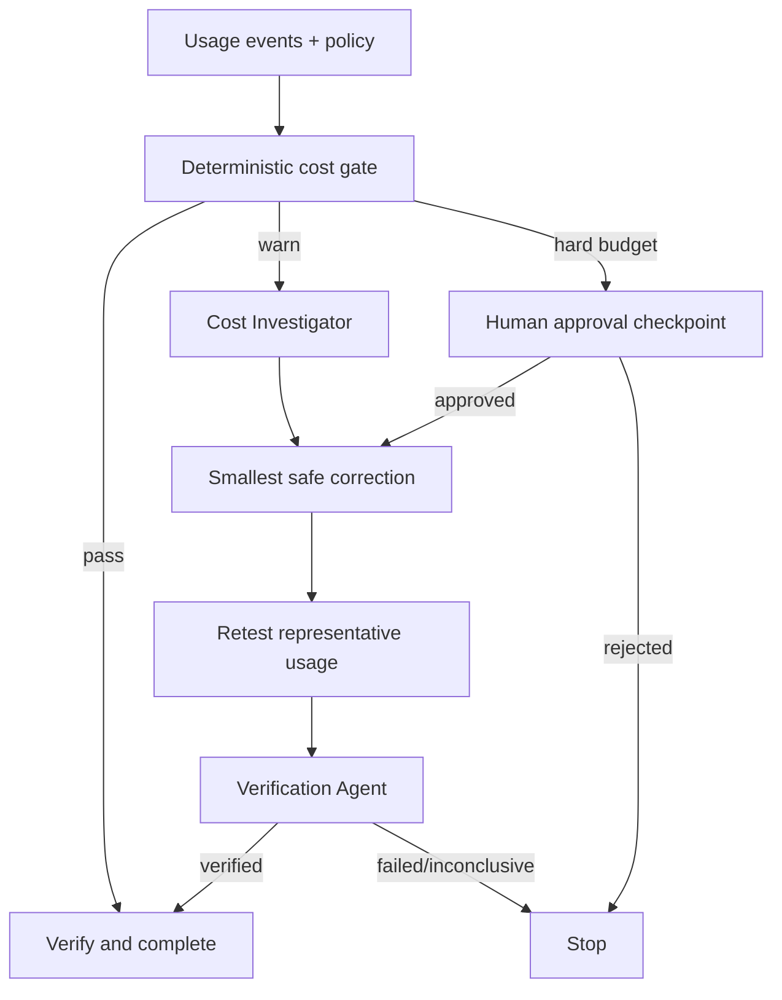

# Agent LLM Cost Anomaly Budget Gate

A reusable, tool-neutral package for detecting abnormal LLM spend, enforcing deterministic budgets, investigating cost drivers, and requiring human approval before dangerous budget overrides.

## Problem
AI-assisted applications can accumulate unexpected cost through prompt/context growth, model-routing changes, retries, duplicate calls, cache misses, tool loops, or traffic spikes. Ad-hoc review often discovers the problem only after spend has already increased.

## Purpose
This package turns LLM cost control into a repeatable gate with explicit inputs, deterministic checks, bounded investigation, approval boundaries, and independent verification.

## When to use
Use it for CI changes that affect prompts or model routing, scheduled usage checks, cost regressions, agent loops, retry-policy changes, cache changes, or any workflow where an AI agent can materially change token consumption.

## When not to use
Do not use this package as a billing source of truth when provider cost data is unavailable. Do not infer missing prices or silently treat malformed telemetry as zero cost. It does not deploy changes or modify provider billing settings.

## Architecture



## Package tree

```text
agent-llm-cost-anomaly-budget-gate/
├── README.md
├── config/
│   └── budget-policy.yaml
├── schemas/
│   ├── usage-event.schema.json
│   └── gate-result.schema.json
├── scripts/
│   ├── llm_cost_gate.py
│   └── verify_package.py
├── skills/
│   ├── cost-investigation.md
│   └── budget-exception-review.md
├── rules/
│   └── cost-safety.md
├── subagents/
│   ├── cost-investigator.md
│   └── verification-agent.md
├── workflows/
│   └── cost-anomaly-gate.md
├── hooks/
│   └── lifecycle.md
├── templates/
│   └── budget-override-request.md
├── examples/
│   └── usage-events.jsonl
└── tests/
    └── test_llm_cost_gate.py
```

## Component responsibilities
- `config/budget-policy.yaml`: reusable policy for total, request, user, and anomaly thresholds.
- `schemas/usage-event.schema.json`: telemetry contract for usage events.
- `schemas/gate-result.schema.json`: output contract for downstream automation.
- `scripts/llm_cost_gate.py`: deterministic enforcement and anomaly detection.
- `scripts/verify_package.py`: package completeness check.
- `skills/cost-investigation.md`: evidence-first investigation procedure.
- `skills/budget-exception-review.md`: bounded human-approval procedure.
- `rules/cost-safety.md`: mandatory and forbidden behavior.
- `subagents/cost-investigator.md`: owns root-cause investigation.
- `subagents/verification-agent.md`: independent final verifier.
- `workflows/cost-anomaly-gate.md`: end-to-end orchestration with bounded retries.
- `hooks/lifecycle.md`: deterministic lifecycle commands.
- `templates/budget-override-request.md`: auditable exception contract.
- `examples/usage-events.jsonl`: runnable example input.
- `tests/test_llm_cost_gate.py`: unit coverage for pass, warning, hard-budget, and anomaly behavior.

## Installation
Requires Python 3.10+ and PyYAML.

```bash
python -m pip install pyyaml pytest
python scripts/verify_package.py
pytest -q tests/test_llm_cost_gate.py
```

## Configuration
Edit `config/budget-policy.yaml` for your own currency-normalized USD policy, thresholds, anomaly lookback, and approval boundaries. Core workflow logic is provider-neutral; normalize provider billing records into `schemas/usage-event.schema.json` before running the gate.

Important policy fields:
- `soft_budget`: warning threshold for the evaluation window.
- `hard_budget`: stop/approval threshold.
- `per_request_max_cost`: catches individual runaway calls.
- `per_user_daily_max_cost`: optional user-attributed guardrail when `user_id` is available.
- `anomaly.*`: statistical and growth-ratio rules.
- `approval.required_for_hard_budget_override`: keeps production budget changes human-controlled.

## Permissions
The gate itself needs only read access to usage exports and repository policy plus write access to a local artifact directory. Billing administration, production configuration, provider model settings, and deployment permissions are intentionally outside this package.

## Usage

```bash
python scripts/llm_cost_gate.py \
  --events examples/usage-events.jsonl \
  --policy config/budget-policy.yaml \
  --output artifacts/cost-gate.json
```

For CI where warnings must fail the job:

```bash
python scripts/llm_cost_gate.py \
  --events usage.jsonl \
  --policy config/budget-policy.yaml \
  --output artifacts/cost-gate.json \
  --fail-on-warn
```

Exit codes:
- `0`: pass, or warn when `--fail-on-warn` is not set.
- `2`: invalid input/config/runtime error.
- `3`: block or human approval required.
- `4`: warning promoted to CI failure.

## Example invocation for an AI coding agent
Give the agent the usage JSONL, policy path, current repository diff, and relevant feature/model ownership. Instruct it to follow `workflows/cost-anomaly-gate.md`, delegate investigation to `subagents/cost-investigator.md`, and require independent verification via `subagents/verification-agent.md` before reporting success.

## Workflow
1. Validate package and usage input.
2. Run the deterministic cost gate.
3. If clean, proceed to verification.
4. If anomalous, investigate measurable drivers: request count, tokens, model mix, retries, cache misses, or loops.
5. Plan the smallest safe correction.
6. Stop for human approval when a hard-budget override or production cost-control change is required.
7. Apply only authorized changes.
8. Re-test representative usage; retry transient tool failures at most twice.
9. Independently verify both cost reduction and functional acceptance criteria.
10. Record remaining risk and complete only when no blocking failure remains.

## Approval boundaries
Explicit human approval is required before:
- Raising or bypassing a hard budget.
- Changing production billing limits or provider quotas.
- Switching production models/providers when the change materially raises expected cost.
- Removing or weakening cost controls.
- Any associated production deployment, secret/config change, or irreversible operational change.

Agents must stop before these actions and must never silently increase permissions.

## Failure handling
- **Transient I/O/tool failure:** preserve evidence and retry at most two times.
- **Validation failure:** stop; report malformed or missing telemetry.
- **Permission failure:** stop; do not self-escalate.
- **Hard-budget breach:** stop at human approval.
- **Build/test regression after optimization:** fail verification.
- **Insufficient evidence:** mark investigation inconclusive rather than inventing root cause.

## Verification
Success is evidence-based. At minimum:
1. `python scripts/verify_package.py` passes.
2. `pytest -q tests/test_llm_cost_gate.py` passes.
3. The usage input is valid and preserves request/model/token/cost evidence.
4. The gate result is `pass`, or an active, explicit, time-bounded human exception exists.
5. Relevant host-repository tests pass after any corrective change.
6. The Verification Agent confirms before/after evidence and checks that controls were not weakened.

`Task executed` is not equivalent to `verified successfully`.

## Definition of Done
- Required telemetry and repository context were gathered.
- Deterministic gate execution completed.
- Every warning/blocking finding was investigated or explicitly marked unresolved with missing evidence.
- Required human approval exists and has expiry/rollback information when applicable.
- Representative after-change usage was measured.
- Functional acceptance criteria still pass.
- Independent verification status is `verified`.
- Remaining risks are documented.
- No blocking failure remains.

## Customization
Adapt threshold values and telemetry adapters, not the safety model. Provider-specific collectors can live outside this package as long as they emit the usage-event contract. Add organization-specific functional tests or cost attribution fields without removing hard-budget approval, bounded retries, evidence preservation, or independent verification.
