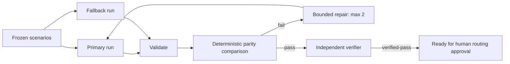

# Agent LLM Fallback Model Behavior Parity Gate

A reusable evidence gate for proving that an LLM fallback model preserves critical behavior before production failover routing is changed.

## Problem
Fallbacks often pass availability checks yet differ in structured output, tool choice, refusal boundaries, grounding, latency, or cost. Those differences surface only during incidents when failover is already active.

## When to use
Use before adding or changing a fallback model/provider/version, or when prompts/tool schemas/routing changes could alter fallback behavior. Do not use this kit to deploy or mutate production routing.

## Architecture


## Package tree
```text
agent-llm-fallback-model-behavior-parity-gate/
├── README.md
├── config/policy.yaml
├── examples/fallback.json
├── examples/primary.json
├── hooks/lifecycle.md
├── rules/safety-and-evidence.md
├── schemas/evaluation-result.schema.json
├── scripts/compare_results.py
├── scripts/validate_results.py
├── skills/fallback-parity-investigation.md
├── subagents/parity-verifier.md
└── workflows/fallback-parity-gate.md
```

## Dependencies
Python 3.9+; no third-party Python packages are required. Your repository supplies the actual model/evaluation harness. Core instructions are tool-neutral.

## Installation
Copy this directory into the target repository. Make scripts executable on Unix if desired. Adapt `config/policy.yaml` model aliases and thresholds, then map your evaluation harness output to the JSON contract.

## Configuration
`config/policy.yaml` defines required scenarios and default thresholds: maximum score drop 0.05, cost multiplier 1.50, latency multiplier 1.75. Add domain-critical scenarios rather than replacing the four defaults.

## Usage
Generate `primary.json` and `fallback.json` from identical frozen fixtures, then run:

```bash
python scripts/validate_results.py primary.json --required structured-output tool-selection refusal-boundary context-grounding
python scripts/validate_results.py fallback.json --required structured-output tool-selection refusal-boundary context-grounding
python scripts/compare_results.py primary.json fallback.json --max-score-drop 0.05 --max-cost-multiplier 1.50 --max-latency-multiplier 1.75
```

A successful comparison writes `fallback-parity-report.json` and exits 0; parity failure exits 2. The included example files form a passing smoke test.

## Workflow and ownership
Follow `workflows/fallback-parity-gate.md`. The investigation skill defines evidence collection and the bounded repair loop. `subagents/parity-verifier.md` owns independent final verification and must not be the implementation agent.

## Permissions and approval boundaries
Evaluation is non-production and non-destructive. Production routing/deployment, security weakening, secret or production-config changes, breaking API changes, and irreversible actions require explicit human approval and are not performed by this kit.

## Failure and recovery
Transient provider/tool failures may be retried once with failed evidence retained. Validation/parity failures are deterministic and must not be retried unchanged. Compatibility repair is bounded to two full-suite iterations; then stop and escalate with evidence.

## Verification
Verification requires valid result contracts, complete required scenarios, zero fallback failures where primary passed a blocking behavior, thresholds within policy, full-suite rerun after edits, diff inspection, and independent `verified-pass`.

## Definition of Done
The frozen context is identified; primary/fallback evidence exists; both result files validate; parity comparison passes; independent verification passes; unresolved risks are recorded; no approval-required production action was silently executed.

## Customization
Extend scenarios for domain-specific tool contracts, multilingual behavior, retrieval grounding, long-context behavior, streaming, or provider-specific limits. Keep scenario fixtures identical across compared models and restart both runs whenever evaluator semantics or thresholds change.
