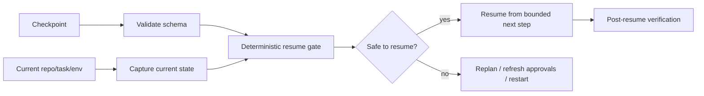

# Agent Long-Running Checkpoint Resume Integrity Gate

Reusable safety kit for long-running AI coding/operations agents that may pause, restart, lose process state, or resume hours later. It prevents an agent from continuing from a checkpoint when repository state, task scope, approvals, environment, or dependency assumptions have drifted.

## Problem
Long-running agents commonly persist a checkpoint and later continue as if nothing changed. That is unsafe when the branch advanced, files changed, approvals expired, secrets/permissions changed, tests became stale, or the task itself was superseded. A syntactically valid checkpoint is not proof that resumption is valid.

## Trigger
Use before resuming any agent task from persisted state after process restart, worker migration, tool outage, human pause, approval wait, CI interruption, or a delay longer than the configured freshness window.

## Inputs
- checkpoint JSON matching `schemas/checkpoint.schema.json`
- current repository path
- current Git HEAD and working tree
- current task identity and scope hash
- approval records referenced by the checkpoint
- optional environment fingerprint
- `config/resume-policy.json`

## Architecture


## Package tree
```text
README.md
config/resume-policy.json
schemas/checkpoint.schema.json
schemas/resume-report.schema.json
scripts/capture_resume_state.py
scripts/resume_integrity_gate.py
scripts/verify_package.py
skills/create-safe-checkpoint.md
skills/validate-resume-context.md
rules/checkpoint-resume-safety.md
subagents/checkpoint-inspector.md
subagents/resume-planner.md
subagents/verification-agent.md
workflows/checkpoint-resume.md
hooks/pre-checkpoint.md
hooks/pre-resume.md
examples/checkpoint-valid.json
examples/current-state-drifted.json
tests/test_resume_integrity_gate.py
```

## Installation
Python 3.10+ only. Executable scripts use the standard library.

## Usage
Capture deterministic current state:
```bash
python scripts/capture_resume_state.py --repo . --task-id TASK-123 --scope "src/api,tests/api" --output current-state.json
```

Evaluate a saved checkpoint:
```bash
python scripts/resume_integrity_gate.py --checkpoint checkpoint.json --current current-state.json --policy config/resume-policy.json --output resume-report.json
```

Run package self-verification:
```bash
python scripts/verify_package.py
```

Exit codes from the gate: `0` safe to resume, `1` resume blocked by integrity policy, `2` invalid input/configuration.

## Integrity model
The checkpoint binds resumable work to: task identity, normalized scope hash, repository HEAD, clean/dirty state, tracked-diff hash, expected next stage, checkpoint age, environment fingerprint when required, and approval expirations. The gate distinguishes stale context from ordinary execution failure.

A changed HEAD is blocking by default. A dirty-tree mismatch is blocking. A scope mismatch is blocking. Expired approvals are blocking. Age beyond the configured limit is blocking. Environment fingerprint drift is configurable because some repositories intentionally resume on interchangeable workers.

## Approval boundaries
A resume gate cannot grant authorization. Production deployment, destructive SQL, schema/data deletion, force push/history rewrite, infrastructure mutation, secret changes, production configuration, security weakening, breaking public contracts, and irreversible migrations require explicit current human approval. Approval captured before the checkpoint must still be valid at resume time.

## Failure and recovery
- Invalid checkpoint/current-state JSON: stop, no retry.
- Transient Git/tool read failure: retry at most twice while preserving stderr.
- Integrity mismatch: do not retry blindly; route to Resume Planner.
- Expired approval: refresh from a human; never extend automatically.
- Repository drift: re-explore affected context and create a fresh plan/checkpoint.
- Verification failure after resume: at most two implementation cycles, then stop with evidence.

## Verification
Resumption is verified only when the deterministic gate passes, the planned next stage still matches the task, relevant repository context is refreshed, host build/tests pass after resumed edits, the diff is reviewed, and an independent Verification Agent confirms no stale assumption remains.

## Definition of Done
- checkpoint and current-state schemas are valid
- task identity and scope match
- Git state matches policy or was explicitly re-baselined through replanning
- required approvals are current
- checkpoint age is acceptable
- resume report status is `pass`
- resumed stage is bounded and named
- relevant tests/build pass
- independent verification completes
- residual risks are recorded
- no blocking approval or integrity failure remains

## Portability
Core workflow is agent-neutral and works with Codex, Claude Code, Cursor, ChatGPT, GitHub Copilot, OpenCode, or custom agent runners. Adapter-specific persistence belongs outside the core package; store checkpoints in the schema defined here.
