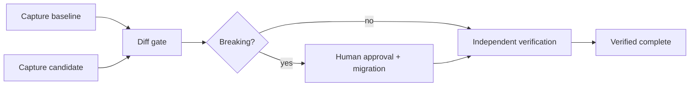

# Agent MCP Tool Schema Drift Gate

Reusable compatibility gate for MCP servers and agent clients. It detects breaking drift in tools, resources, and prompts before agents depend on an incompatible contract.

## Problem
MCP servers can stay healthy while tool names, required arguments, JSON Schema shapes, prompt definitions, or resources drift underneath agent workflows. Runtime failures then appear late and are hard to attribute.

## Trigger
Run after MCP registration/schema changes, MCP SDK upgrades, release preparation, or incidents involving tool validation failures.

## Inputs
- baseline capability snapshot
- candidate capability snapshot
- repository references to MCP tools/prompts/resources
- host build/test evidence
- optional explicit human approval for intentional breaking change

## Architecture


## Package tree
```text
README.md
config/policy.json
schemas/report.schema.json
scripts/mcp_schema_gate.py
scripts/verify_package.py
skills/investigate-schema-drift.md
skills/plan-compatible-migration.md
rules/mcp-contract-safety.md
subagents/contract-explorer.md
subagents/migration-planner.md
subagents/verification-agent.md
workflows/mcp-schema-drift.md
hooks/pre-change.md
hooks/post-change.md
examples/baseline.json
examples/candidate-breaking.json
tests/test_mcp_schema_gate.py
```

## Requirements
Python 3.10+. Runtime scripts use only the standard library.

## Snapshot format
A snapshot is a JSON object containing `tools`, `resources`, and `prompts` arrays. Every entry has a unique string `name`. Tools may expose MCP-style `inputSchema`.

Descriptions, titles, examples, defaults, and comments are ignored for invocation compatibility. The gate treats capability removal, newly required arguments, removal of existing arguments, changes to an existing argument schema, and structural resource/prompt changes as breaking.

## Usage
```bash
python scripts/mcp_schema_gate.py --baseline examples/baseline.json --candidate examples/candidate-breaking.json --output mcp-drift-report.json
python scripts/verify_package.py
```

Exit codes: 0 = compatible, 1 = breaking drift, 2 = invalid input.

## Approval boundaries
Explicit human approval is required before intentionally shipping a breaking MCP contract. Approval does not remove the obligation to migrate known clients and verify them. Production deployment, infrastructure changes, secret changes, destructive operations, force push/history rewrite, or security weakening also require separate explicit approval.

## Failure and recovery
Invalid snapshots block. Transient capture/tool failures retry at most twice. Compatibility/build/test failures allow at most two implementation cycles. Unknown external consumer impact stops for escalation. The gate never fails open.

## Verification
A server that starts successfully is not proof of compatibility. Verification requires valid snapshots, deterministic drift output, migrated known consumers, host tests/build passing, independent review, and no unresolved approval-required action.

## Definition of Done
- drift enumerated with evidence
- breaking/non-breaking separated
- known consumers mapped
- required migration implemented
- deterministic tests pass
- host validation passes
- independent verifier marks verified
- residual risks recorded
- no blocking failure remains
