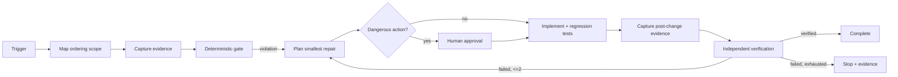

# Agent Message Ordering Sequence Gate

A reusable, evidence-driven implementation kit for finding and preventing order-sensitive message-processing defects in queue/event-driven systems.

## Problem
Asynchronous systems can process messages in a different order from business intent because of partitioning, concurrent consumers, retries, redelivery, dead-letter replay, producer races, or non-atomic sequence assignment. These failures often pass happy-path tests and appear later as stale state, impossible transitions, or duplicate side effects.

## Purpose
Make ordering assumptions explicit, capture partition/sequence evidence, detect inversions and gaps deterministically, constrain repairs to the smallest safe boundary, and require independent verification.

## When to use
Use when changing or investigating producers, queues/topics, partition routing, consumer concurrency, retries, event handlers, or order-sensitive state transitions.

Do not use when the domain is intentionally order-independent or when the only available signal is wall-clock time from unsynchronized machines and no authoritative sequence can be established.

## Architecture

## Package tree
- `skills/investigate-ordering.md`
- `skills/repair-ordering.md`
- `rules/message-ordering-safety.md`
- `subagents/ordering-investigator.md`
- `subagents/verification-agent.md`
- `workflows/message-ordering-gate.md`
- `hooks/pre-change.md`
- `hooks/final-verification.md`
- `scripts/message_order_gate.py`
- `scripts/verify_package.py`
- `config/policy.json`
- `schemas/evidence.schema.json`
- `templates/evidence.json`
- `examples/evidence-pass.json`
- `tests/test_message_order_gate.py`

## Installation and dependencies
Copy this directory into a repository. Requires Python 3.10+ and uses only the standard library. The host application supplies its own build/test tooling.

## Configuration
`config/policy.json` defines gap tolerance, duplicate handling, retry limits, and approval-required actions. Defaults require contiguous monotonic sequence within each partition. Duplicate sequences are reported but allowed because at-least-once delivery can be valid; the application must still prove idempotent duplicate handling.

## Permissions
Investigation requires only repository and read-only evidence access. Least privilege is mandatory. Production queue/data/config mutation is outside normal execution and requires explicit human approval.

## Usage
Copy `templates/evidence.json`, populate observations in actual consumption order, then run:

`python scripts/message_order_gate.py --evidence evidence.json --policy config/policy.json --output gate-result.json`

Run package tests:

`python -m unittest discover -s tests -v`

Verify package integrity:

`python scripts/verify_package.py`

Exit code 0 means the supplied trace satisfies configured ordering rules; 1 means a deterministic ordering finding blocks verification; 2 means input/tool validation failed.

## Workflow
The Ordering Investigator owns scope discovery and evidence. The implementation owner applies the smallest evidenced repair. The Verification Agent independently reconstructs the scope, runs adversarial cases, checks the diff, and decides `verified`, `blocked`, or `inconclusive`.

## Approval boundaries
Stop before message/queue deletion, queue purge, sequence-state rewrite, production transport configuration changes, destructive data repair, disabling ordering checks, force push/history rewrite, secret changes, or security weakening.

## Failure and recovery
Transient tool/environment failures may be retried at most twice. A repair/test loop is limited to two implementation iterations. Missing partition/sequence evidence yields `inconclusive`, not success. Repeated failures preserve evidence and escalate; permissions are never silently expanded.

## Verification
Proof requires the original failure evidence or regression reproduction, post-change ordered traces, applicable duplicate/gap/reversed/concurrent/retry tests, deterministic gate success, host build/tests, diff review, and independent verification. Code generation alone is not completion.

## Definition of Done
The ordering scope and sequence authority are known; evidence is preserved; the original defect is explained; the smallest safe repair is implemented; duplicate handling remains safe; tests/build and deterministic gate pass; independent verification reports `verified`; required approvals exist; and remaining risks are documented without a blocking failure.

## Customization
For transports with intentional gaps, raise `max_gap` only with an evidenced business reason. Adapt evidence extraction to Kafka offsets, Service Bus sessions, SQS FIFO message groups, RabbitMQ application sequences, database outbox sequences, or domain aggregate versions while keeping the core `message_id`, `partition_key`, and integer `sequence` contract.
