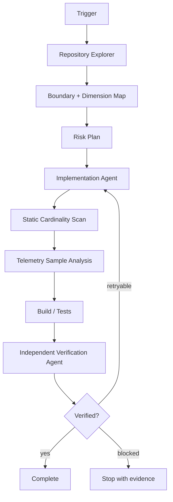

# Agent Observability Cardinality Budget Gate

A reusable, tool-neutral AI engineering kit that prevents telemetry cost and reliability incidents caused by unbounded metric-label, span-attribute, and log-field cardinality.

## Problem

AI-assisted changes frequently add observability fields such as `user_id`, raw URL, request ID, prompt text, exception message, tenant ID, file path, or arbitrary model/tool output. The code can build and tests can pass while telemetry series, indexing load, storage cost, query latency, and backend quotas explode in production. This package turns cardinality review into a repeatable engineering gate with deterministic scanning, telemetry-sample analysis, bounded remediation, independent verification, and explicit approval boundaries.

## Trigger

Use when code adds or changes metrics, tracing, structured logging, OpenTelemetry instrumentation, labels/tags/attributes, dynamic metric names, route dimensions, AI model/tool metadata, or telemetry exporters. Also use during cost incidents, backend series-limit alerts, high-cardinality warnings, or unexplained observability ingestion growth.

## Inputs

- repository root;
- task/change description;
- changed files or diff when available;
- optional JSONL telemetry sample;
- `config/cardinality-policy.json`.

## Outputs

- deterministic source findings;
- sample cardinality report when telemetry is supplied;
- facts, hypotheses, decisions, and evidence;
- bounded remediation plan;
- machine-checkable verification evidence.

## Architecture



## Package tree

```text
agent-observability-cardinality-budget-gate/
├── README.md
├── config/cardinality-policy.json
├── examples/evidence.example.json
├── examples/telemetry-sample.jsonl
├── hooks/lifecycle.md
├── rules/safety-and-observability.md
├── schemas/evidence.schema.json
├── scripts/analyze-sample.py
├── scripts/run-gate.sh
├── scripts/scan-cardinality.py
├── scripts/verify-evidence.py
├── skills/cardinality-investigation.md
├── skills/cardinality-remediation.md
├── skills/cardinality-verification.md
├── subagents/implementation-agent.md
├── subagents/repository-explorer.md
├── subagents/verification-agent.md
├── tests/test-gate.py
└── workflows/end-to-end.md
```

## Dependencies

Python 3.10+ standard library only. `run-gate.sh` requires a POSIX shell. Host-project formatters, linters, builds, and tests remain repository-specific.

## Installation

Copy this directory into a repository. Keep relative paths intact. Review the policy file before enforcing the gate.

```bash
python3 scripts/scan-cardinality.py --repo /path/to/repo --config config/cardinality-policy.json --output /tmp/cardinality-scan.json
python3 scripts/analyze-sample.py --input examples/telemetry-sample.jsonl --config config/cardinality-policy.json --output /tmp/cardinality-sample.json
python3 -m unittest tests/test-gate.py
```

## Configuration

`config/cardinality-policy.json` defines excluded paths, known dangerous dimension names, safe low-cardinality dimensions, maximum distinct values per key in a sample, maximum uniqueness ratio, source file extensions, and blocking severity. Tune thresholds to the observability backend and expected traffic shape; do not weaken them merely to make a failing change pass.

## Usage

```bash
./scripts/run-gate.sh --repo /path/to/repo --sample /path/to/sample.jsonl --evidence /path/to/evidence.json
```

The source scanner is heuristic. A static finding is a lead, not proof of a defect. Confirm material risk using call-site context, tests, telemetry samples, or backend evidence before claiming root cause.

## Workflow

1. Validate repository and policy inputs.
2. Locate telemetry producers and changed boundaries.
3. Inventory dimensions and classify bounded versus unbounded sources.
4. Run deterministic scan.
5. Analyze representative telemetry sample when available.
6. Form one evidence-backed hypothesis at a time.
7. Implement the smallest safe normalization, aggregation, allowlist, route-template, bucketing, or removal change.
8. Run host tests/build plus gate scripts.
9. Produce evidence matching `schemas/evidence.schema.json`.
10. Independent verifier confirms the claim. Maximum two implementation retries.

## Approval boundaries

Explicit human approval is required before production deployment, exporter/backend configuration changes, retention changes, sampling-policy changes, secret changes, infrastructure changes, destructive data operations, breaking public telemetry contracts relied on by external consumers, weakening security/privacy controls, or broad dependency upgrades. Agents stop before approval-required actions and never silently increase privileges.

## Failure handling

- Validation failure: stop and preserve command output.
- Static blocking finding: investigate; do not auto-edit solely from regex evidence.
- Sample threshold breach: identify offending key and value source before remediation.
- Build/test failure: one diagnosis pass and at most two implementation retries total.
- Tool failure: retry once only when clearly transient.
- Permission failure: stop; never elevate automatically.
- Missing representative sample: verification may proceed with focused deterministic tests, otherwise record `blocked`.
- Repeated failure after retry budget: stop with preserved evidence and unresolved risks.

## Verification

Execution is not verification. Successful verification requires applicable host tests/build to pass, no unexplained blocking findings, sample thresholds to pass or have approved documented exceptions, evidence JSON to validate, changed telemetry dimensions to be traced to bounded value sources, privacy/security constraints to remain intact, and the Verification Agent to set `verification_status` to `verified`.

## Definition of Done

- affected telemetry producers are identified;
- each changed dimension has an explicit boundedness rationale;
- confirmed high-cardinality sources are remediated with the smallest safe change;
- deterministic scanner passes or every non-blocking finding is explained;
- representative sample analysis passes when a sample is available;
- host build/tests pass where applicable;
- evidence contract is valid;
- independent verification is complete;
- required approval is recorded before any dangerous action;
- remaining risks are explicit and no blocking failure remains.

## Portability

Core instructions are compatible with Codex, Claude Code, Cursor, ChatGPT, GitHub Copilot, OpenCode, and other coding agents. Tool-specific adapters are intentionally omitted; bind repository-native commands in the host workflow rather than altering this package's safety semantics.
