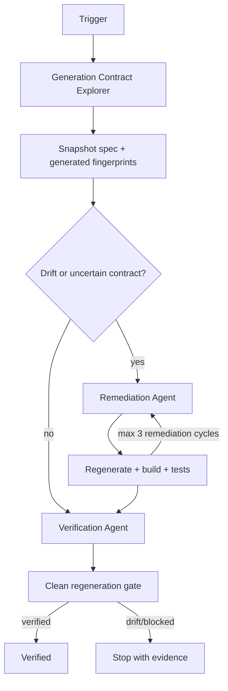

# Agent OpenAPI Generated Client Drift Gate

A reusable, tool-neutral engineering gate that prevents AI coding agents and CI pipelines from silently shipping generated API clients that no longer match the repository's authoritative OpenAPI contract.

## Problem
Generated SDKs frequently drift from their source specification. Common causes include a changed OpenAPI document without regeneration, a changed generator version, local-only generator flags, post-processing scripts, nondeterministic templates, or manual edits inside generated code. A repository can compile while exposing stale request models, missing endpoints, wrong nullability, obsolete serialization behavior, or incompatible client contracts.

## Purpose
This kit turns generated-client synchronization into an evidence-based workflow: discover the exact generation contract, fingerprint source and generated artifacts, remediate one evidenced cause at a time, regenerate from a clean state, run relevant tests, and require an independent verifier before declaring success.

## When to use
Use after OpenAPI changes, generated SDK diffs, generator/config changes, unexplained CI regeneration failures, release preparation, or when adding a generated-client consistency check to a repository.

## When not to use
This kit is not an API design review, runtime conformance test, API security scanner, deployment tool, or replacement for consumer contract testing. It only proves synchronization against the configured authoritative spec and generator pipeline.

## Architecture


## Package tree
```text
agent-openapi-generated-client-drift-gate/
├── README.md
├── config/
│   └── gate-config.json
├── hooks/
│   ├── final-verification.md
│   └── pre-task.md
├── rules/
│   └── openapi-generated-client-rules.md
├── scripts/
│   └── gate.py
├── skills/
│   ├── discover-generation-contract.md
│   └── remediate-client-drift.md
├── subagents/
│   ├── generation-contract-explorer.md
│   ├── remediation-agent.md
│   └── verification-agent.md
├── tests/
│   └── test_gate.py
└── workflows/
    └── generated-client-drift-workflow.md
```

## Component responsibilities
- `skills/discover-generation-contract.md` maps authoritative specs, generator versions/commands, transformations, outputs, and consumers.
- `skills/remediate-client-drift.md` defines the bounded fix-regenerate-test procedure.
- `rules/openapi-generated-client-rules.md` enforces repository, API, dependency, secret, and approval boundaries.
- `subagents/generation-contract-explorer.md` performs read-only discovery.
- `subagents/remediation-agent.md` owns minimal implementation changes.
- `subagents/verification-agent.md` independently owns the final pass/fail decision.
- `workflows/generated-client-drift-workflow.md` defines the end-to-end bounded workflow.
- `hooks/pre-task.md` captures the baseline fingerprint.
- `hooks/final-verification.md` blocks completion when clean regeneration changes generated output.
- `scripts/gate.py` provides deterministic snapshot, regeneration, and fingerprint comparison operations.
- `tests/test_gate.py` verifies the deterministic gate behavior using temporary Git repositories.

## Installation
Copy this directory into a repository. Requirements are Python 3.9+ and Git. The actual OpenAPI generator/runtime is repository-specific and must already be installable or pinned by the host project.

No third-party Python packages are required by `scripts/gate.py`.

## Configuration
Edit `config/gate-config.json`.

- `spec_paths`: candidate authoritative spec files. At least one must exist.
- `generated_roots`: directories or files containing checked-in generated clients.
- `generator_commands`: exact generator command chain, in execution order. Example values might be `dotnet tool run nswag run nswag.json`, `npm run generate:api`, or `openapi-generator-cli generate ...`; use the repository's actual pinned command.
- `ignore_globs`: non-semantic files excluded from fingerprints.
- `allow_manual_edits`: policy signal for agents; defaults to false.
- `max_regeneration_attempts`: bounded recovery limit. The workflow additionally caps remediation cycles at three.
- `require_clean_worktree_before_regeneration`: blocks the final generation gate when unrelated changes exist.
- `require_generated_diff_empty_after_regeneration`: documents the expected final invariant.

Do not put secrets in the configuration. If a generator requires credentials, stop and use the host repository's existing secret mechanism with least privilege.

## Permissions
The core gate needs repository read access, local Git status/diff, Python execution, and local execution of the configured generator/build/tests. Remediation requires normal repository edit permission. It does not require production, registry, infrastructure, secret-management, deployment, or Git-history rewrite permissions.

## Usage
Run from this package directory, or adapt paths from the host repository root.

Capture the current contract fingerprint:
```bash
python scripts/gate.py snapshot \
  --config config/gate-config.json \
  --out .openapi-drift/before.json
```

After configuring the exact generator command and reaching a clean candidate state, prove regeneration creates no generated drift:
```bash
python scripts/gate.py regenerate \
  --config config/gate-config.json \
  --out .openapi-drift/regenerate.json
```

Compare two explicit snapshots when investigating whether source/spec/generated state changed between checkpoints:
```bash
python scripts/gate.py verify-pair \
  --before .openapi-drift/before.json \
  --after .openapi-drift/after.json \
  --out .openapi-drift/pair-verification.json
```

Run the package tests:
```bash
python -m unittest tests/test_gate.py
```

## Example invocation for an AI coding agent
Provide the task plus this package and instruct the agent to follow `workflows/generated-client-drift-workflow.md`, starting with `skills/discover-generation-contract.md`. The agent must not manually patch generated files merely to satisfy tests and must stop before any approval-required API or dependency change.

## Workflow
The workflow is:

```text
Trigger
  ↓
Discover authoritative spec + generator contract
  ↓
Snapshot evidence
  ↓
Classify drift
  ↓
Minimal remediation
  ↓
Regenerate
  ↓
Build/test
  ↓
Independent clean-regeneration verification
  ↓
verified | blocked | failed
```

Facts, hypotheses, decisions, evidence, and open questions must remain separate. Scanner/fingerprint differences are evidence of state change, not automatically proof of the business root cause.

## Approval boundaries
Explicit human approval is required before breaking an API contract, changing a generator major version, performing a large dependency upgrade, deleting public generated surface, changing secrets, changing infrastructure or production configuration, weakening security controls, deploying, releasing, or rewriting Git history. Agents stop before these actions.

## Failure and recovery
- **Transient generator/network/tool failure:** preserve logs and retry at most twice.
- **Validation failure:** fix configuration or missing context; do not proceed to a success state.
- **Build/test failure:** preserve output, test one bounded hypothesis, and re-run; maximum three remediation cycles.
- **Deterministic generated drift:** do not blind-retry. Inspect the diff and generation contract.
- **Permission failure:** stop without escalating privileges.
- **Missing/ambiguous authoritative spec or generator:** status is blocked until repository evidence resolves it.

## Verification
`Task executed` means code generation or edits ran. It does not mean the repository is synchronized.

`Task verified successfully` requires all of the following:
- authoritative spec identified with evidence;
- exact generator command and version known;
- generated roots identified;
- no forbidden manual generated-file edits;
- relevant compile/build/tests pass;
- clean deterministic regeneration creates no unexpected generated diff;
- required approvals are present;
- independent verifier reports `verified`.

## Definition of Done
The task is done only when required context is gathered, the generation contract is documented by evidence, all required source/generated artifacts exist, the smallest necessary changes are present, relevant tests pass, final regeneration is clean, approval requirements are satisfied, unresolved risks are documented, and no blocking failure remains.

## Customization
Keep core workflow instructions tool-neutral. Customize only `config/gate-config.json`, repository-native build/test commands, and the exact generator command/version. If a project needs semantic OpenAPI compatibility checks in addition to generated synchronization, add them as a separate deterministic gate rather than weakening this one.
