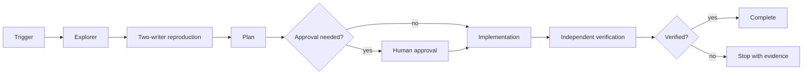

# Agent Optimistic Concurrency Lost-Update Gate

## Problem
Concurrent read-modify-write operations can both succeed while the later write silently erases part of the earlier writer's intent. AI-generated fixes often add retries or broaden transactions without proving conflict semantics.

## Purpose
Provide a reusable evidence-first workflow to discover shared writers, reproduce a lost update, implement native optimistic concurrency, and independently prove that stale writers cannot silently overwrite committed state.

## When to use
Use for shared mutable entities, counters/settings/profile edits, EF Core/JPA/ORM updates, REST resources with ETags, document databases with versions, background workers, or any feature where concurrent writers are plausible.

## When not to use
Do not use as a substitute for distributed locking when the business invariant truly requires exclusive ownership, or when last-write-wins is explicitly required and documented.

## Architecture


## Package tree
```text
agent-optimistic-concurrency-lost-update-gate/
├── README.md
├── skills/
│   ├── investigate-concurrency.md
│   └── implement-concurrency-control.md
├── rules/concurrency-safety.md
├── subagents/
│   ├── concurrency-explorer.md
│   ├── implementation-agent.md
│   └── verification-agent.md
├── workflows/lost-update-gate.md
├── hooks/lifecycle-hooks.md
├── scripts/concurrency_gate.py
├── schemas/verification-report.schema.json
├── templates/investigation-report.md
└── examples/concurrency-verification.json
```

## Installation
Copy this directory into the target repository. Requires Python 3.9+ and Git. Project-specific build/test tooling remains the host repository's responsibility.

## Permissions
Core investigation needs read access plus local test execution. Implementation needs repository write access. Production, schema, destructive, secret, infrastructure, breaking-contract, security-weakening, force-push and irreversible actions are outside default permissions and require explicit approval.

## Usage
```bash
python scripts/concurrency_gate.py preflight --repo .
python scripts/concurrency_gate.py scan --repo .
python scripts/concurrency_gate.py verify --repo . --report artifacts/concurrency-verification.json
```
The scanner is heuristic discovery only; it does not prove safety. The verifier checks the explicit evidence contract after project-specific tests have actually run.

## Workflow
Follow `workflows/lost-update-gate.md`. Explorer owns evidence collection, Implementation Agent owns changes, and Verification Agent independently verifies. Build/test repair is bounded to two implementation iterations; transient tool startup retries are bounded to two.

## Failure handling
Environment and permission failures stop with preserved evidence. An inconclusive reproduction is not success. A concurrency conflict is a domain outcome and must not be hidden by blind retry. Repeated build/test failure stops after two fix iterations.

## Approval boundaries
Explicit approval is required before schema changes, destructive SQL/data operations, production deployment/configuration, infrastructure or secret changes, breaking API changes, weakened security, irreversible migrations, large dependency upgrades, force push, or history rewriting.

## Verification
Success requires all in-scope writers mapped, a faithful overlapping-writer test, explicit conflict behavior, preservation of the winning write, passing build and targeted tests, scoped diff, valid verification report, and independent verification.

## Definition of Done
- Required context and writer map exist.
- Facts and hypotheses are separated.
- Lost-update risk is reproduced or ruled out with evidence.
- Required implementation and tests exist.
- Build and targeted tests pass.
- Two-writer verification passes.
- Required approvals are obtained.
- No unintended changes remain.
- Remaining risks are documented.
- Verification Agent reports `verified`.

## Customization
Adapt the project-specific test/build commands and concurrency primitive to the persistence stack, but keep the conflict contract, bounded retries, independent verification, and approval boundaries intact.