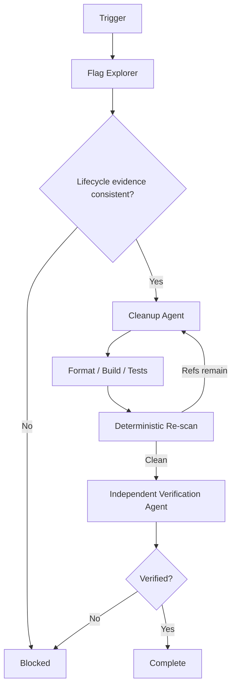

# Agent Orphaned Feature Flag Cleanup Gate

A reusable AI engineering kit for safely removing retired feature flags without guessing which branch must survive, deleting adjacent controls, or leaving stale references behind.

## Problem
Feature flags frequently outlive their rollout. Once stale, they create dead branches, duplicated tests, obsolete configuration, misleading telemetry, and future debugging ambiguity. AI coding agents are especially prone to treating an expired flag or a locally disabled default as proof that one branch can be deleted. That is unsafe when rollout state, production behavior, or ownership evidence differs from the repository.

## Purpose
Make feature-flag cleanup evidence-driven and bounded: discover the lifecycle, prove the permanent behavior, remove only flag-specific dead code, run deterministic reference checks, execute repository-native tests, and require independent verification.

## When to use
Use when a flag is marked retired, a rollout is complete, an expiration/cleanup issue is opened, or repository maintenance identifies a stale feature-flag branch.

## When not to use
Do not use this package to change rollout percentages, enable/disable production flags, delete remote provider state, alter production configuration, or decide product behavior when the permanent branch is not already established by evidence.

## Architecture


## Package tree
```text
agent-orphaned-feature-flag-cleanup-gate/
├── README.md
├── config/
│   └── flag-policy.json
├── examples/
│   └── flag-registry.json
├── hooks/
│   ├── final-verification.md
│   └── pre-task.md
├── rules/
│   └── feature-flag-rules.md
├── schemas/
│   └── cleanup-report.schema.json
├── scripts/
│   ├── flag_cleanup_gate.py
│   └── run_checks.sh
├── skills/
│   ├── discover-flag-lifecycle.md
│   └── remove-orphaned-flag.md
├── subagents/
│   ├── cleanup-agent.md
│   ├── flag-explorer.md
│   └── verification-agent.md
├── tests/
│   └── test_flag_cleanup_gate.py
└── workflows/
    └── orphaned-flag-cleanup.md
```

## Component responsibilities
- `skills/discover-flag-lifecycle.md` defines the evidence-first discovery procedure.
- `skills/remove-orphaned-flag.md` defines the bounded implementation/test loop.
- `rules/feature-flag-rules.md` defines mandatory safety and approval boundaries.
- `subagents/flag-explorer.md` owns read-only lifecycle/context discovery.
- `subagents/cleanup-agent.md` owns implementation only.
- `subagents/verification-agent.md` independently decides final status.
- `scripts/flag_cleanup_gate.py` scans exact flag references and validates final retired-state evidence.
- `scripts/run_checks.sh` runs the deterministic scan + verification sequence.
- `hooks/` define pre-task and final lifecycle checks.
- `config/flag-policy.json` contains portable scan/retry policy.
- `schemas/cleanup-report.schema.json` documents the final verification artifact contract.

## Installation
Copy this directory into the target repository. Requirements:
- Python 3.9+
- Bash for `run_checks.sh`
- The repository's native build/test tooling

If your copy process strips executable bits, either invoke scripts explicitly (`python ...`, `bash ...`) or run:
```bash
chmod +x scripts/flag_cleanup_gate.py scripts/run_checks.sh
```

## Configuration
Replace `examples/flag-registry.json` with your repository's real flag registry or generate an equivalent JSON file with this shape:
```json
{
  "flags": [
    {
      "key": "checkout-v2",
      "state": "retired",
      "owner": "payments",
      "retired_at": "2026-09-01",
      "expected_behavior": "enabled"
    }
  ]
}
```

`expected_behavior` must be `enabled` or `disabled` for final verification. Edit `config/flag-policy.json` to match repository file extensions and generated/vendor directories. Keep `allowed_reference_globs` narrow; widening it weakens evidence and should be reviewed.

## Permissions
The core workflow needs repository read access, local edit access for implementation, and local build/test permission. It does not require production flag-provider access, registry administration, deployment permission, secret-management access, infrastructure mutation, or Git history rewrite rights.

## Usage
From this package directory, or adapt paths when embedded elsewhere:
```bash
python scripts/flag_cleanup_gate.py scan \
  --flag checkout-v2 \
  --root /path/to/repository \
  --registry /path/to/flag-registry.json \
  --policy config/flag-policy.json \
  --out .flag-cleanup/scan.json
```

After cleanup and repository-native tests:
```bash
python scripts/flag_cleanup_gate.py scan \
  --flag checkout-v2 \
  --root /path/to/repository \
  --registry /path/to/flag-registry.json \
  --policy config/flag-policy.json \
  --out .flag-cleanup/scan.json

python scripts/flag_cleanup_gate.py verify \
  --flag checkout-v2 \
  --registry /path/to/flag-registry.json \
  --policy config/flag-policy.json \
  --scan .flag-cleanup/scan.json \
  --out .flag-cleanup/verification.json
```

Or configure environment variables and run:
```bash
FLAG=checkout-v2 \
REGISTRY=/path/to/flag-registry.json \
ROOT=/path/to/repository \
bash scripts/run_checks.sh
```

## Workflow
Follow `workflows/orphaned-flag-cleanup.md`:

1. Discover lifecycle and all exact references.
2. Prove the permanent branch from registry plus repository/test evidence.
3. Plan a disposition for every active reference.
4. Implement the smallest cleanup.
5. Run formatter/build/targeted tests.
6. Re-scan until zero non-allowlisted references remain, with at most 3 implementation cycles.
7. Independently verify final evidence.

A scan finding is evidence of a reference, not proof that the reference is safe to remove. Documentation and historical artifacts can be allowlisted; executable references cannot be silently ignored.

## Approval boundaries
Explicit human approval is required before:
- changing or deleting production flag/provider state;
- production configuration changes;
- breaking public API contracts;
- data/file deletion outside scoped dead source code;
- secret changes;
- infrastructure changes;
- weakening security controls;
- irreversible migrations;
- large dependency upgrades.

Agents stop before approval-required actions and never increase permissions to unblock themselves.

## Failure and recovery
- **Transient tool/environment failure:** preserve logs and retry at most 2 times.
- **Validation failure:** missing registry entry, missing owner/retired state, contradictory permanent behavior, or unreadable context blocks implementation.
- **Build/test failure:** return to the Cleanup Agent within a maximum of 3 implementation/test-fix cycles.
- **Remaining reference:** classify it; remove it only with evidence or mark the workflow blocked.
- **Permission failure:** stop; do not escalate automatically.
- **Business-rule conflict:** if registry and repository evidence disagree on permanent behavior, stop for human resolution.

Never retry a deterministic failure until success without changing the evidenced hypothesis.

## Verification
`Task executed` means source was edited and commands ran.

`Task verified successfully` requires all of the following:
- lifecycle evidence is complete;
- registry state is `retired`;
- `expected_behavior` is explicit;
- targeted repository tests/build pass;
- scan reports zero non-allowlisted references;
- final diff contains no unrelated changes;
- required approvals exist;
- independent verifier reports `verified`.

Run the package's deterministic tests:
```bash
python -m unittest tests/test_flag_cleanup_gate.py
```

## Definition of Done
- Flag owner, state, retirement date, and permanent behavior are known.
- Every repository reference was classified before editing.
- Permanent behavior is preserved and covered by tests.
- Dead flag-only branches/plumbing are removed without deleting unrelated validation, authorization, telemetry, or error handling.
- Repository-native checks pass.
- Zero non-allowlisted references remain.
- Verification output is `verified`.
- Required approvals are recorded.
- Remaining risks are documented and non-blocking.

## Customization
For non-JSON flag systems, export a small JSON registry snapshot rather than embedding provider credentials into this kit. Add ecosystem-specific file extensions and generated directories in `config/flag-policy.json`. Keep provider-specific integrations outside the core workflow so discovery, implementation, safety, and verification remain portable across Codex, Claude Code, Cursor, ChatGPT, GitHub Copilot, OpenCode, and other coding agents.
