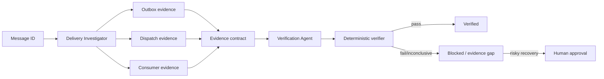

# Agent Outbox Delivery Verification Gate

A reusable evidence-first workflow for AI coding/operations agents investigating transactional-outbox messages that appear missing, delayed, duplicated, or uncertain. It prevents the common mistake of treating an outbox processed flag or broker acknowledgement as proof that downstream business processing succeeded.

## When to use
Use when an application persists integration events transactionally and a developer or operator needs to determine the exact delivery state before considering recovery. Do not use as a broker implementation, production replay tool, or substitute for application-specific idempotency.

## Architecture


## Package tree
```text
agent-outbox-delivery-verification-gate/
├── README.md
├── config/gate.json
├── schemas/evidence.schema.json
├── skills/investigate-delivery.md
├── rules/safety.md
├── subagents/delivery-investigator.md
├── subagents/verification-agent.md
├── workflows/investigate-and-verify.md
├── hooks/lifecycle.md
├── scripts/verify_outbox.py
└── examples/evidence.json
```

## Components
`skills/investigate-delivery.md` defines the reusable investigation procedure. `rules/safety.md` enforces evidence and production boundaries. The Delivery Investigator gathers facts while the independent Verification Agent owns the final decision. `schemas/evidence.schema.json` defines the handoff contract. `scripts/verify_outbox.py` performs a mutation-free deterministic completion check. `hooks/lifecycle.md` defines blocking lifecycle gates.

## Installation and dependencies
Copy this directory into the target repository. Python 3.9+ is sufficient for the verifier; it uses only the standard library. Database, broker, and observability clients are intentionally project-specific and should be exposed to the agent with read-only permissions.

## Configuration
`config/gate.json` fixes two transient query retries, the three required evidence classes, allowed statuses, and approval-required operations. Adapt evidence source names to the target observability stack without weakening approval boundaries.

## Permissions
Default to repository read access plus read-only database/log/trace access. No broker publish, database write, production configuration, secret-management, or deployment permission is required for investigation and verification.

## Usage
Give the agent a message/correlation ID, expected event type, environment, and bounded time window, then execute `workflows/investigate-and-verify.md`. Store the resulting evidence in a JSON file using the schema contract.

Example deterministic check:
```bash
python scripts/verify_outbox.py examples/evidence.json
```
A zero exit code proves that the artifact contains the required evidence classes and declares a passing verified result; it does not independently query production systems. Source evidence must therefore remain traceable and reviewable.

## Workflow and recovery
The investigator traces persistence → dispatcher → consumer, then assesses duplicate and ordering hazards. The verifier independently reviews identity and evidence before running the script. Transient telemetry queries may retry at most twice. Permission, validation, contradictory-evidence, and business failures stop immediately. Evidence gaps produce `blocked` or `inconclusive`, never fabricated success.

## Approval boundaries
Explicit human approval is required before production replay, message deletion, database schema change, broker/production configuration change, permission elevation, or any action capable of producing another delivery. The approval request must identify the message, proposed action, duplicate risk, ordering risk, and containment/rollback plan.

## Verification
Successful verification requires the same message identity across an outbox row, dispatch attempt, and consumer observation; explicit duplicate and ordering analysis; schema-compatible evidence; `status=verified`; `verification.result=pass`; and exit code 0 from `scripts/verify_outbox.py`.

## Definition of Done
The message identity is proven, required evidence is preserved, consumer business processing is distinguished from broker acknowledgement, risks are assessed, deterministic verification passes, and no approval-required action was executed without approval. An inconclusive investigation is complete only as a blocked outcome with the missing evidence named.

## Portability
The workflow is agent-tool neutral. Codex, Claude Code, Cursor, ChatGPT, Copilot, OpenCode, or another coding agent can implement the roles as long as the same contracts, least-privilege rules, bounded retries, independent verification, and approval boundaries are preserved.
