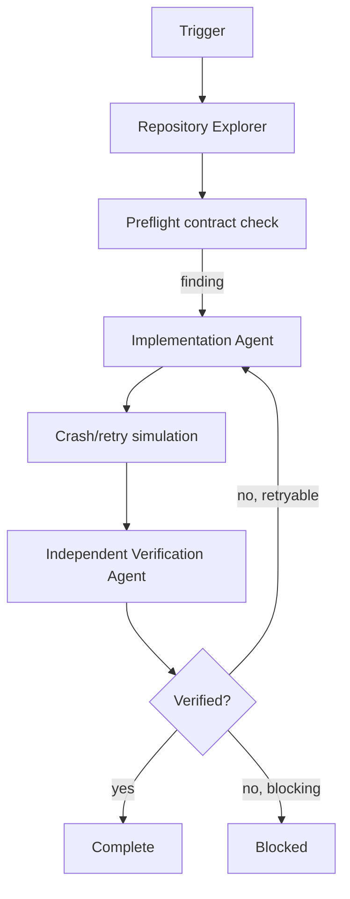

# Agent Outbox Transactional Message Delivery Gate

A reusable implementation kit for proving that database state changes and emitted integration messages stay consistent under crashes, retries, duplicate delivery, and partial failure.

## Problem
Applications often commit business data and publish a message as two separate operations. A crash between them can create missing events; publishing first can create messages for transactions that later roll back. A transactional outbox closes that atomicity gap, but incorrect polling, leasing, idempotency, or retry behavior can still duplicate or lose delivery.

## Purpose
Give an AI coding agent a bounded workflow to discover the transaction boundary, verify outbox persistence, inspect dispatcher ownership, implement the smallest safe fix, simulate crash windows deterministically, and independently verify delivery guarantees.

## When to use
Use for new or modified event publishing, queue/broker integration, background dispatchers, transactional outbox implementations, duplicate-message incidents, missing events, or reliability review before release.

## When not to use
This package does not deploy brokers, mutate production data, rotate secrets, or guarantee exactly-once side effects across arbitrary external systems. It targets atomic persistence plus at-least-once dispatch with idempotent consumers.

## Architecture


## Package tree
```text
agent-outbox-transactional-message-delivery-gate/
├── README.md
├── config/outbox-policy.json
├── examples/evidence.json
├── hooks/final-verification.md
├── hooks/pre-task.md
├── rules/outbox-rules.md
├── schemas/evidence.schema.json
├── scripts/outbox_check.py
├── scripts/simulate_delivery.py
├── skills/discover-outbox-contract.md
├── skills/remediate-delivery-risk.md
├── subagents/implementation-agent.md
├── subagents/repository-explorer.md
├── subagents/verification-agent.md
├── tests/test_outbox_check.py
└── workflows/outbox-delivery-workflow.md
```

## Installation
Copy this directory into a repository. Requirements: Python 3.9+ and Git. The scripts use only the Python standard library. No database or broker credentials are required for the included deterministic checks.

## Configuration
Edit `config/outbox-policy.json` to match approved repository patterns. The default policy requires evidence for: business write and outbox insert sharing one transaction, stable event identity, retry metadata, bounded lease ownership, consumer idempotency, and no direct broker publish inside the business transaction path.

## Usage
```bash
python scripts/outbox_check.py scan --root . --policy config/outbox-policy.json --out .outbox/evidence.json
python scripts/simulate_delivery.py --scenario all --out .outbox/simulation.json
python scripts/outbox_check.py verify --evidence .outbox/evidence.json --simulation .outbox/simulation.json --out .outbox/verification.json
python -m unittest tests/test_outbox_check.py
```

## Permissions
Read repository; edit only relevant application/tests; run local tests. Production database writes, broker publishing, destructive SQL, schema migration execution, infrastructure changes, secret changes, deployment, force push, and breaking API changes require explicit human approval and are outside the default workflow.

## Workflow
Follow `workflows/outbox-delivery-workflow.md`. Repository reasoning identifies transaction semantics; deterministic scripts check required evidence fields and simulate crash windows. Implementation and final verification have separate ownership.

## Failure handling
Transient tool/test-environment failures may be retried at most twice with evidence preserved. Implementation/test-fix cycles are capped at three. Deterministic contract failures are not blind-retried. Permission failures stop immediately without privilege escalation.

## Verification
`Task executed` means code changed or checks ran. `Task verified successfully` requires: atomic business+outbox persistence evidence, stable event identity, bounded dispatcher claim/lease semantics, retry preservation, idempotent consumer evidence, passing simulation, passing repository tests, clean diff scope, and independent verifier status `verified`.

## Approval boundaries
Human approval is required before database schema changes, destructive SQL, production data edits, broker/topic changes, secret changes, production deployment/config changes, large dependency upgrades, breaking contracts, or weakening idempotency/retry/security controls.

## Definition of Done
- Transaction boundary is identified with file/line evidence.
- Outbox insert is atomic with the business mutation.
- Event identity is stable across retries.
- Dispatcher ownership cannot silently double-claim the same record without expiry semantics.
- Failed delivery remains retryable and does not mark the row delivered.
- Consumer-side duplicate handling is documented and tested or an explicit blocking risk is recorded.
- Deterministic simulation passes all scenarios.
- Relevant project tests pass.
- No unrelated changes remain.
- Final verification status is `verified`.

## Customization
Extend scanner patterns for your stack, but keep claims evidence-based. Use repository-native integration tests for framework-specific transaction semantics and keep production credentials out of this package.