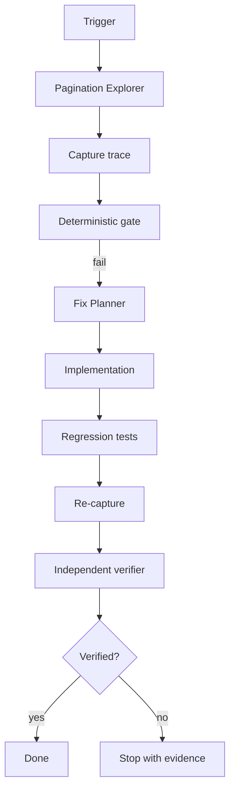

# Agent Pagination Cursor Stability Gate

Reusable implementation kit for detecting and repairing unstable cursor/keyset pagination that duplicates, skips, reorders, or cycles records.

## Problem
Single-page tests can pass while boundary behavior fails because of non-unique ordering, missing tie-breakers, incomplete cursor payloads, mismatched predicates, or non-advancing cursors.

## Purpose
Combine repository investigation, deterministic trace validation, bounded remediation, regression tests, independent verification, and explicit approval boundaries.

## When to use
Use after pagination changes, duplicate/missing records, infinite pagination, inconsistent ordering, or cursor-format migrations.

## When not to use
This is not an authorization test suite, migration reviewer, load tester, or offset-pagination framework. It never requires production mutation.

## Architecture


## Package tree
```text
agent-pagination-cursor-stability-gate/
├── README.md
├── config/policy.json
├── schemas/trace.schema.json
├── scripts/pagination_cursor_gate.py
├── scripts/verify_package.py
├── skills/investigate-cursor-instability.md
├── skills/plan-stable-pagination-fix.md
├── rules/cursor-stability-rules.md
├── subagents/pagination-explorer.md
├── subagents/fix-planner.md
├── subagents/verification-agent.md
├── workflows/cursor-stability.md
├── hooks/pre-change.md
├── hooks/post-change.md
├── examples/stable-trace.json
├── examples/unstable-trace.json
└── tests/test_pagination_cursor_gate.py
```

## Installation
Copy the directory into a repository. Requires Python 3.9+ only. Restore executable bits on Unix with `chmod +x scripts/*.py` if needed.

## Configuration
Edit `config/policy.json`. Defaults require unique IDs, cursor continuity, strict monotonic order, terminal null cursor, and bounded page count.

## Permissions
Core use needs repository read and local test execution. Implementation needs normal worktree edits. Production writes, deployment, infrastructure, secrets, destructive database actions, and Git history rewriting are excluded.

## Usage
```bash
python scripts/pagination_cursor_gate.py --trace examples/stable-trace.json --policy config/policy.json --out .cursor-gate/report.json
python scripts/verify_package.py
```

Each trace item contains `id` and `sort_key`, the exact ORDER BY tuple. Add `expected_ids` when an independent complete snapshot exists.

## Workflow
Follow `workflows/cursor-stability.md`: discover → capture → gate → plan → implement → test → re-capture → independently verify. Implementation cycles are capped at three; transient tool/API retries at two.

## Approval boundaries
Human approval is required before breaking an existing cursor/API contract, schema changes, destructive SQL/data deletion, production deployment/configuration, infrastructure/secret changes, security weakening, Git history rewriting, or large dependency upgrades.

## Failure handling
Malformed input exits 2. Stability violations exit 1 and preserve evidence. Deterministic failures are not blind-retried.

## Verification
**Task executed** means investigation or edits occurred. **Task verified successfully** requires relevant tests, final trace status `pass`, no unintended contract/security changes, required approvals, and independent verifier status `verified`.

## Definition of Done
- Pagination entry point, filters, ordering tuple, cursor codec, and tests are identified.
- The defect is reproduced with evidence.
- Ordering is a deterministic total order.
- Cursor payload/comparison semantics match that order.
- Regression tests cover the defect and boundary ties.
- Final trace has no duplicate IDs, cursor cycles/discontinuities, non-monotonic order, or missing expected IDs.
- Final cursor is terminal according to policy.
- Relevant tests and package verification pass.
- Required approvals exist; remaining risks are non-blocking.

## Customization
Extend the trace with endpoint metadata if useful, but keep `id`, `sort_key`, and cursor fields stable. Add database-specific adapters rather than weakening the core gate.
