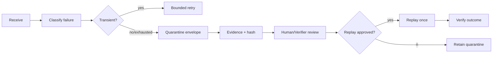

# Agent Poison Message Quarantine Gate

A reusable gate for queue consumers that repeatedly fail on the same message. It prevents infinite retry storms, preserves evidence, quarantines poison messages, and makes replay an explicit verified operation.

## Problem and trigger
Use when a queue/topic/subscription consumer has retries, dead-lettering, or manual replay and a malformed or business-invalid message can consume capacity indefinitely. Do not use as a replacement for normal transient retry policy.

## Architecture


## Package tree
- `config/policy.json` — retry/quarantine policy.
- `schemas/quarantine-envelope.schema.json` — handoff contract.
- `scripts/quarantine_gate.py` — validate, classify, create/verify envelopes.
- `skills/investigate-poison-message.md` — evidence-first investigation.
- `skills/replay-quarantined-message.md` — controlled replay.
- `rules/safety.md` — enforceable boundaries.
- `subagents/investigator.md`, `subagents/verifier.md` — separated ownership.
- `workflows/quarantine-and-replay.md` — end-to-end bounded workflow.
- `hooks/pre-replay.md`, `hooks/post-failure.md` — lifecycle checks.
- `examples/failure.json` — runnable example.
- `tests/test_quarantine_gate.py` — deterministic tests.

## Install and dependencies
Python 3.10+ only; no third-party packages. Copy this directory into a repository. Adjust `config/policy.json` for the host queue. The reference script does not connect to a broker or delete messages; adapters should invoke it around the host's receive/dead-letter/replay operations.

## Usage
```bash
python scripts/quarantine_gate.py validate-policy config/policy.json
python scripts/quarantine_gate.py quarantine --policy config/policy.json --failure examples/failure.json --out quarantine.json
python scripts/quarantine_gate.py verify-envelope --policy config/policy.json quarantine.json
```

## Workflow and permissions
The consumer may read message metadata/body, retry within policy, and write a quarantine artifact. It must not purge queues, change broker policy, expose secrets, or replay into production without explicit approval. Replay requires an unchanged envelope hash and independent verification.

## Failure handling
Transient failures retry at most `max_transient_retries`; validation/business failures quarantine immediately; exhausted transient failures quarantine. Tool/environment failures stop and preserve evidence. A failed replay is never automatically replayed again.

## Verification / Definition of Done
Done only when policy validates; failure evidence is captured; envelope schema and SHA-256 integrity pass; retry count is bounded; sensitive body handling follows policy; verifier records a decision; any production replay has explicit approval; replay outcome is recorded; no destructive queue operation occurred.

## Customization
Implement broker-specific adapters outside the core gate. Keep classification names and envelope fields stable or version the schema. Prefer message references/hashes over raw bodies when payloads may contain secrets or PII.
