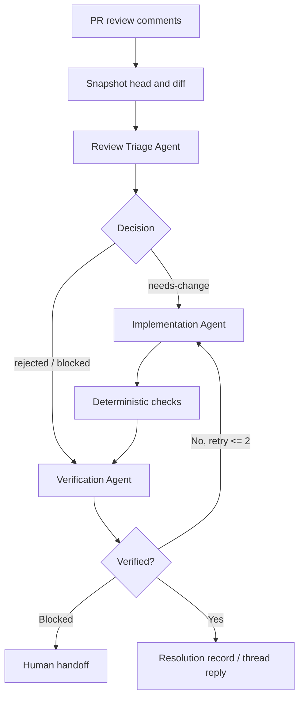

# Agent PR Review Comment Resolution Gate

A reusable AI-engineering package for turning pull-request review comments into evidence-backed code changes, bounded retries, independent verification, and safe reviewer handoff.

## Problem
AI coding agents often treat review comments as instructions to edit code immediately. That creates four recurring risks: stale review context, over-broad refactors, unverified “fixed” claims, and silent disagreement with reviewers. This package separates investigation, implementation, and verification so every comment reaches a traceable state.

## Purpose
Use this kit to process unresolved pull-request review feedback with a repeatable workflow that:

- snapshots the current PR state before edits;
- triages each comment against repository evidence;
- implements only accepted changes;
- verifies tests and diff scope deterministically;
- keeps disputed or blocked comments visible;
- stops before dangerous actions that require human approval.

## When to use
Use for PRs with inline review threads, requested changes, architecture/code-quality review feedback, or a human request to address review comments.

## When not to use
Do not use as a substitute for product decisions, security exceptions, production deployment approval, force-push authorization, or breaking-contract approval. Those decisions remain human-owned.

## Architecture



## Package tree

```text
agent-pr-review-comment-resolution-gate/
├── README.md
├── config/
│   └── policy.yaml
├── hooks/
│   └── lifecycle.md
├── rules/
│   └── pr-review-safety.md
├── schemas/
│   └── review-resolution.schema.json
├── scripts/
│   ├── diff_scope_gate.py
│   ├── review_gate.py
│   └── verify_package.py
├── skills/
│   ├── review-comment-triage.md
│   └── review-fix-verify.md
├── subagents/
│   ├── review-implementation-agent.md
│   ├── review-triage-agent.md
│   └── review-verification-agent.md
├── templates/
│   └── resolution.json
├── tests/
│   └── test_review_gate.py
└── workflows/
    └── resolve-review-comments.md
```

## Component responsibilities

`skills/review-comment-triage.md` defines how to convert reviewer text into repository-backed decisions. `skills/review-fix-verify.md` defines the implementation/test loop. The three subagents isolate triage, editing, and verification ownership. `rules/pr-review-safety.md` defines mandatory and forbidden behavior. `workflows/resolve-review-comments.md` coordinates the complete lifecycle. `hooks/lifecycle.md` defines blocking checkpoints. `scripts/review_gate.py` validates that every completed comment has evidence and a terminal state. `scripts/diff_scope_gate.py` prevents unrelated file changes. `scripts/verify_package.py` validates package completeness.

## Installation

Copy this directory into a repository or agent-instructions location. Python 3.9+ is sufficient for the deterministic scripts. `pytest` is needed only to run the package tests.

No secrets are required by this package.

## Configuration

Edit `config/policy.yaml` only when repository governance differs. Keep `max_retries` bounded. Add approval-required actions rather than removing safety boundaries when the repository is high risk.

## Permissions

The triage and verification agents need read access to the repository and pull-request discussion. The implementation agent needs only the minimum write access required to edit the working branch. Thread replies/resolution should be performed only by an authorized GitHub identity/tool. Production, infrastructure, secret, destructive database, and history-rewrite permissions are not required.

## Usage

1. Record the PR number and current head SHA.
2. Retrieve unresolved review threads and the current diff.
3. Run the triage procedure in `skills/review-comment-triage.md`.
4. Create a resolution record based on `templates/resolution.json`.
5. Apply accepted changes with `skills/review-fix-verify.md`.
6. Run repository tests/build/formatters.
7. Validate comment evidence:

```bash
python scripts/review_gate.py --input resolution.json
```

8. Validate changed-file scope when Git is available:

```bash
python scripts/diff_scope_gate.py \
  --allowed-file src/service.py \
  --allowed-file tests/test_service.py
```

9. Have the independent verification agent confirm the final states.
10. Only then reply to or resolve review threads.

## Example invocation

Provide an agent with the PR number, repository, current head SHA, unresolved review comments, and the instruction:

> Execute `workflows/resolve-review-comments.md`. Follow `rules/pr-review-safety.md`. Do not resolve any review thread until the verification agent marks its comment resolved with evidence.

## Workflow and retry policy

The end-to-end workflow is defined in `workflows/resolve-review-comments.md`. Each implementation/root-cause loop allows at most two retries. A retry must preserve failure evidence and change the hypothesis or implementation. After the second failed attempt, the comment becomes `blocked` and is escalated instead of looping indefinitely.

## Approval boundaries

Explicit human approval is required before force pushes, history rewriting, breaking API changes, large dependency upgrades, production configuration changes, or any other action listed under `require_explicit_human_approval_for` in `config/policy.yaml`. Agents must stop before performing the action; they must never increase permissions to unblock themselves.

## Failure handling

Stale PR state is handled by one refetch and re-triage of affected comments. Tool or permission failures preserve evidence and produce `blocked` status. Test failures must be separated into baseline failures versus regressions introduced by the review fix. Conflicting reviewer requests require human resolution. No workflow path retries indefinitely.

## Verification

A task is not complete merely because code was edited. A verified resolution requires:

- repository evidence for each comment decision;
- relevant tests/build checks for code changes;
- final diff review with no unintended files;
- terminal status for every review comment;
- no unapproved dangerous action;
- `review_gate.py` passing on the final resolution record.

Run the package self-check with:

```bash
python scripts/verify_package.py
```

Run script tests with:

```bash
pytest tests/test_review_gate.py
```

## Definition of Done

The package workflow is complete only when every review comment is `resolved`, `rejected-with-evidence`, or explicitly `blocked`; relevant tests/build checks have evidence; final diff scope is verified; required approvals exist; the resolution contract passes; and no blocking failure remains hidden.

## Customization

Repository-specific test/build commands belong in the host repository's agent context rather than this tool-neutral core. Tool-specific GitHub, Codex, Claude Code, Cursor, ChatGPT, Copilot, or OpenCode adapters may fetch comments or post replies, but they should preserve the same schema, status model, retry limits, approval boundaries, and independent verification stage.
