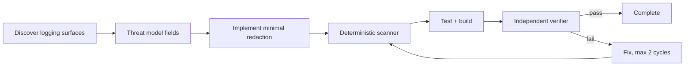

# Agent Production Log PII Redaction Gate

Reusable implementation kit for preventing AI-assisted code changes from introducing sensitive-data leakage into application logs, traces, structured events, or incident bundles.

## Problem
AI coding agents often add diagnostics during debugging. Functional tests can pass while logs begin emitting email addresses, phone numbers, IP addresses, bearer tokens, authorization headers, session identifiers, payment-like numbers, or configured business-sensitive fields. The leak may only appear under production data.

## Trigger
Use when code changes logging, telemetry, exception serialization, HTTP middleware, tracing, incident collection, request/response capture, or data models consumed by observability code.

## Inputs
- repository and working tree
- `config/redaction-policy.json`
- optional text/JSON log samples
- changed source files
- host build/test commands
- explicit approvals for any intentional sensitive logging exception

## Architecture


## Package tree
```text
README.md
config/redaction-policy.json
schemas/redaction-report.schema.json
scripts/log_redaction_gate.py
scripts/verify_package.py
skills/discover-log-exposure.md
skills/implement-redaction.md
rules/log-data-safety.md
subagents/log-exposure-explorer.md
subagents/redaction-planner.md
subagents/verification-agent.md
workflows/log-redaction-gate.md
hooks/pre-change.md
hooks/post-change.md
examples/safe.log
examples/unsafe.log
tests/test_log_redaction_gate.py
```

## Requirements
Python 3.10+. Executable scripts use only the standard library.

## Usage
```bash
python scripts/log_redaction_gate.py --policy config/redaction-policy.json --input examples/unsafe.log --output redaction-report.json
python scripts/verify_package.py
```

Exit codes: `0` no blocking findings, `1` sensitive findings detected, `2` invalid input/configuration.

## Detection model
The deterministic scanner detects policy-enabled patterns such as email addresses, bearer tokens, authorization headers, IPv4 addresses, long payment-like digit sequences, and configured literal field names. It is a gate, not a complete DLP system. Agents must also inspect logging call sites and structured payload construction.

## Approval boundaries
Explicit human approval is required before intentionally logging a sensitive field, weakening redaction, changing production telemetry configuration, changing secrets, deploying production, deleting data, altering infrastructure, or bypassing the gate. Approval never authorizes logging credentials, bearer tokens, passwords, private keys, or raw secret values.

## Failure and recovery
- invalid policy/input: stop and fix configuration;
- scanner/tool failure: retry at most twice only if transient;
- detected exposure: preserve evidence and allow at most two implementation/fix cycles;
- unknown production payload shape: stop and escalate rather than claiming safe coverage;
- verifier disagreement: task remains blocked.

## Verification
Success requires deterministic scan evidence, relevant unit/integration tests, host build/static checks, inspection of changed logging call sites, no unapproved sensitive output, and independent Verification Agent review. A passing build alone is not verification.

## Definition of Done
- logging entry points affected by the change are identified;
- sensitive fields are classified;
- deterministic scanner passes on approved samples;
- regression tests demonstrate redaction;
- host build/tests pass;
- no raw secrets are emitted;
- required approvals exist;
- independent verification is `verified`;
- residual risks are documented.

## Portability
Core instructions and scripts are agent-neutral and can be used with Codex, Claude Code, Cursor, ChatGPT, GitHub Copilot, OpenCode, or other coding agents.